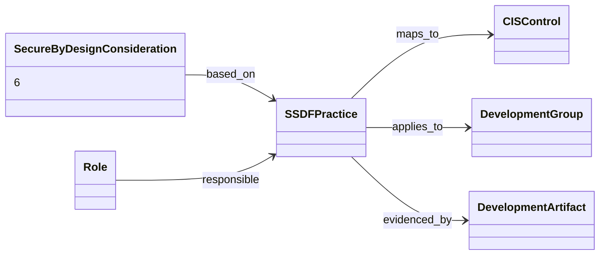

# CIS/SAFECode Secure by Design v1.1 — object model (public material only)

9 objects, 6 edges, all stated, from the CIS landing page, CIS/SAFECode press releases and the SAFECode blog (2026-07-13). The guide and spreadsheet were not read (registration wall). CIS/SAFECode state v1.1 "is consistent in content with the new ETSI standard", so the full model is `etsi-ts-104-219/distilled/object-model.yaml`.

