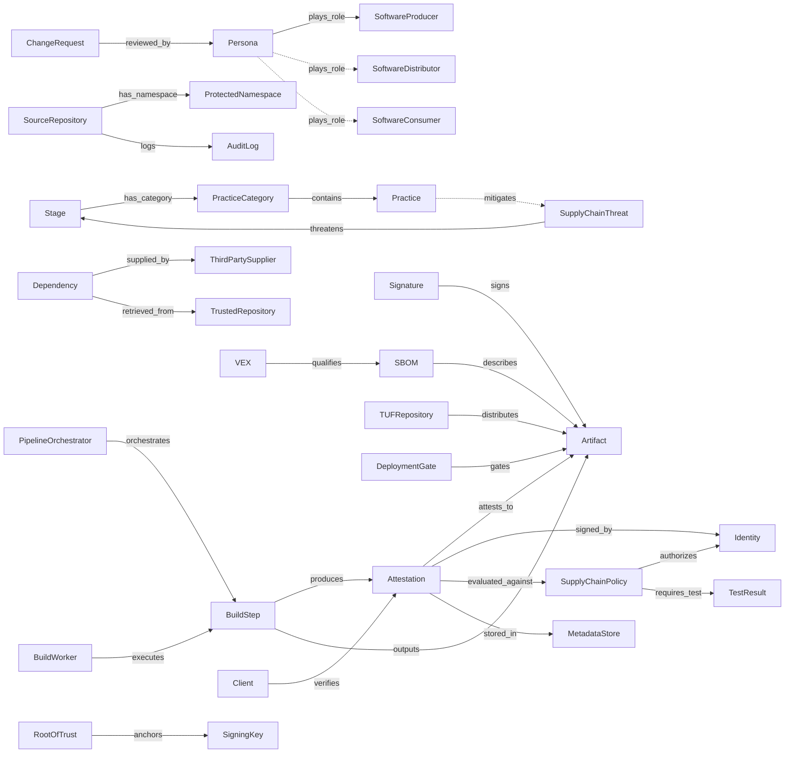
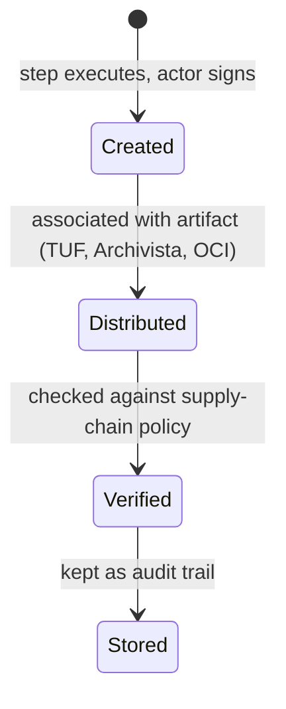

# CNCF Software Supply Chain Best Practices v2 — object model

Machine source: `object-model.yaml` (39 objects, 29 edges, 5 gaps; locators are SSCBPv2.md headings).

Attestation lifecycle (Part 2 › Attestations), stated as four phases:

## Findings for tmodel

1. **Policy evaluated against attestations is the gate check.** The paper defines supply-chain
   policy as "requirements for the software supply chain, defined in software, including authorized
   actors and expected actions", evaluated against signed attestations. That is the automatable
   Gate exit criterion R-041/R-042 need. tmodel has no `Policy` object.
2. **A deployment gate is a real, automated gate.** The admission controller "can supplement, but
   not replace" verification at the end of the pipeline and by the end user. Gates are layered, not
   single.
3. **Distributor is a missing Party role** in ARCH-0001 §2b.
4. **VEX statuses** (AFFECTED / NOT AFFECTED / UNDER INVESTIGATION / FIXED) are the values the R-027b
   VEX-override Assertion should carry.
5. **Stages ≈ lifecycle phases.** The five stages and the SLSA threat mapping A–I give a
   supply-chain slice of the `LifecyclePhase` axis (R-037).
