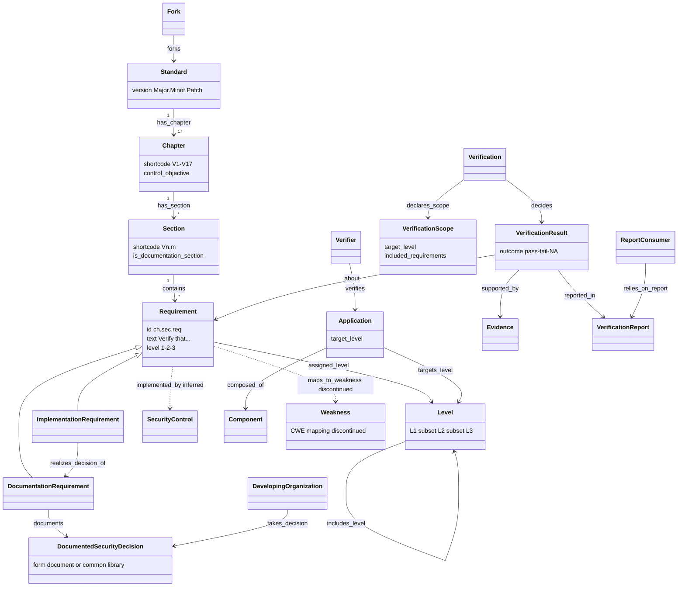

# ASVS 5.0.0 — object model

Machine form: `object-model.yaml` (43 objects, 45 edges, 9 gaps; all objects and all but one edge `stated`; the verify pass of 2026-10-02 added ApprovalStatus and 8 edges not yet drawn in the diagram below).
The diagram shows the load-bearing core; supply-chain, crypto and data-protection objects are in the YAML.

## Findings

1. **ASVS is an outcome catalogue, not a process model.** Its `Requirement` is a property of the
   *Application* ("ASVS does not prescribe development lifecycle activities"). It has no Phase, Gate,
   Practice or Activity objects. In an SDL model ASVS supplies the *content* of a verification gate's exit
   criteria, not the gates.
2. **Documentation vs implementation is a first-class split.** 31 documentation requirements (11 sections)
   are satisfied by a `DocumentedSecurityDecision`. Each is paired with an implementation requirement, and
   the two are verified separately. This is R-040's documentation vs technical mitigation kind, stated by a
   standard.
3. **Level is a cumulative conformance profile** (70 / 253 / 345). Some requirements change *within* one id
   by level (V13.3.1: "For an L3 application ... hardware-backed").
4. **The verification side is fully modelled.** Scope, per-requirement pass/fail/N/A, evidence, report and
   consumer map directly onto ARCH-0001 §4 Assertion + Review and the R-043 governed view.
5. **The threat link was cut.** CWE and NIST mappings were removed in 5.0. Threat modeling as a practice
   moved to the non-mandatory Appendix D. The one remaining tie is V13.1.4's "based on the organization's
   threat model".
