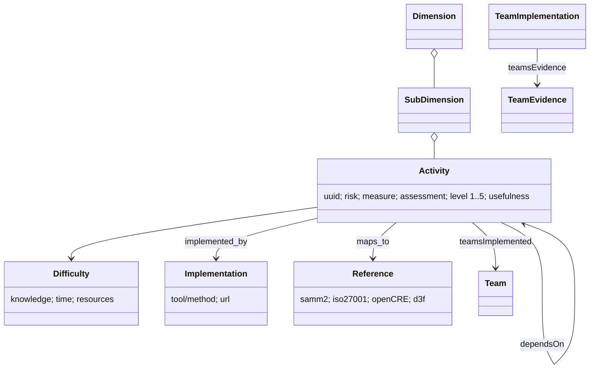

# OWASP DSOMM (data v5.1.0) — object model

Source of truth `object-model.yaml` (11 objects, 8 edges).

**Findings.** Each DSOMM activity pairs a *risk* with a *measure* (a
threat→mitigation statement), carries an *assessment* ("Show …") and has
per-team implementation and evidence slots — the closest data model among the
maturity models to tmodel's MitigationInstance + Evidence + Review (R-040,
R-042). Every activity cites SAMM (278 of 280 references resolve to SAMM v2.2
ids; `crosswalk.yaml`).
