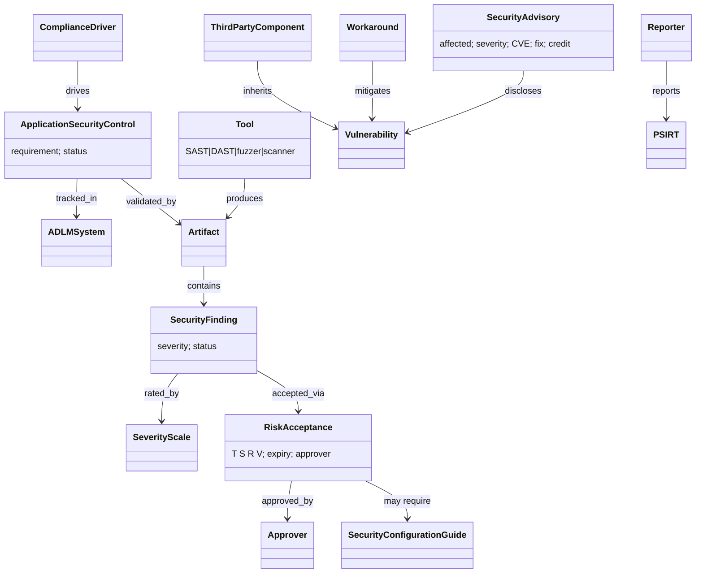

# SAFECode FPSSD 3rd ed. — object model

Source of truth `object-model.yaml` (25 objects, 14 edges).

**Findings.** (1) "manage the controls as structured data in an ADLM system
rather than in an unstructured document" is the clearest industry statement of
R-043 (KG as SoT, documents as views). (2) TSRV (Technique, Specifics,
Remaining risk, Verification) is a ready-made field set for an accepted-risk
MitigationInstance. (3) No gate object — release is mentioned only as the
deadline for risk approval.
