# rfc-8551 — protocol model

## Framing: store-and-forward, no exchange of its own

S/MIME 4.0 secures MIME entities. It does not define a session, a request and reply,
an acknowledgement or an error message. The source says: “However, S/MIME is not restricted to mail; it can be used with any transport mechanism that transports MIME data, such as HTTP or SIP.” (§1) A sending agent builds a self-contained entity; any transport carries it; a receiving agent processes it later, alone. So every flow below is one sender's construction, the transport and its intermediaries, and one receiver's local processing, and every `on_error` is local to the role that detects it.

The one failure the source says travels back to a sender is a transport bounce. An RFC 1847-compliant transfer agent that meets 8-bit data in the first part of a multipart/signed “would have to return the message to the sender as undeliverable.” (§3.1.3) That return is not an S/MIME message.

The source comes close to an exchange in two places. Neither defines the request or the correlation:

- §4: “a user agent could automatically generate a message to an intended recipient requesting that recipient's certificate in a signed return message.” Modelled as `certificate-request-by-signed-return`.
- §3.8: the certs-only message is used “such as in response to a registration request”, a mechanism that §3.9 says “S/MIME v4.0 does not require”. Modelled as `registration-request` and `certificate-management`.

Capability discovery happens as a side effect of signed mail. A signer announces SMIMECapabilities and SMIMEEncryptionKeyPreference; a receiver that verifies the signature caches them; later, when the roles reverse, that cache drives the algorithm and certificate choice (`capability-and-preference-caching`, `encryption-algorithm-selection`, `recipient-key-management-certificate-selection`).

Every creation flow has the same shape: “The data to be secured is always a canonical MIME entity.  The MIME entity and other data, such as certificates and algorithm identifiers, are given to CMS processing facilities that produce a CMS object.  Finally, the CMS object is wrapped in MIME.” (§3) The steps bind by result: “These steps are descriptive rather than prescriptive.” (§3.1)

## Reading `protocol.yaml`

| key | what it holds |
|---|---|
| `source`, `applicability`, `conventions` | digest, the store-and-forward note, the quoting and basis rules |
| `framing` | 5 statements of what kind of document this is, quoted |
| `roles` | 13 roles with the source's names for them, locators and quotes |
| `message_names_used` | every message name a step uses, with where the source defines it; `in_source: no` marks names the source uses but never defines as a structure (registration request, certificate request message, signed return message, returned message). For the cross-check pass to reconcile with `messages.yaml` |
| `flows` | 22 flows, 124 steps. Each step has `from`, `to`, `message`, `action`, `locator`, `quotes`, `constrained_by`, `on_error` and `on_error_basis`; where needed also `condition`, `invokes`, `inferred` / `inferred_reason`, `on_error_inferred`, `on_error_quotes` and `on_error_constrained_by` |
| `error_paths` | 36 error paths: trigger, detecting role, flow steps, outcome, basis |
| `source_defects_and_tensions` | 17 entries, recorded and not repaired |
| `not_defined` | 10 things an implementer will not find in RFC 8551 |

- **Quotes.** Each one is a contiguous run of `.cache/rfc-8551.txt`. The RFC line wrapping is undone (a line break plus its indent becomes one space) and page headers and footers are dropped.
- **Requirements.** `constrained_by` cites `rfc-8551#R-NNNN` from `requirements.yaml`.
- **Inferred.** A step marked `inferred: true` is not stated literally, and `inferred_reason` says what the source does and does not say. `on_error_basis: unspecified` means the source names the failure but not what follows it. That is the most common case: the source never defines what “indicating an error condition” (§2.6) or “treated as failing” (§2.5.2) does.

## Roles

| role | kind | source names | locators |
|---|---|---|---|
| `sending-agent` | party | sending agent, sender, sending client, originator, S/MIME agent, interactive sending agent | §1.2, §1.1, §2.7.1, §3, §3.1.1 |
| `receiving-agent` | party | receiving agent, recipient, receiver, receiving client, client, recipient computer | §1.2, §1.1, §3.1, §3.7 |
| `user` | party | user, human sender | §2.5, §2.7.2, §4, §6 |
| `cms-processing` | component | CMS processing facilities, CMS generating process | §3, §3.5.3.2, §3.8 |
| `mime-user-agent` | component | MIME-capable user agent, receiving application | §3.1 |
| `transport` | channel | Internet SMTP infrastructure, mail transport infrastructure, communications channel | §1, §3.1.3, §3.2 |
| `message-transfer-agent` | intermediary | message transfer agent, mail transport agents, compliant agent | §3.1.3, §3.1.4 |
| `gateway` | intermediary | gateway with no special knowledge of S/MIME, benign intermediate agents | §3.2.1, §3.5.1 |
| `trusted-gateway` | intermediary | trusted gateway | §3.1.2 |
| `certification-authority` | party | certification authority | §3.9 |
| `server-implementation` | party | server implementations, secure mail list servers | §6 |
| `attacker` | adversary | someone watching the communications channel, careful attacker, passive observers | §2.7.3, §3.4, §3.7, §6 |
| `capabilities-list-maintainer` | mentioned | maintainer of the registered SMIMECapabilities list | §2.5.2 |

The two agents are defined in §1.2. A sending agent is “Software that creates S/MIME CMS content types, MIME body parts that contain CMS content types, or both.” A receiving agent is “Software that interprets and processes S/MIME CMS objects, MIME body parts that contain CMS content types, or both.” The source keeps their requirements apart on purpose: “An automated process that sends an encrypted message might not be able to receive an encrypted message at all, for example.” (§1.1)

## Flows

In the diagrams, `smime-type=X` stands for the media type `application/pkcs7-mime; smime-type=X`. Mermaid treats a semicolon as a line break, so the diagrams do not use one.

### `mime-entity-preparation`

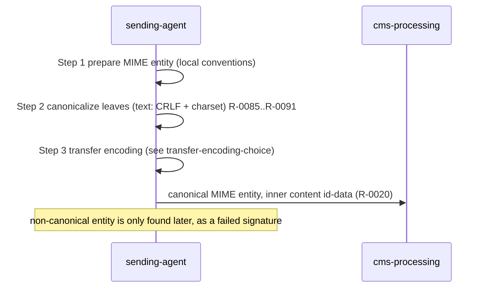
```mermaid
sequenceDiagram
  participant SA as sending-agent
  participant CMS as cms-processing
  SA->>SA: Step 1 prepare MIME entity (local conventions)
  SA->>SA: Step 2 canonicalize leaves (text: CRLF + charset) R-0085..R-0091
  SA->>SA: Step 3 transfer encoding (see transfer-encoding-choice)
  SA->>CMS: canonical MIME entity, inner content id-data (R-0020)
  Note over SA: non-canonical entity is only found later, as a failed signature
```

### `transfer-encoding-choice`

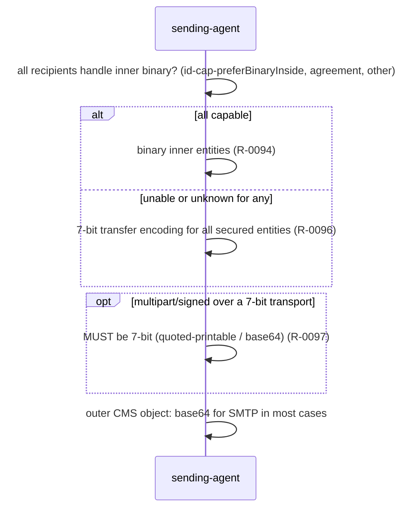
```mermaid
sequenceDiagram
  participant SA as sending-agent
  SA->>SA: all recipients handle inner binary? (id-cap-preferBinaryInside, agreement, other)
  alt all capable
    SA->>SA: binary inner entities (R-0094)
  else unable or unknown for any
    SA->>SA: 7-bit transfer encoding for all secured entities (R-0096)
  end
  opt multipart/signed over a 7-bit transport
    SA->>SA: MUST be 7-bit (quoted-printable / base64) (R-0097)
  end
  SA->>SA: outer CMS object: base64 for SMTP in most cases
```

### `encryption-algorithm-selection`

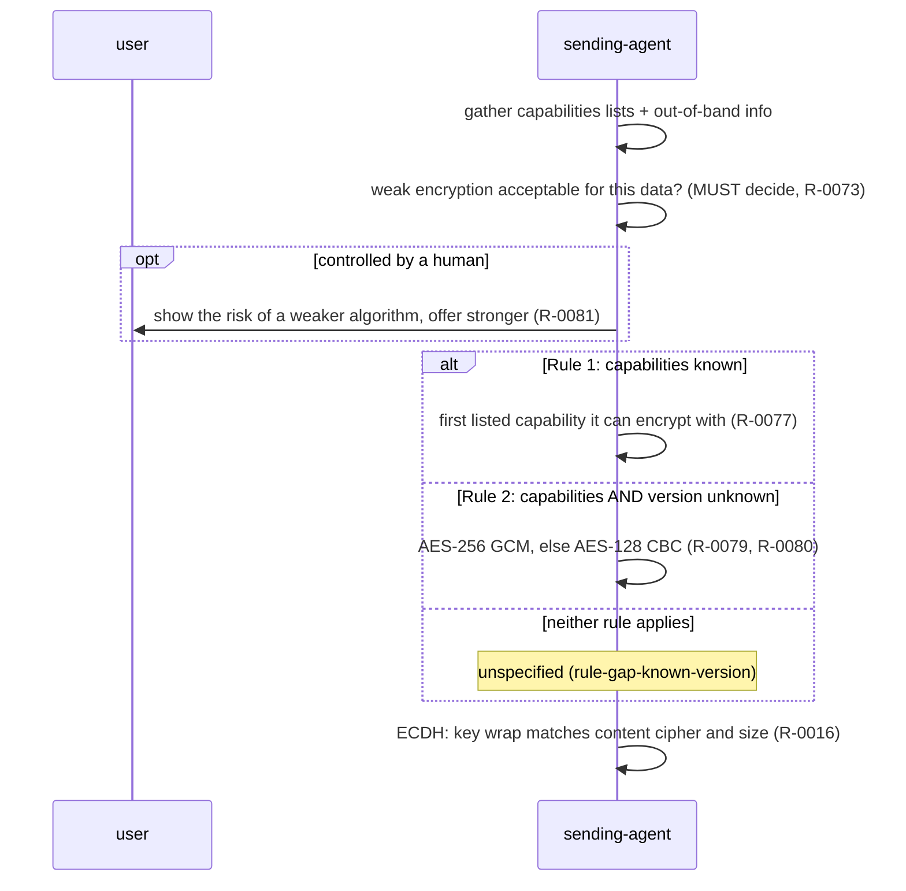
```mermaid
sequenceDiagram
  participant U as user
  participant SA as sending-agent
  SA->>SA: gather capabilities lists + out-of-band info
  SA->>SA: weak encryption acceptable for this data? (MUST decide, R-0073)
  opt controlled by a human
    SA->>U: show the risk of a weaker algorithm, offer stronger (R-0081)
  end
  alt Rule 1: capabilities known
    SA->>SA: first listed capability it can encrypt with (R-0077)
  else Rule 2: capabilities AND version unknown
    SA->>SA: AES-256 GCM, else AES-128 CBC (R-0079, R-0080)
  else neither rule applies
    Note over SA: unspecified (rule-gap-known-version)
  end
  SA->>SA: ECDH: key wrap matches content cipher and size (R-0016)
```

### `multiple-recipients`

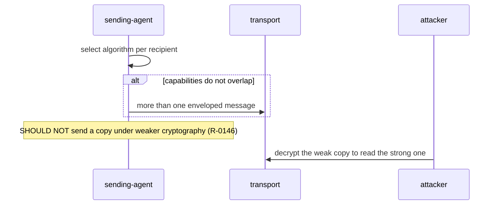
```mermaid
sequenceDiagram
  participant SA as sending-agent
  participant T as transport
  participant X as attacker
  SA->>SA: select algorithm per recipient
  alt capabilities do not overlap
    SA->>T: more than one enveloped message
  end
  Note over SA: SHOULD NOT send a copy under weaker cryptography (R-0146)
  X->>T: decrypt the weak copy to read the strong one
```

### `recipient-key-management-certificate-selection`

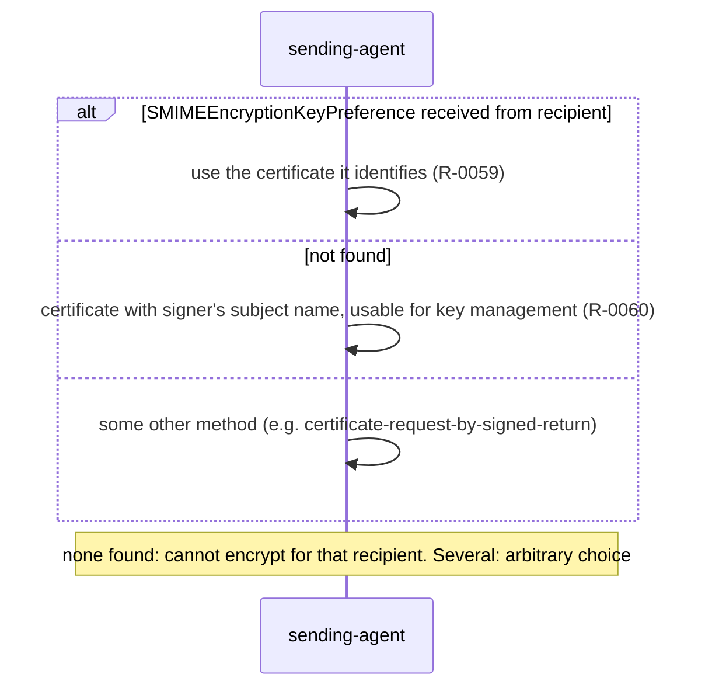
```mermaid
sequenceDiagram
  participant SA as sending-agent
  alt SMIMEEncryptionKeyPreference received from recipient
    SA->>SA: use the certificate it identifies (R-0059)
  else not found
    SA->>SA: certificate with signer's subject name, usable for key management (R-0060)
  else
    SA->>SA: some other method (e.g. certificate-request-by-signed-return)
  end
  Note over SA: none found: cannot encrypt for that recipient. Several: arbitrary choice
```

### `enveloped-only`

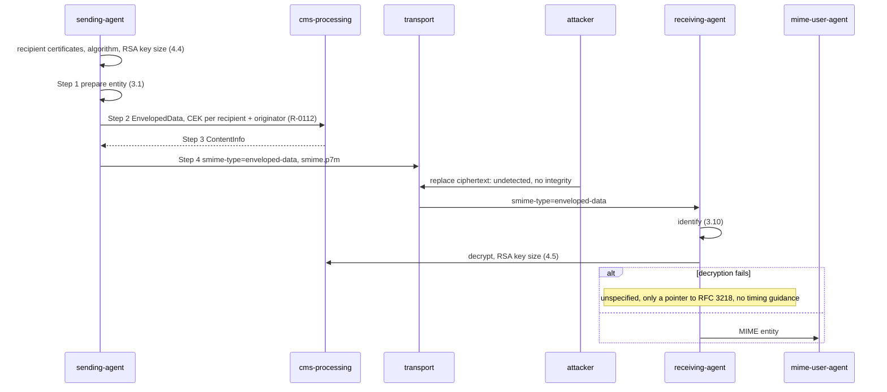
```mermaid
sequenceDiagram
  participant SA as sending-agent
  participant CMS as cms-processing
  participant T as transport
  participant X as attacker
  participant RA as receiving-agent
  participant MUA as mime-user-agent
  SA->>SA: recipient certificates, algorithm, RSA key size (4.4)
  SA->>SA: Step 1 prepare entity (3.1)
  SA->>CMS: Step 2 EnvelopedData, CEK per recipient + originator (R-0112)
  CMS-->>SA: Step 3 ContentInfo
  SA->>T: Step 4 smime-type=enveloped-data, smime.p7m
  X->>T: replace ciphertext: undetected, no integrity
  T->>RA: smime-type=enveloped-data
  RA->>RA: identify (3.10)
  RA->>CMS: decrypt, RSA key size (4.5)
  alt decryption fails
    Note over RA: unspecified, only a pointer to RFC 3218, no timing guidance
  else
    RA->>MUA: MIME entity
  end
```

### `authenticated-enveloped-only`

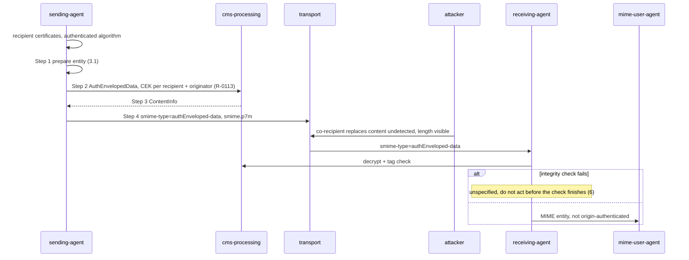
```mermaid
sequenceDiagram
  participant SA as sending-agent
  participant CMS as cms-processing
  participant T as transport
  participant X as attacker
  participant RA as receiving-agent
  participant MUA as mime-user-agent
  SA->>SA: recipient certificates, authenticated algorithm
  SA->>SA: Step 1 prepare entity (3.1)
  SA->>CMS: Step 2 AuthEnvelopedData, CEK per recipient + originator (R-0113)
  CMS-->>SA: Step 3 ContentInfo
  SA->>T: Step 4 smime-type=authEnveloped-data, smime.p7m
  X->>T: co-recipient replaces content undetected, length visible
  T->>RA: smime-type=authEnveloped-data
  RA->>CMS: decrypt + tag check
  alt integrity check fails
    Note over RA: unspecified, do not act before the check finishes (6)
  else
    RA->>MUA: MIME entity, not origin-authenticated
  end
```

### `signed-only-pkcs7-mime`

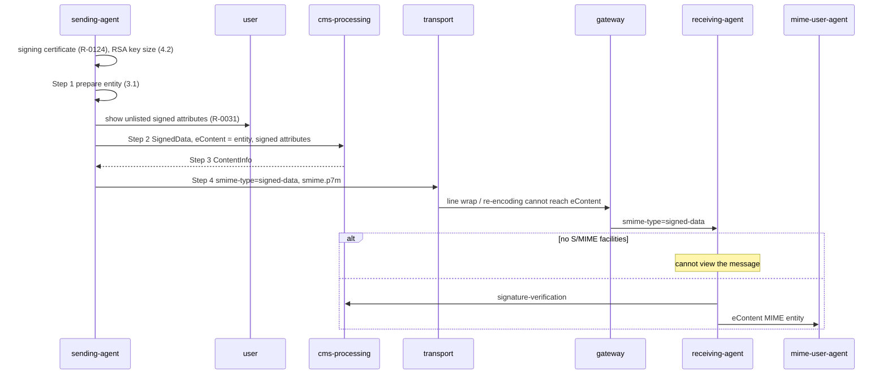
```mermaid
sequenceDiagram
  participant SA as sending-agent
  participant U as user
  participant CMS as cms-processing
  participant T as transport
  participant G as gateway
  participant RA as receiving-agent
  participant MUA as mime-user-agent
  SA->>SA: signing certificate (R-0124), RSA key size (4.2)
  SA->>SA: Step 1 prepare entity (3.1)
  SA->>U: show unlisted signed attributes (R-0031)
  SA->>CMS: Step 2 SignedData, eContent = entity, signed attributes
  CMS-->>SA: Step 3 ContentInfo
  SA->>T: Step 4 smime-type=signed-data, smime.p7m
  T->>G: line wrap / re-encoding cannot reach eContent
  G->>RA: smime-type=signed-data
  alt no S/MIME facilities
    Note over RA: cannot view the message
  else
    RA->>CMS: signature-verification
    RA->>MUA: eContent MIME entity
  end
```

### `signed-only-multipart-signed`

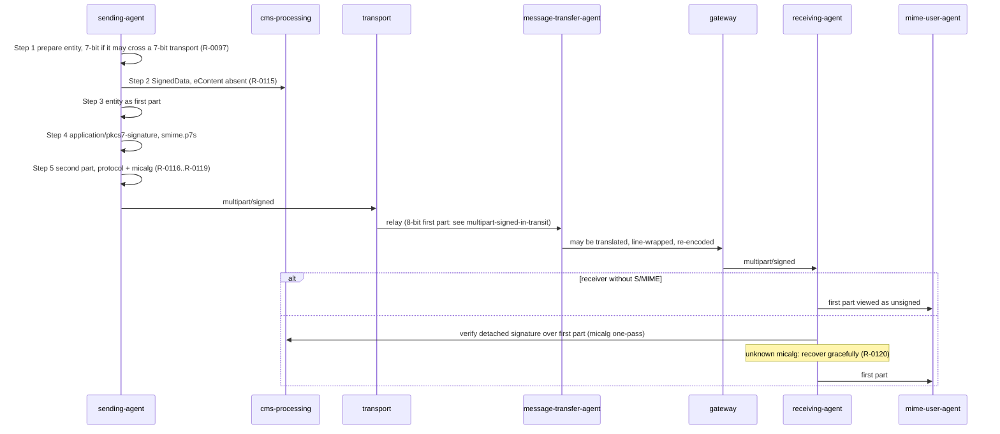
```mermaid
sequenceDiagram
  participant SA as sending-agent
  participant CMS as cms-processing
  participant T as transport
  participant MTA as message-transfer-agent
  participant G as gateway
  participant RA as receiving-agent
  participant MUA as mime-user-agent
  SA->>SA: Step 1 prepare entity, 7-bit if it may cross a 7-bit transport (R-0097)
  SA->>CMS: Step 2 SignedData, eContent absent (R-0115)
  SA->>SA: Step 3 entity as first part
  SA->>SA: Step 4 application/pkcs7-signature, smime.p7s
  SA->>SA: Step 5 second part, protocol + micalg (R-0116..R-0119)
  SA->>T: multipart/signed
  T->>MTA: relay (8-bit first part: see multipart-signed-in-transit)
  MTA->>G: may be translated, line-wrapped, re-encoded
  G->>RA: multipart/signed
  alt receiver without S/MIME
    RA->>MUA: first part viewed as unsigned
  else
    RA->>CMS: verify detached signature over first part (micalg one-pass)
    Note over RA: unknown micalg: recover gracefully (R-0120)
    RA->>MUA: first part
  end
```

### `multipart-signed-in-transit`

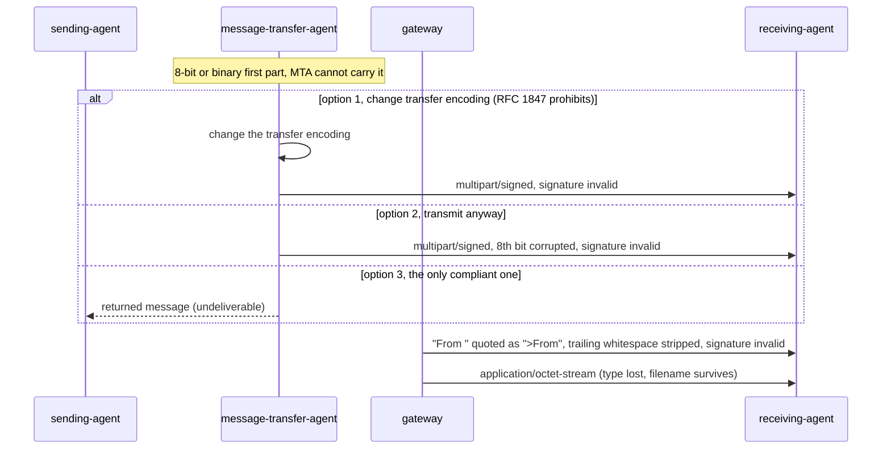
```mermaid
sequenceDiagram
  participant SA as sending-agent
  participant MTA as message-transfer-agent
  participant G as gateway
  participant RA as receiving-agent
  Note over MTA: 8-bit or binary first part, MTA cannot carry it
  alt option 1, change transfer encoding (RFC 1847 prohibits)
    MTA->>MTA: change the transfer encoding
    MTA->>RA: multipart/signed, signature invalid
  else option 2, transmit anyway
    MTA->>RA: multipart/signed, 8th bit corrupted, signature invalid
  else option 3, the only compliant one
    MTA-->>SA: returned message (undeliverable)
  end
  G->>RA: "From " quoted as ">From", trailing whitespace stripped, signature invalid
  G->>RA: application/octet-stream (type lost, filename survives)
```

### `compressed-only`

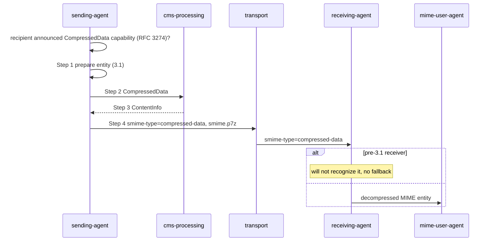
```mermaid
sequenceDiagram
  participant SA as sending-agent
  participant CMS as cms-processing
  participant T as transport
  participant RA as receiving-agent
  participant MUA as mime-user-agent
  SA->>SA: recipient announced CompressedData capability (RFC 3274)?
  SA->>SA: Step 1 prepare entity (3.1)
  SA->>CMS: Step 2 CompressedData
  CMS-->>SA: Step 3 ContentInfo
  SA->>T: Step 4 smime-type=compressed-data, smime.p7z
  T->>RA: smime-type=compressed-data
  alt pre-3.1 receiver
    Note over RA: will not recognize it, no fallback
  else
    RA->>MUA: decompressed MIME entity
  end
```

### `multiple-operations`

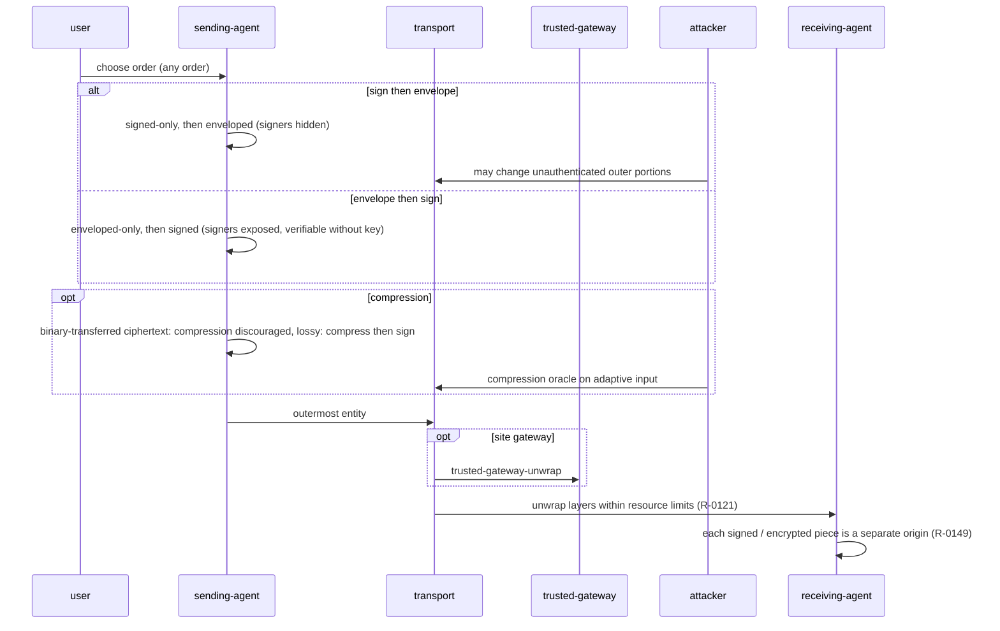
```mermaid
sequenceDiagram
  participant U as user
  participant SA as sending-agent
  participant T as transport
  participant TG as trusted-gateway
  participant X as attacker
  participant RA as receiving-agent
  U->>SA: choose order (any order)
  alt sign then envelope
    SA->>SA: signed-only, then enveloped (signers hidden)
    X->>T: may change unauthenticated outer portions
  else envelope then sign
    SA->>SA: enveloped-only, then signed (signers exposed, verifiable without key)
  end
  opt compression
    SA->>SA: binary-transferred ciphertext: compression discouraged, lossy: compress then sign
    X->>T: compression oracle on adaptive input
  end
  SA->>T: outermost entity
  opt site gateway
    T->>TG: trusted-gateway-unwrap
  end
  T->>RA: unwrap layers within resource limits (R-0121)
  RA->>RA: each signed / encrypted piece is a separate origin (R-0149)
```

### `trusted-gateway-unwrap`

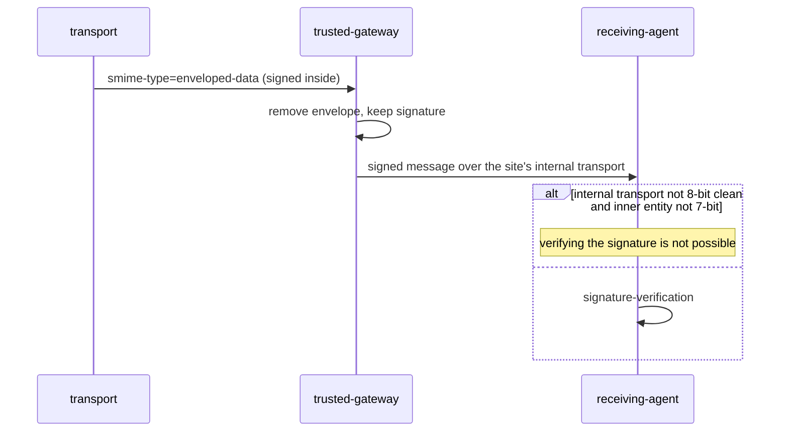
```mermaid
sequenceDiagram
  participant T as transport
  participant TG as trusted-gateway
  participant RA as receiving-agent
  T->>TG: smime-type=enveloped-data (signed inside)
  TG->>TG: remove envelope, keep signature
  TG->>RA: signed message over the site's internal transport
  alt internal transport not 8-bit clean and inner entity not 7-bit
    Note over RA: verifying the signature is not possible
  else
    RA->>RA: signature-verification
  end
```

### `certificate-management`

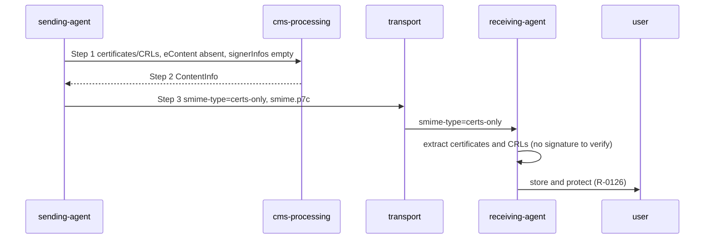
```mermaid
sequenceDiagram
  participant SA as sending-agent
  participant CMS as cms-processing
  participant T as transport
  participant RA as receiving-agent
  participant U as user
  SA->>CMS: Step 1 certificates/CRLs, eContent absent, signerInfos empty
  CMS-->>SA: Step 2 ContentInfo
  SA->>T: Step 3 smime-type=certs-only, smime.p7c
  T->>RA: smime-type=certs-only
  RA->>RA: extract certificates and CRLs (no signature to verify)
  RA->>U: store and protect (R-0126)
```

### `registration-request`

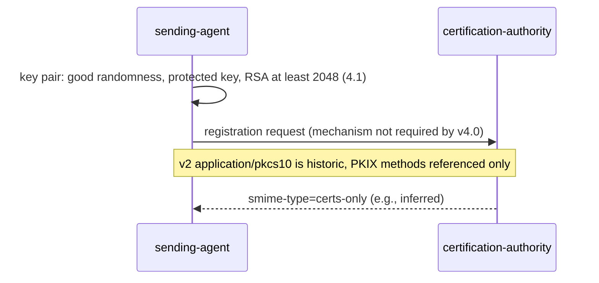
```mermaid
sequenceDiagram
  participant SA as sending-agent
  participant CA as certification-authority
  SA->>SA: key pair: good randomness, protected key, RSA at least 2048 (4.1)
  SA->>CA: registration request (mechanism not required by v4.0)
  Note over SA,CA: v2 application/pkcs10 is historic, PKIX methods referenced only
  CA-->>SA: smime-type=certs-only (e.g., inferred)
```

### `certificate-request-by-signed-return`

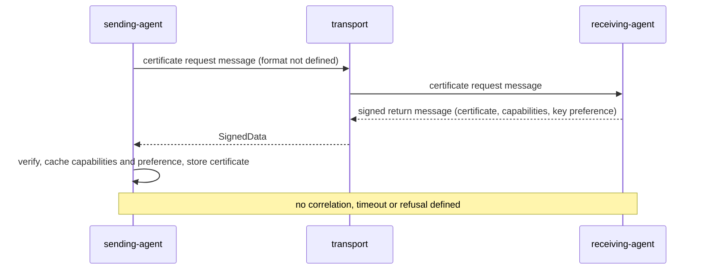
```mermaid
sequenceDiagram
  participant SA as sending-agent
  participant T as transport
  participant RA as receiving-agent
  SA->>T: certificate request message (format not defined)
  T->>RA: certificate request message
  RA-->>T: signed return message (certificate, capabilities, key preference)
  T-->>SA: SignedData
  SA->>SA: verify, cache capabilities and preference, store certificate
  Note over SA,RA: no correlation, timeout or refusal defined
```

### `rsa-key-size-decision`

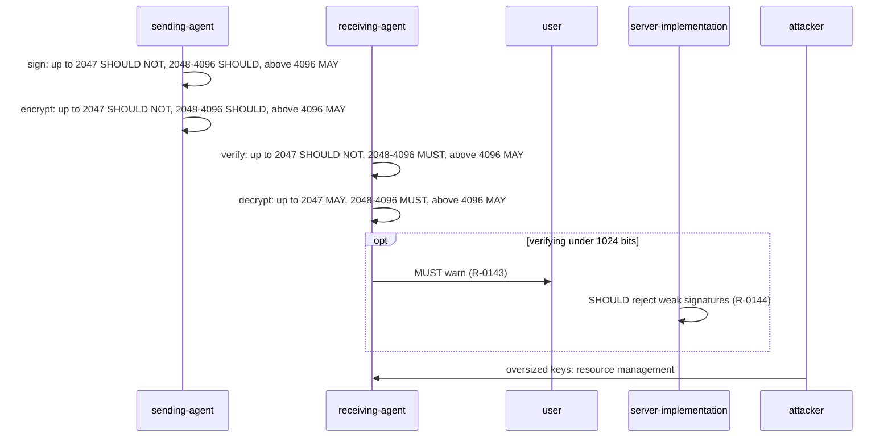
```mermaid
sequenceDiagram
  participant SA as sending-agent
  participant RA as receiving-agent
  participant U as user
  participant S as server-implementation
  participant X as attacker
  SA->>SA: sign: up to 2047 SHOULD NOT, 2048-4096 SHOULD, above 4096 MAY
  SA->>SA: encrypt: up to 2047 SHOULD NOT, 2048-4096 SHOULD, above 4096 MAY
  RA->>RA: verify: up to 2047 SHOULD NOT, 2048-4096 MUST, above 4096 MAY
  RA->>RA: decrypt: up to 2047 MAY, 2048-4096 MUST, above 4096 MAY
  opt verifying under 1024 bits
    RA->>U: MUST warn (R-0143)
    S->>S: SHOULD reject weak signatures (R-0144)
  end
  X->>RA: oversized keys: resource management
```

### `smime-identification`

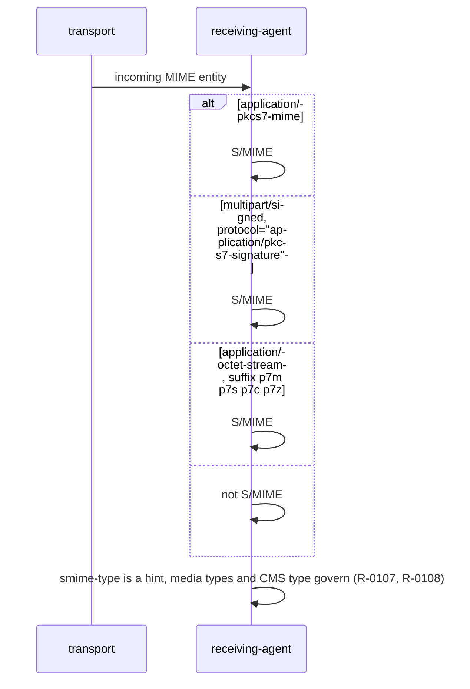
```mermaid
sequenceDiagram
  participant T as transport
  participant RA as receiving-agent
  T->>RA: incoming MIME entity
  alt application/pkcs7-mime
    RA->>RA: S/MIME
  else multipart/signed, protocol="application/pkcs7-signature"
    RA->>RA: S/MIME
  else application/octet-stream, suffix p7m p7s p7c p7z
    RA->>RA: S/MIME
  else
    RA->>RA: not S/MIME
  end
  RA->>RA: smime-type is a hint, media types and CMS type govern (R-0107, R-0108)
```

### `signature-verification`

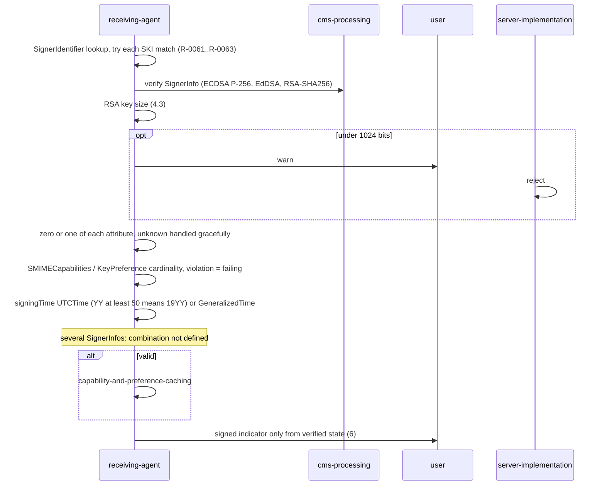
```mermaid
sequenceDiagram
  participant RA as receiving-agent
  participant CMS as cms-processing
  participant U as user
  participant S as server-implementation
  RA->>RA: SignerIdentifier lookup, try each SKI match (R-0061..R-0063)
  RA->>CMS: verify SignerInfo (ECDSA P-256, EdDSA, RSA-SHA256)
  RA->>RA: RSA key size (4.3)
  opt under 1024 bits
    RA->>U: warn
    S->>S: reject
  end
  RA->>RA: zero or one of each attribute, unknown handled gracefully
  RA->>RA: SMIMECapabilities / KeyPreference cardinality, violation = failing
  RA->>RA: signingTime UTCTime (YY at least 50 means 19YY) or GeneralizedTime
  Note over RA: several SignerInfos: combination not defined
  alt valid
    RA->>RA: capability-and-preference-caching
  end
  RA->>U: signed indicator only from verified state (6)
```

### `capability-and-preference-caching`

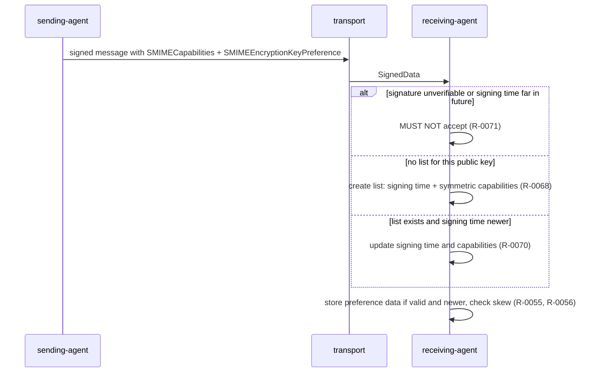
```mermaid
sequenceDiagram
  participant SA as sending-agent
  participant T as transport
  participant RA as receiving-agent
  SA->>T: signed message with SMIMECapabilities + SMIMEEncryptionKeyPreference
  T->>RA: SignedData
  alt signature unverifiable or signing time far in future
    RA->>RA: MUST NOT accept (R-0071)
  else no list for this public key
    RA->>RA: create list: signing time + symmetric capabilities (R-0068)
  else list exists and signing time newer
    RA->>RA: update signing time and capabilities (R-0070)
  end
  RA->>RA: store preference data if valid and newer, check skew (R-0055, R-0056)
```

### `receive-processing-and-presentation`

```mermaid
sequenceDiagram
  participant RA as receiving-agent
  participant MUA as mime-user-agent
  participant U as user
  RA->>RA: recommended (lowercase): do not act on content before the integrity check finishes
  opt top-level protected entity is message/rfc822
    RA->>MUA: present as top-level message, distinguish inner/outer headers (R-0083, R-0084)
  end
  MUA->>U: text/html must be a complete document (R-0147)
  MUA->>U: each multipart/mixed piece, each protected piece a separate origin
```

### `historic-message-processing`

```mermaid
sequenceDiagram
  participant RA as receiving-agent
  participant U as user
  RA->>RA: decrypt old mail (RC2/40, tripleDES) only to read, never to encrypt
  Note over RA: dropped algorithm: old mail no longer accessible
  RA->>U: historic signatures treated differently (expired CRLs, weak keys and hashes)
  RA->>RA: id-dsa read as id-dsa-with-sha1 (R-0151)
```

## Decision procedures

The source gives these as ordered procedures, so they are drawn as flowcharts too. Each one matches the flow of the same name above.

### Decision: encryption algorithm (§2.7.1, §2.7.1.1, §2.7.1.2, §2.7.2)

“The decision to use or not use weak encryption overrides any other decision in this section about which encryption algorithm to use.” (§2.7.1) “These rules are ordered, so the sending agent SHOULD make its decision in the order given.” (§2.7.1)

```mermaid
flowchart TD
  A[Encrypted message to send] --> B{Weak encryption acceptable for this data? MUST decide}
  B -- no --> B1[Exclude weak algorithms: MUST NOT use one]
  B -- yes --> C
  B1 --> C{Human-controlled agent?}
  C -- yes --> C1[Let the human weigh a weaker algorithm, or choose a stronger one]
  C -- no --> D
  C1 --> D{Rule 1: capabilities received from recipient?}
  D -- yes --> D1[First listed capability the sender can encrypt with]
  D1 --> D2{Found one?}
  D2 -- no --> Z[Unspecified]
  D2 -- yes --> W
  D -- no --> E{Rule 2: capabilities AND version unknown?}
  E -- yes --> E1{Use AES-256 GCM?}
  E1 -- yes --> E2[AES-256 GCM: AuthEnvelopedData]
  E1 -- no --> E3[AES-128 CBC: EnvelopedData]
  E -- no, version known --> Z
  E2 --> W[ECDH: key wrap cipher and size match content cipher]
  E3 --> W
```

### Decision: capability list update (§2.7.1, §2.5.3)

```mermaid
flowchart TD
  A[Signed message with SMIMECapabilities] --> B{Signature verified?}
  B -- no --> R[MUST NOT accept capabilities]
  B -- yes --> C{Signing time far beyond clock skew?}
  C -- yes --> R2[MUST NOT accept]
  C -- no --> D{List exists for sender's public key?}
  D -- no --> E[Create list: signing time + symmetric capabilities]
  D -- yes --> F{Incoming signing time newer than stored?}
  F -- yes --> G[Update signing time and capabilities]
  F -- no --> H[Keep stored list, inferred]
  E --> S[Store for future use]
  G --> S
```

### Decision: recipient key-management certificate (§2.5.3.1)

```mermaid
flowchart TD
  A[Need recipient's key-management certificate] --> B{SMIMEEncryptionKeyPreference received from recipient?}
  B -- yes --> C[Use the certificate it identifies]
  B -- no --> D{Certificate with signer's subject name usable for key management?}
  D -- yes --> E{More than one?}
  E -- yes --> F[Arbitrary choice]
  E -- no --> C2[Use it]
  D -- no --> G{Some other method finds one?}
  G -- yes --> C2
  G -- no --> H[Encryption cannot be done for this recipient]
```

### Decision: is this an S/MIME message (§3.10)

```mermaid
flowchart TD
  A[Incoming MIME entity] --> B{application/pkcs7-mime?}
  B -- yes --> Y[S/MIME]
  B -- no --> C{multipart/signed with protocol application/pkcs7-signature?}
  C -- yes --> Y
  C -- no --> D{application/octet-stream with name or filename suffix p7m, p7s, p7c, p7z?}
  D -- yes --> Y
  D -- no --> N[Not S/MIME, inferred]
```

### Decision: transfer encoding (§3.1.2, §3.1.3, §3.2)

```mermaid
flowchart TD
  A[Secured entity] --> B{multipart/signed over a 7-bit transport?}
  B -- yes --> B1[MUST be 7-bit: quoted-printable or base64]
  B -- no --> C{All recipients known to handle inner binary?}
  C -- yes --> C1[Binary inner entities]
  C -- no or unknown --> C2[7-bit transfer encoding for all secured entities]
  C1 --> D[Outer CMS object: base64 for SMTP in most cases]
  C2 --> D
  B1 --> D
```

### Decision: RSA key size (§4.1 to §4.5, §6)

| operation | up to 2047 bits | 2048 to 4096 | above 4096 | requirements |
|---|---|---|---|---|
| generate (signature key) | MUST NOT | — | — | R-0129 |
| sign | SHOULD NOT | SHOULD | MAY | R-0130 to R-0132 |
| verify | SHOULD NOT | MUST | MAY | R-0133 to R-0135 |
| encrypt (key establishment) | SHOULD NOT | SHOULD | MAY | R-0136 to R-0138 |
| decrypt | MAY | MUST | MAY | R-0139 to R-0141 |

Verifying keys under 1024 bits: “it MUST warn the user” (§6, R-0143). Servers “SHOULD reject messages with weak signatures” (§6, R-0144). The curve fixes the key sizes for ECDSA, EdDSA and ECDH.

```mermaid
flowchart TD
  A[RSA key, operation] --> B{size up to 2047?}
  B -- yes --> B1{operation}
  B1 -- generate --> G0[MUST NOT]
  B1 -- sign / verify / encrypt --> G1[SHOULD NOT]
  B1 -- decrypt --> G2[MAY]
  G1 --> W{verify and under 1024?}
  W -- yes --> W1[MUST warn user, server SHOULD reject]
  B -- no --> C{size up to 4096?}
  C -- yes --> C1[sign / encrypt SHOULD, verify / decrypt MUST]
  C -- no --> D[MAY, with resource management against oversized keys]
```

## Source defects and tensions

These are recorded in `protocol.yaml` under `source_defects_and_tensions` and are not repaired. The ones that matter most for an implementer:

- **`if-present-vs-must-include`** (§2.5.2, §2.5.3). Each attribute rule starts “If present”, but the next sentence says the SignedAttributes “MUST include a single instance”. Read literally, every signerInfo must carry both attributes.
- **`rule-gap-known-version`** (§2.7.1.1, §2.7.1.2). If the sender knows the recipient's version but not its capabilities, neither rule applies. The stored list holds no version either.
- **`rule2-fallback-reasoning`** (§2.7.1.2, §6). The fallback is AES-128 CBC, but the stated reason is a presumption about AES-GCM. CBC is also the mode §6 tells mail systems to move away from.
- **`extensions-vs-identification`** (§3.2.1, §3.10). Agents “MUST NOT rely on the file extensions”, yet §3.10 identifies S/MIME in application/octet-stream by file suffix.
- **`cross-reference-3.1`** (§3.1). The text points to “Sections 3.2 and 3.5” for EnvelopedData, CompressedData and AuthEnvelopedData. They are in §3.3, §3.4 and §3.6.
- **`decryption-failure-guidance-absent`**, **`multiple-signers-undefined`** and **`error-condition-undefined`** (§6, §3.5.3, §2.6). The source has no decryption-failure, timing or uniform-error guidance; it does not say how several signatures combine; and it never says what an “error condition” does.
- **`retrieval-actor`** (§4). The receiving agent is given the duty of retrieving certificates for “recipients of digital envelopes”, which is a sending-side need.
- **`verify-band-1024-2047`** (§4.3, §6, Appendix B.2). Keys of 1024 to 2047 bits are SHOULD NOT for verification, but no user-facing treatment is stated for them.
- **`reference-label-swap`** (§1.4, §7.1, Appendix A). The reference lists for [SMIMEv3.1] and [SMIMEv3.2] are swapped, and RFC 5751 is labelled [SMIMEv2]. This is editorial only.

## Not defined by RFC 8551

- Any reply, receipt or error message from receiver to sender.
- The format of a registration request or a certificate request message.
- Certificate validation and revocation checking (RFC 5750).
- How several SignerInfos combine into one result.
- What a user or application is shown when verification or decryption fails.
- How to handle a decryption failure: uniform errors, timing, oracle resistance.
- Any limit on nesting depth or on oversized keys, and any value for clock skew.
- Triple wrapping and the other ESS structures (RFC 2634, RFC 5035).
- The algorithm rule when the recipient's version is known but its capabilities are not.
