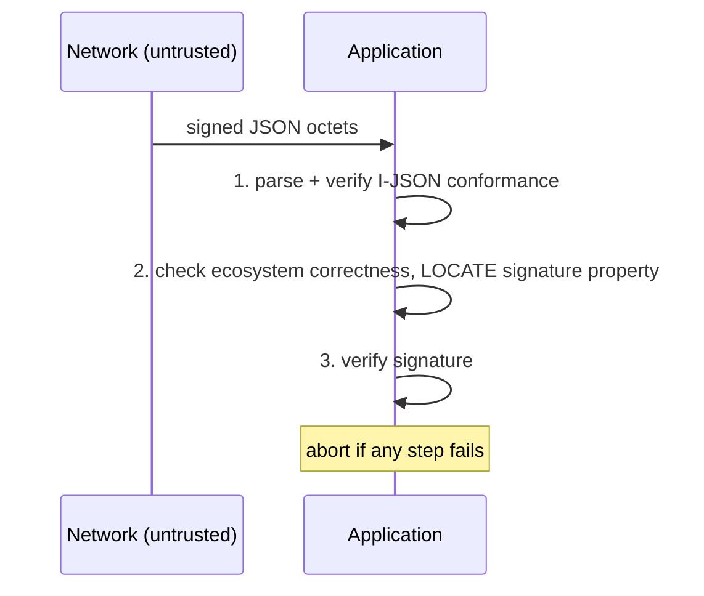
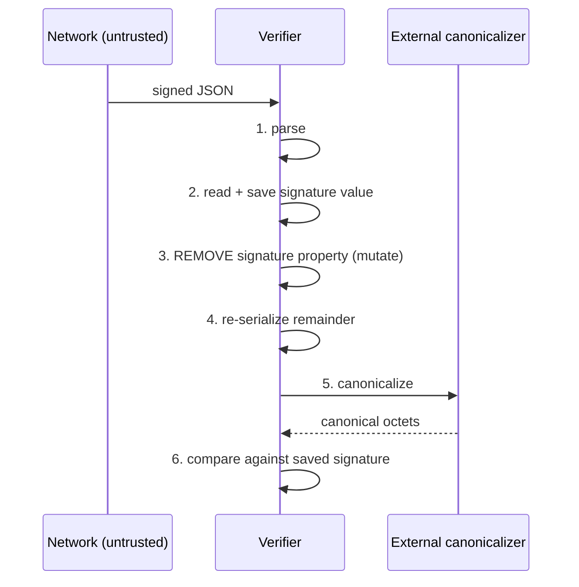

# RFC 8785 — procedural content

**Applicability: PARTIAL, and the partiality is itself the finding.**

RFC 8785 defines no exchange protocol. There are no roles that send each other
messages, no framing, no error signalling between parties, and §4 reads in full
*"This document has no IANA actions."* What it does define is **local
processing order** in two places, and that order is the single most
consequential thing in the document for this project, because it is what
R-O-05 contradicts.

Compare RFC 8949, whose record declares `protocol` not-applicable outright. The
difference is real: RFC 8949 specifies a data format and stops, while RFC 8785
tells an application *when to verify a signature relative to when it parses*.

---

## 1. The one normative procedure — §5

This is the only procedural content carrying a BCP 14 keyword.

> When JCS is applied to signature schemes like the one described in
> Appendix F, applications MUST perform the following operations before acting
> upon received data:
>
> 1.  Parse the JSON data and verify that it adheres to I-JSON.
> 2.  Verify the data for correctness according to the conventions defined by
>     the ecosystem where it is to be used.  This also includes locating the
>     property holding the signature data.
> 3.  Verify the signature.
>
> If any of these steps fail, the operation in progress MUST be aborted.

Roles: a single **application acting on received data**. No counterparty.

**The ordering is the finding.** Steps 1 and 2 run on unauthenticated input,
and step 2 locates the signature property inside that input, before step 3
authenticates anything. Mapped against our documents in `design-notes.md`.

---

## 2. The non-normative procedures — Appendix F

Appendix F carries **no BCP 14 keyword anywhere**, yet §5's MUST cites it
("signature schemes like the one described in Appendix F") and §3's single
RECOMMENDED points at it. That layering — a normative obligation whose referent
is an informative appendix — is recorded as a source defect in
`design-notes.md`.

### 2.1 Signature creation (producer)

> 1.  Create the data to be signed.
> 2.  Serialize the data using existing JSON tools.
> 3.  Let the external canonicalizer process the serialized data and return
>     canonicalized result data.
> 4.  Sign the canonicalized data.
> 5.  Add the resulting signature value to the original JSON data through a
>     designated signature property.
> 6.  Serialize the completed (now signed) JSON object using existing JSON
>     tools.

### 2.2 Signature verification (verifier)

> 1.  Parse the signed JSON data using existing JSON tools.
> 2.  Read and save the signature value from the designated signature property.
> 3.  Remove the signature property from the parsed JSON object.
> 4.  Serialize the remaining JSON data using existing JSON tools.
> 5.  Let the external canonicalizer process the serialized data and return
>     canonicalized result data.
> 6.  Verify that the canonicalized data matches the saved signature value
>     using the algorithm and key used for creating the signature.

**Verification canonicalizes.** Steps 3–5 mutate, re-serialize and
re-canonicalize unauthenticated input before step 6 does any cryptography. This
is the procedure R-O-05 forbids in terms. It is non-normative, so the
contradiction with R-O-05 rests on §5 alone — but Appendix F is what §5 means
by "signature schemes like the one described in Appendix F", and it is the only
worked description of the scheme the document contains.

### 2.3 The signature property is a hole, not a field

The designated signature property is never present while canonicalization runs:
it is added at creation step 5, *after* signing at step 4, and removed at
verification step 3, *before* canonicalizing at step 5. Consequences, derived:

- its **name cannot affect sort order**, so it may be chosen freely;
- the signature input carries **no tag, length, algorithm binding or domain
  separation**. Anything of that kind must live as ordinary properties inside
  the canonicalized object, where it is subject to the same sorting and
  escaping rules as application data.

---

## 3. Error paths

| # | Trigger | Required response | Locator |
|---|---|---|---|
| 1 | Input is not I-JSON | abort | §5 |
| 2 | Ecosystem correctness check fails | abort | §5 |
| 3 | Signature does not verify | abort | §5 |
| 4 | Lone surrogate in string data | "terminate with an appropriate error" | §3.2.2.2 |
| 5 | NaN or Infinity in number data | "terminate with an appropriate error" | §3.2.2.3 |

Errors 4 and 5 are raised by the canonicalizer; 1–3 by the application. No
error is signalled to a counterparty, because there is none. "An appropriate
error" is nowhere specified.

---

## 4. What is absent

No roles beyond producer and verifier, no messages, no transport, no
negotiation, no versioning handshake, no key distribution, no algorithm
agreement — Appendix F leaves the signature property merely "designated" and
names no algorithm identifier, key representation or signature-value encoding.
A profile adopting JCS supplies all of that itself.

`state-machine.yaml` is **not applicable**: there is no lifecycle, no persistent
state, and no transitions. The two procedures above are straight-line
sequences, captured here.
