# rfc-9052 — protocol model

## Framing: procedures, not a wire protocol

RFC 9052 is not a wire protocol. It defines no network exchange: there is no
request, no response, no handshake, no negotiation, no status code, and no
error signalling between parties. What it defines is a family of CBOR
**structures** plus, for each of them, an ordered **procedure** — the steps for
building the canonical byte string that goes into a cryptographic function, and
the steps for checking it again on the other side. Section 1 says as much: the
document contains "The procedures used to build the inputs to the cryptographic
functions required for each of the structures." Section 1.4 makes the point
structurally, defining `Internal_Types = Sig_structure / Enc_structure /
MAC_structure` for "those nonterminals that are used for security computations
but are not emitted for transport" — `Sig_structure`, `Enc_structure` and
`MAC_structure` never appear on any wire.

So every flow in `protocol.yaml` carries `kind: local-procedure`, and in almost
every step `from` and `to` are the same role. That is not a modelling shortcut;
it is the finding. The only genuine hand-offs the document describes are
between an **application** and the COSE layer: the application supplies the
externally supplied authenticated data (§4.3), supplies a detached payload
(§4.1, §6.1), and makes the trust decision about the key and the signing
identity after verification succeeds (§4.4, §12). Those are modelled as
`application -> signer` / `application -> verifier` steps. Whatever carries the
finished `COSE_Sign1` or `COSE_Encrypt` from one machine to another is out of
scope here — the document only says how the object is identified once it
arrives (CBOR tag, `cose-type` media type parameter, or CoAP Content-Format;
§2, Tables 1 and 2).

Two consequences for anyone building from this record:

- **The recipient is a structure, not a party.** `COSE_recipient` is a layer of
  the message that holds an encrypted CEK. The recursion in §5.3 step 5 and
  §5.4 step 5 runs inside the sender, over layers, not across a network.
- **There is no failure protocol.** Where a step can fail, the source usually
  states the check and not the consequence. See
  [What the source leaves unspecified](#what-the-source-leaves-unspecified).

## Roles

Each role name below is one the source itself uses; none is invented for the
model.

| role | where the source names it | what it does here |
|---|---|---|
| `signer` | §4.1 "Signing with One or More Signers"; §4.4 "the signer information (COSE_Signature)" | builds `Sig_structure`, calls the signature creation algorithm |
| `verifier` | §4.4 "The steps for verifying a signature are" | rebuilds `Sig_structure`, calls the signature verification algorithm |
| `sender` | §4.3 "The sender can use the additional-data functionality"; §8.5.2 "a shared secret between the sender and the recipient" | encrypts content, wraps CEKs, computes MACs |
| `recipient` | §5.1 `COSE_recipient`; §3 "Recipients MUST accept both a zero-length byte string and a zero-length map" | decrypts, verifies MACs |
| `application` | §4.3 "the method of constructing the byte array is a function of the application"; §4.4 "the application performs the appropriate checks" | supplies `external_aad` and detached payloads, resolves headers, makes the trust decision |

## Flows

Eleven flows, all `local-procedure`. Step order in each diagram follows the
source's own numbered lists — the `Sig_structure` / `Enc_structure` /
`MAC_structure` field order first, then the "How to …" / "The steps to …"
listing.

### 1. `resolve-header-parameters` — §3, §3.1, §9, §1.5

A shared precondition for every other flow: before any structure can be built,
the two header buckets have to be read and reconciled. This is the one place in
the document with an explicit, mandatory failure outcome.

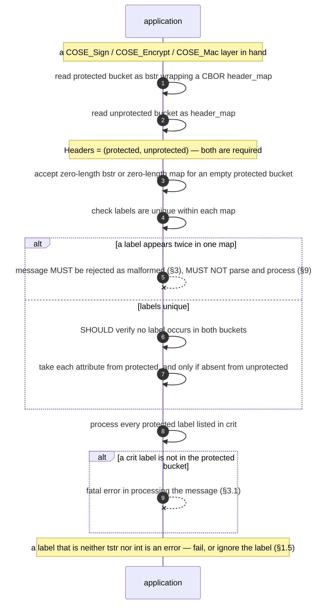

### 2. `sign-cose-sign` — §4.4

Context string `"Signature"`. The `sign_protected` field is present, because
`COSE_Sign` separates body header parameters from per-signature ones.

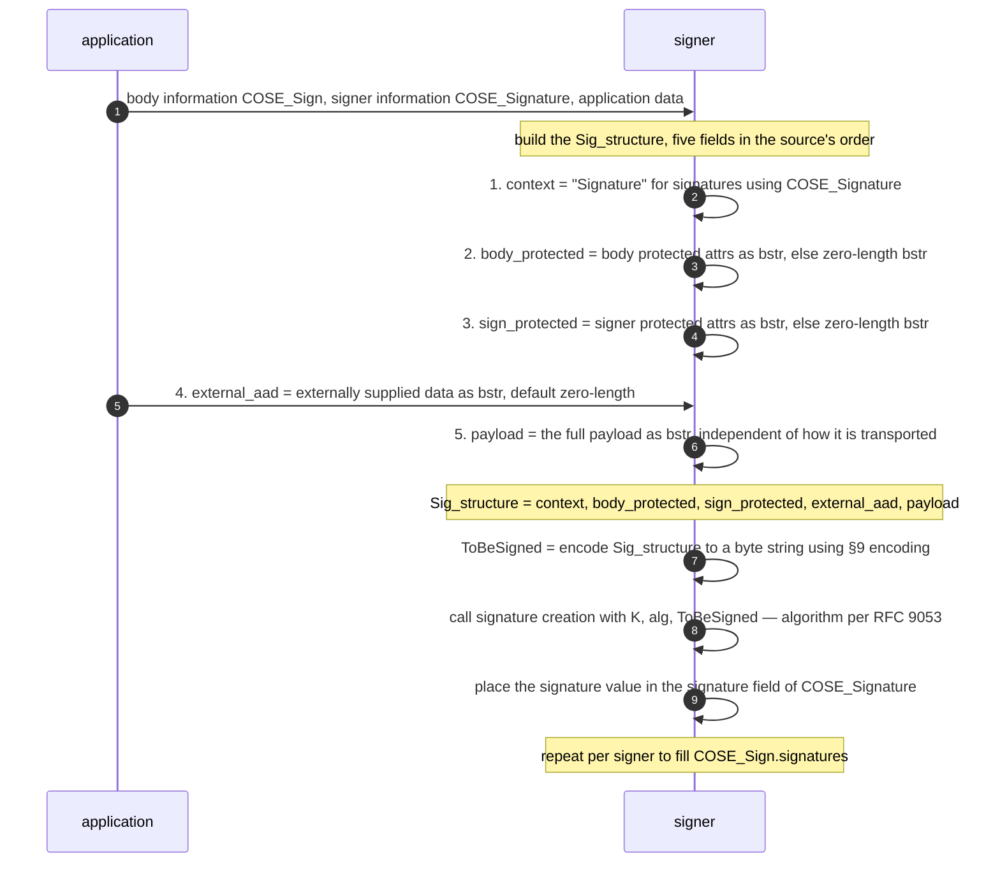

### 3. `sign-cose-sign1` — §4.4

Same procedure, two differences that matter: the context string is
`"Signature1"`, and `sign_protected` is **omitted** rather than set to a
zero-length byte string. Because the context string is inside the signed bytes,
a `COSE_Sign` and a `COSE_Sign1` over the same payload are not
interchangeable — §4 says a converted structure "will fail signature
validation".

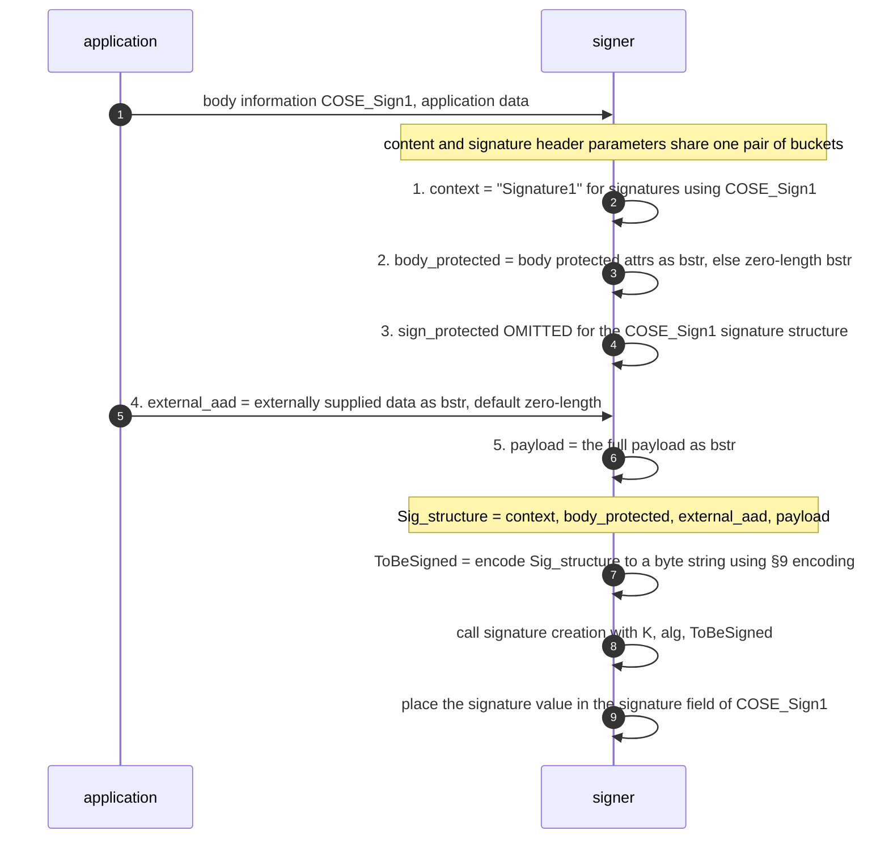

### 4. `verify-cose-sign` — §4.4

Verification is the same construction run again, then one algorithm call. Note
what the source appends after the three numbered steps: an application-level
check that is explicitly *not* part of signature verification.

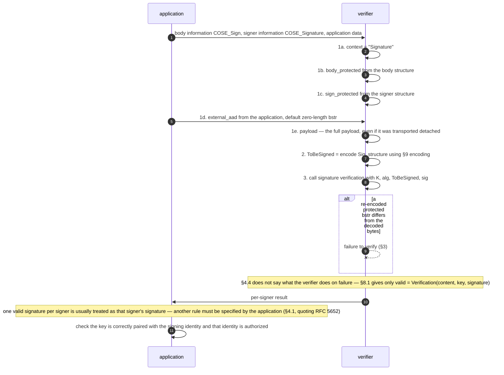

### 5. `verify-cose-sign1` — §4.4

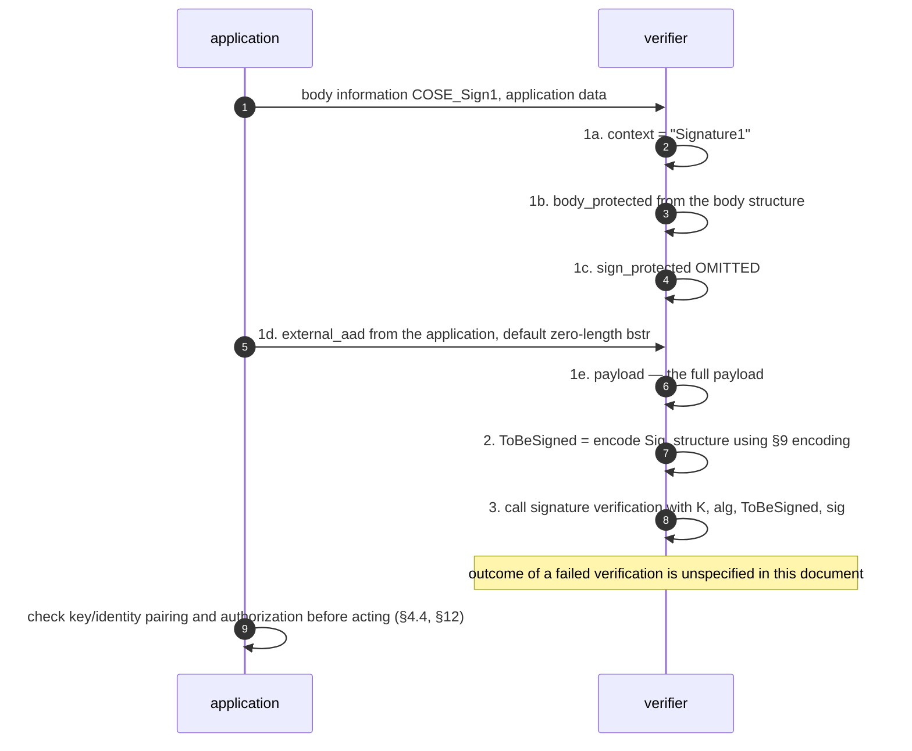

### 6. `encrypt-aead` — §5.3

`Enc_structure` has three fields, not five: there is no signer layer and no
payload, because the plaintext goes to the AEAD function as `P` rather than
into the authenticated-data structure.

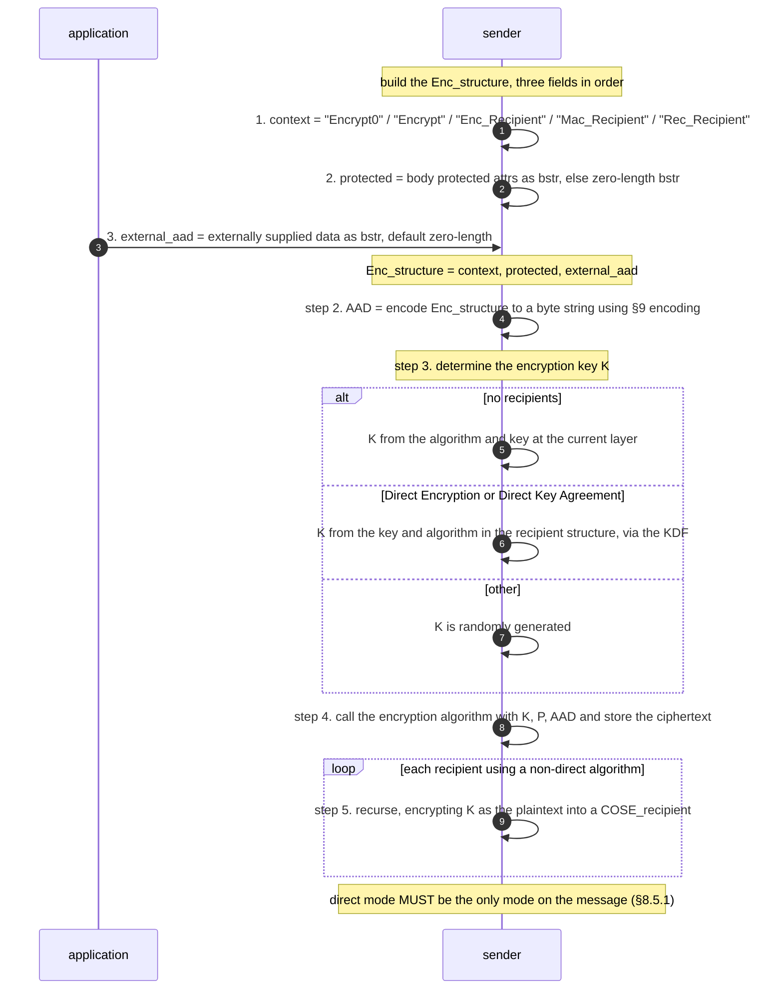

### 7. `decrypt-aead` — §5.3

Symmetric to flow 6, with one real difference: in the `other` case the key is
recovered by decrypting a recipient structure, and that is the one decrypt step
with a stated, mandatory error behaviour.

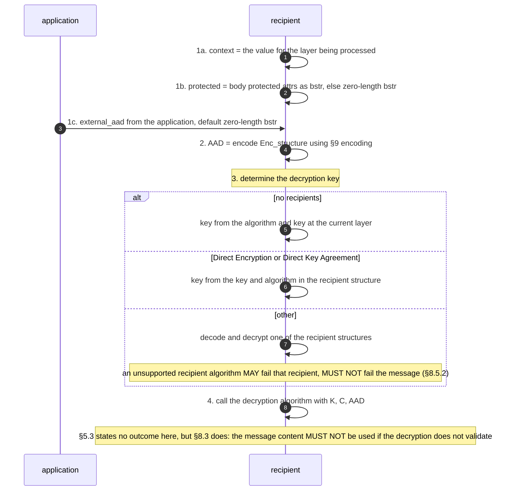

### 8. `encrypt-ae` — §5.4

AE algorithms take no associated data, so this procedure builds **no**
`Enc_structure` at all. Instead its first two steps are assertions that there
is nothing to authenticate alongside the plaintext. In practice this is the key
wrap path (§8.5.2: "All of the currently defined key wrap algorithms for COSE
are AE algorithms").

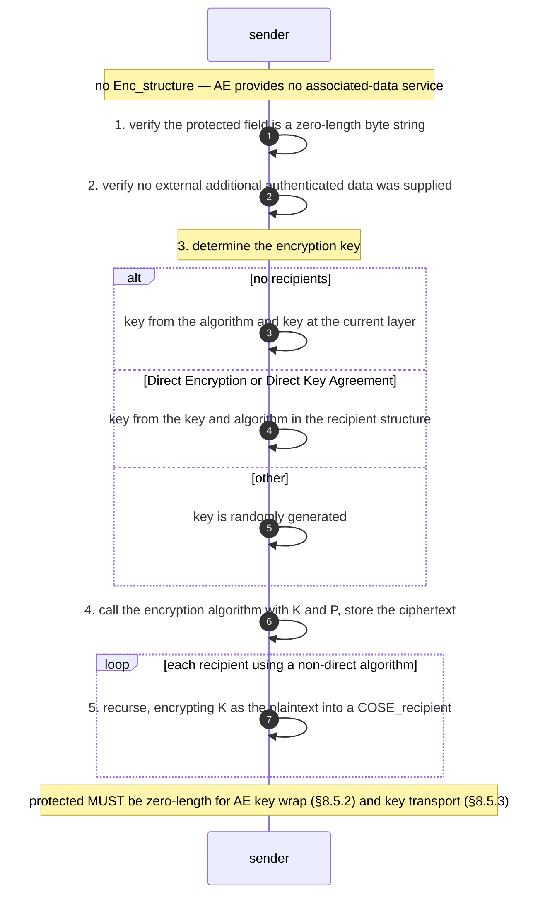

### 9. `decrypt-ae` — §5.4

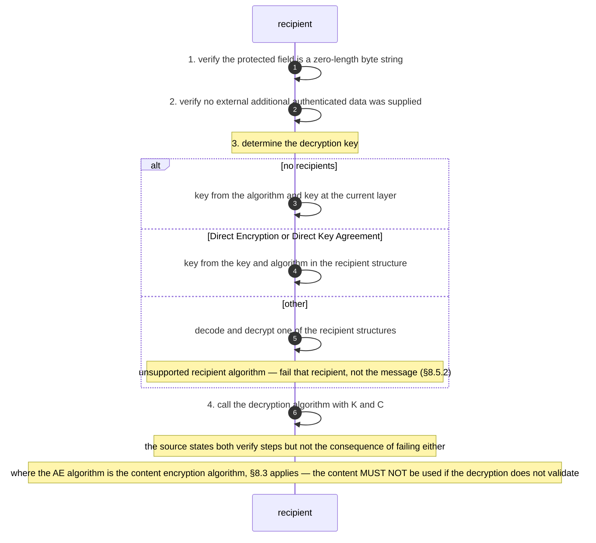

### 10. `mac-compute` — §6.3

`MAC_structure` has four fields: like `Sig_structure` it carries the payload,
and like `Enc_structure` it has no signer layer. A single listing in the source
covers `COSE_Mac` and `COSE_Mac0`, with the difference appearing in the context
string and in the final step.

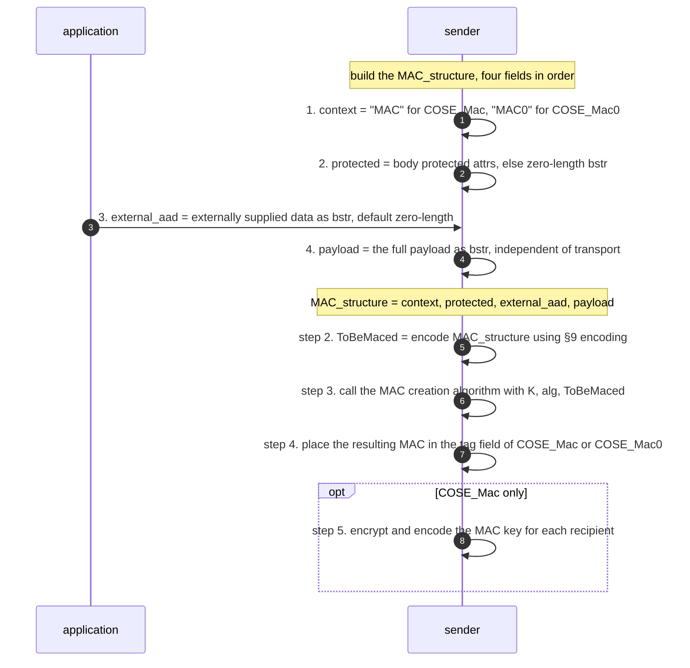

### 11. `mac-verify` — §6.3

Two details of the source's own wording are preserved here rather than tidied
away. First, obtaining the key from a recipient structure is step **3**, after
`ToBeMaced` has been built, not before. Second, step 4 says to call the "MAC
creation algorithm" — not a verification algorithm — and the comparison against
the `tag` field is a separate step 5.

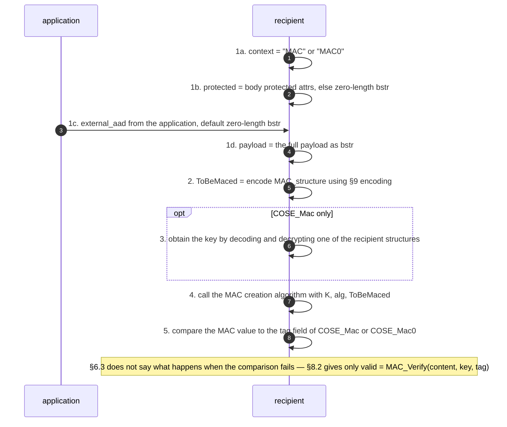

## What the source leaves unspecified

Of 81 steps across the 11 flows, **51** record `on_error: unspecified in this
document`. The cross-check pass adjudicated all of them against
`requirements.yaml` and moved two: the AEAD decryption call (§5.3) and the AE
decryption call (§5.4) had been recorded as unspecified, but §8.3
(`rfc-9052#R-0066`) does state the consequence — "The message content MUST NOT
be used if the decryption does not validate" — so those two now cite it. The
other 51 survive the adjudication: no requirement in the record specifies a
consequence for any of them. The pattern is consistent and worth stating
plainly: **RFC 9052
specifies checks, not consequences.** It tells you to verify the protected
field is zero-length (§5.4), to compare the MAC against the tag (§6.3), to call
the signature verification algorithm (§4.4) — and in none of those cases does
it say what a conforming implementation then does. §8.1 and §8.2 give the
functions as `valid = Verification(message content, key, signature)` and
`valid = MAC_Verify(message content, key, tag)`, but that is the algorithm
taxonomy, not the procedure, and the `valid` result is never threaded back into
the §4.4 or §6.3 step lists.

Five places are exceptions, and they are the only mandatory error behaviour in
the document. Each is carried both as a requirement and in the `on_error` of the
step it governs, and the requirement id is cited there:

| locator | failure | stated outcome | requirement |
|---|---|---|---|
| §3, §9 | the same label used twice as a key in one map | the message **MUST be rejected as malformed**; applications **MUST NOT** parse and process such a message | `R-0012`, `R-0092` |
| §3.1 | `crit` names a label that is not in the protected bucket | "a fatal error in processing the message" | `R-0022` |
| §8.5.2 | a `recipients` field present with an unsupported algorithm | failing that recipient is acceptable; **failing to process the message is not** | `R-0074`, `R-0099` |
| §1.5 | a label that is neither `tstr` nor `int` | an error — the application **may** fail processing **or** ignore the label, but **MUST NOT** create such messages | `R-0002`, `R-0003` |
| §8.3 | a content decryption that does not validate | the message content **MUST NOT** be used | `R-0066` |

Two further failures are described as consequences rather than as required
behaviour: converting between `COSE_Sign` and `COSE_Sign1` "will fail signature
validation" (§4), and a badly behaved intermediary that re-encodes the protected
`bstr` non-identically causes "a failure to verify" (§3). Both are statements
about what will happen, not instructions about what to do.

There is nothing resembling an error code, an error message, a retry rule, or a
way to report failure to a peer — consistent with the framing above. Anything
of that kind belongs to the profiling application (§10), which "need[s] to
determine the set of messages defined in this document that they will be using"
and must define its own external-data encoding and algorithm set.

## Where this document defers

| deferred to | what | locator |
|---|---|---|
| **RFC 9053** (and RFC 8230) | all algorithm rules and procedures — signature, MAC, content encryption, KDF, key wrap and key transport. Every "call the … algorithm" step in the flows above is a call across this boundary. | §1, §5.3, §5.4, §8 |
| **IANA "COSE Header Parameters" registry** | the set of header-parameter labels and their value types beyond the six common ones in §3.1 (`alg`, `crit`, `content type`, `kid`, `IV`, `Partial IV`) | §3, §11.1 |
| **IANA "COSE Algorithms" registry** | the values of `alg` | §3.1 |
| **IANA "COSE Key Common Parameters" / "COSE Key Type Parameters" registries** | key-object parameters beyond `kty`, `kid`, `alg`, `key_ops`, Base IV | §7, §11.2 |
| **IANA "CoAP Content-Formats" and "Media Types" registries** | the values of `content type` | §3.1 |
| **STD 94 (RFC 8949) §4.2.1** | the deterministic encoding requirements that §9 narrows down for `Sig_structure`, `Enc_structure` and `MAC_structure` | §9 |
| **the application / profile** | construction of `external_aad`, transport of a detached payload, whether the algorithm identifier may be implicit, the trust decision on a key, content padding, and any negotiation or discovery | §4.3, §10, §12, Appendix A |
| **RFC 8610 (CDDL)** | the grammar notation. Note the direction of authority: "The CDDL grammar is informational; the prose description is normative" (§1.4) — so the flows above follow the numbered prose, and the CDDL fragments quoted in the notes are illustrative. | §1.4 |

## Limits of this artifact

- **Key objects have no procedure.** §7 defines `COSE_Key` and `COSE_KeySet`
  structurally and states processing rules (each element processed
  independently, a malformed or unrecognised key is ignored), but gives no
  ordered steps, so no flow is modelled for it. That content belongs in
  `messages.yaml` and `requirements.yaml`.
- **The five content key distribution classes** (§5.1.1, §8.5) are modelled
  only as the `alt` branches inside flows 6–9. Their per-class structural
  requirements are requirements, not steps.
- **Countersignatures** are referenced (§3.1 `crit`, Appendix A) but not defined
  in this document.
