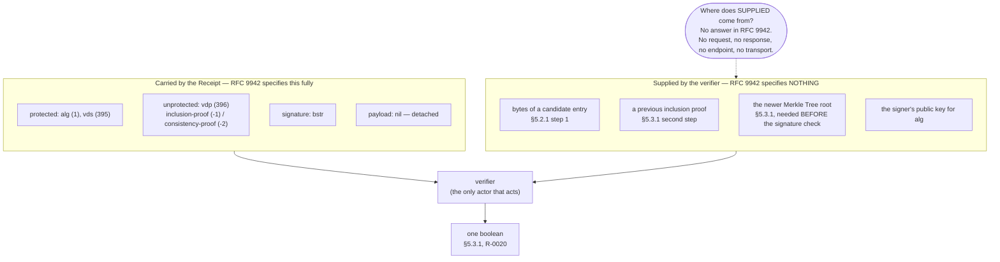

# rfc-9942 — protocol model: **not applicable**

> **Verdict.** RFC 9942 specifies a data format and the local verification
> procedures over it — a Receipt carried in a COSE_Sign1 header — and defines
> no exchange between roles anywhere in its 1033 lines: no request, no
> response, no endpoint, no transport binding and no message any party sends
> another, so the exchange that would carry a Receipt is left to RFC 9943's
> registration model and to SCRAPI, neither of which this document defines.

This file is deliberately not an empty template. An absent protocol is a
finding about the document, and FX-1 (`docs/extraction.md`) allows the
protocol artifact to be declared not applicable "with reason (pure data
formats)" — but only with the reason written down. What follows is the
reason, the evidence, and where the missing exchange actually lives.

The machine-readable form of all of this is `protocol.yaml`, which keeps
`roles: []` and `flows: []` so that a consumer expecting the scaffold shape
still parses.

---

## 1. There is no sequence diagram, and that is the result

FX-1 asks for "a Mermaid sequence diagram" per flow. There are no flows, so
there is no sequence diagram. The diagram below is **not** a protocol. It is a
picture of the hole: what a verifier must already hold before either
verification procedure in this document can start, and where this document
says that material comes from.

Every arrow that would make this a protocol — a party asking another party for
any box in the right-hand group — is the dotted one, and the dotted one is
undefined.

---

## 2. What the document defines instead

| | what | where | our artifact |
|---|---|---|---|
| a data format | three COSE header parameters (`receipts` 394, `vds` 395, `vdp` 396), the CDDL for a COSE_Sign1 carrying Receipts, and the CBOR encodings of RFC9162_SHA256 inclusion and consistency proofs | §2, §4.3, §5.2, §5.3 | `schema/`, `messages.yaml` |
| two local verification procedures | §5.2.1 proof-then-signature; §5.3.1 signature-then-proof — run by one party on bytes it already holds | §5.2.1, §5.3.1 | `state-machine.yaml` |
| envelope carriage, not transport | a Receipt sits in a header of an enclosing COSE envelope; what carries the envelope is never named | §4.3 | — |
| IANA registry procedure | expert-review criteria and registration templates — process between humans and IANA, the only place anything is "requested" of anybody | §8.2 | — |

On carriage, §4.3 (source lines 223–225) is the whole of it:

> This document registers a new COSE header parameter "receipts" (394) to
> enable Receipts to be conveyed in the protected and unprotected headers of
> Enveloped COSE Structures.

"Conveyed in headers." Containment, not transmission. The word *convey* occurs
six times in this document (lines 110, 132, 136, 166, 175, 224) and every one
of them is about conveying data inside a structure, never to a party.

The proofs themselves travel the same way — inside the COSE envelope, in the
unprotected `vdp` map, with the payload detached (`/ payload / null` in both
EDN examples: Figure 6 at source line 547, Figure 9 at source line 659).

---

## 3. The evidence

Case-insensitive search of the full cached source (1033 lines), counted twice:
as a bare substring and with word boundaries. The second column is what
matters, because every nonzero substring count here except one is a false
positive hiding inside a longer word.

| term | substring | word | protocol sense | what the hits actually are |
|---|---:|---:|---:|---|
| HTTP | 18 | 0 | **0** | all `https://` in URLs: 2 in the Copyright Notice (lines 42, 51), 16 in the §9 reference list (lines 900–971) |
| request | 2 | 1 | **0** | line 6, the masthead "Request for Comments: 9942"; line 795, "registration requests" in IANA expert review |
| response | 0 | 0 | **0** | absent |
| endpoint | 0 | 0 | **0** | absent |
| API | 1 | 0 | **0** | the `api` inside "c**api**tals", line 119, BCP 14 boilerplate |
| client | 0 | 0 | **0** | absent |
| server | 0 | 0 | **0** | absent |
| transport | 0 | 0 | **0** | absent — no transport binding of any kind |
| CoAP | 0 | 0 | **0** | absent |
| retrieve | 0 | 0 | **0** | absent |
| fetch | 0 | 0 | **0** | absent |
| discovery | 0 | 0 | **0** | absent |
| status code | 0 | 0 | **0** | absent |
| **protocol** | **0** | **0** | **0** | the word does not appear once in RFC 9942 |
| exchange | 0 | 0 | **0** | absent |
| message | 0 | 0 | **0** | absent |
| send | 0 | 0 | **0** | absent |
| receive | 1 | 0 | **0** | "has received public review", line 36, Status of This Memo |
| session | 0 | 0 | **0** | absent |
| negotiate | 0 | 0 | **0** | absent |
| POST | 2 | 0 | **0** | "**post**al address" in the two IANA registration templates (lines 832, 874) |
| GET | 1 | 1 | **0** | "to **get** sufficient information", line 795, ordinary English |
| URI | 12 | 2 | **0** | ten are the `uri` inside "sec**uri**ty"/"sec**uri**ng"; the two real ones are "home page URI" in the IANA templates (lines 833, 875) |
| URL | 0 | 0 | **0** | absent |
| port | 12 | 0 | **0** | all inside "sup**port**", "sup**port**ed", "**port**ion" — no network port |

**25 terms searched. 17 absent from the document entirely. 0 with any
protocol sense.**

### Three corroborating checks

**The reference list (§9, lines 896–977).** Fourteen references, every one a
data-format, cryptography or IANA-process document: `IANA.cose_header-
parameters`, RFC 2119, RFC 8174, RFC 8610 (CDDL), RFC 8949 (CBOR), RFC 9053
(COSE algorithms), RFC 9162 (Certificate Transparency 2.0), RFC 9596, RFC
9597, STD 96, CBOR-EDN, RFC 7120, RFC 8126, RFC 8392. Not one transport, API
or messaging specification among them.

**References to the SCITT architecture: zero.** The strings `SCITT`, `9943`
and `SCRAPI` do not occur anywhere in RFC 9942. The document that would supply
the exchange is not even cited by the document that defines the receipt.

**Actor nouns exist; sending relations do not.** The document names
"verifier" (6 occurrences), "receipt producer" (1, §6.2), "implementers" (2)
and "transparency service" (2). Not one sentence has one of them as subject
and another as indirect object. The verifier only verifies. The receipt
producer only produces, and is told to perform a privacy analysis
(`rfc-9942#R-0021`). They never meet.

---

## 4. Why there is no single protocol here — the document's own reasons

**It says so in its own statement of scope** (§1, lines 109–111):

> This document describes how to convey VDS and associated VDP types in
> unified Enveloped COSE Structures.

Conveying types in structures is a format problem.

**A Receipt is defined as an object, not as a reply** (§3, lines 165–167):

> Receipt:  A COSE Single Signer Data Object, as defined in RFC 9052 of
> [STD96], containing the header parameters necessary to convey one or more
> VDP for an associated VDS.

Defined by its contents. Nothing about what it answers or who asks.

**It disclaims the thing a protocol is for** (§4.2, lines 216–217):

> Implementers should not expect interoperability across "Verifiable Data
> Structures".

A protocol's purpose is interoperation. This document disclaims interoperation
across the very axis it is extensible along — which is why no single exchange
could be specified here even in principle: what a party would have to send
depends on a VDS this document does not fix.

**It defers the encodings to future specifications** (§4.4.1, lines 421–424;
`rfc-9942#R-0006`, `rfc-9942#R-0007`):

> Each VDS specification applying for inclusion in this registry MUST define
> how to encode the VDS identifier and its Proof Types in CBOR. Each
> specification MUST define how to produce and consume the supported Proof
> Types.

RFC 9942 is an extension point with one worked example (`RFC9162_SHA256`), and
an extension point cannot carry a fixed wire exchange. *(Line-join note: the
wrap between "CBOR." and "Each" falls on a sentence boundary, so this span
carries one space there rather than the source's usual two — the same
convention `requirements.yaml` records.)*

**Even the verification is scoped to one VDS** (§5.3.1, lines 674–676):

> This approach is specific to RFC9162_SHA256; different VDSs may not support
> consistency proofs.

A future VDS may have no consistency notion at all, so there is no procedure
here that a general protocol could wrap.

---

## 5. Where the exchange lives instead

**`rfc-9943` — "An Architecture for Trustworthy and Transparent Digital Supply
Chains"** (held; already linked from this record's `relations.see_also`). The
SCITT architecture carries the Registration flow in which an Issuer submits a
Signed Statement to a Transparency Service and gets a Receipt back, and the
roles — Issuer, Transparency Service, Relying Party, Auditor — that RFC 9942
never names. The question *who gives the verifier the candidate entry, the
previous inclusion proof and the detached newer root?* is answerable there and
unanswerable here.

**`draft-ietf-scitt-scrapi` — "SCITT Reference APIs (SCRAPI)"** (held). The
HTTP binding: endpoints, methods, status codes, the concrete request and
response shapes by which a Receipt is actually asked for and returned. This is
the artifact that would fill `flows`. It is a **draft**, not a standard;
nothing in RFC 9942 depends on it and nothing in it is normative for an
RFC 9942 implementation.

---

## 6. What this means for us

An implementation of RFC 9942 alone is a **library, not a participant**. It
can produce and check bytes; it cannot obtain them.

Each of the three verifier-supplied inputs that `state-machine.yaml` records —
the candidate entry bytes (§5.2.1), the previous inclusion proof (§5.3.1) and
the detached newer Merkle Tree root (§5.3.1) — is a hole this document leaves
for a protocol to fill. If we define our own carriage rather than adopting
SCRAPI, those three are exactly what it has to supply, and the binding between
the supplied root and the proof's `tree-size-2` is ours to specify, because
RFC 9942 does not.

Across this record's artifact set, `messages.yaml` carries real content (the
structures), `state-machine.yaml` carries real content (the procedures), and
protocol is empty. That split is the honest shape of the document, and it
should not be papered over by inventing a flow.
