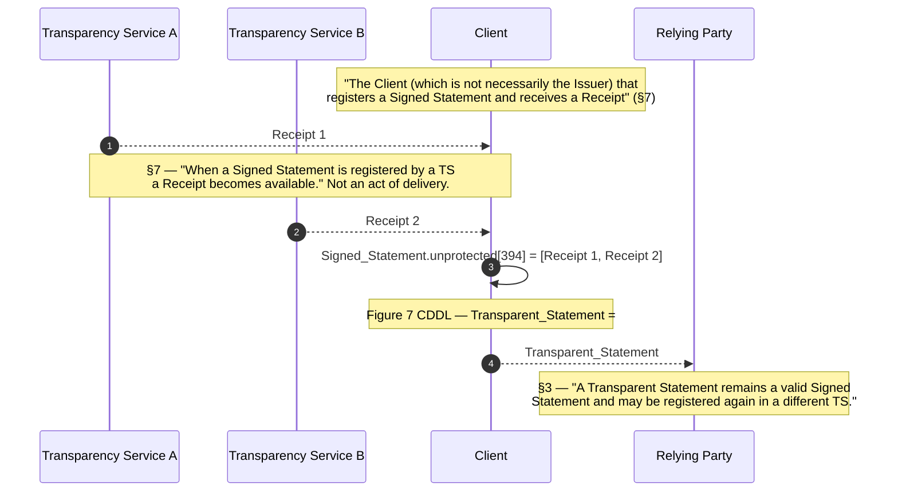
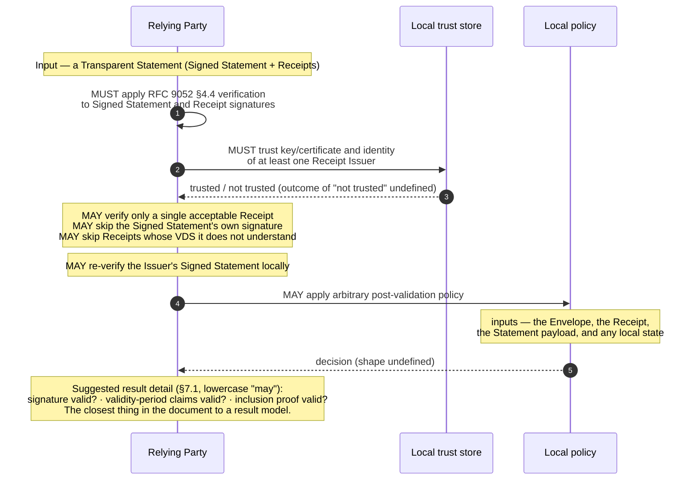

# RFC 9943 — protocol model

Five flows: the §5 information flow, §6.3 registration, §7 Transparent
Statement assembly, §7.1 validation, and §5.1.2 bootstrapping. Structured form
in `protocol.yaml`; this file is the readable rendering.

Two things to carry into every diagram below.

**There is no transport.** RFC 9943 registers two media types
(`application/scitt-statement+cose`, `application/scitt-receipt+cose`, §10.1
and §10.2) and two CoAP Content-Format numbers (277 and 278, §10.3). That is
the entire treatment of the wire. No HTTP or CoAP method, path, request or
response appears anywhere in the document, so every arrow below is a logical
exchange, not an operation an implementer can code against.

**There are no error paths.** Every normative statement in §6.3 and §7.1 is an
obligation with no else-branch. The document says what a TS and a Relying Party
MUST check and never what follows from a check that does not pass. See
[No error paths](#no-error-paths) at the foot of this file for the search
evidence.

---

## 1. Information flow — §5, Figure 2

**This is not a message sequence.** The source says so directly, in the line
immediately above Figure 2:

> The arrows indicate the flow of information.

Figure 2 is a concept diagram. It shows no ordering, no request/response
pairing, no transport and no party-to-party protocol. The sequence below exists
only because this artifact's required form is a sequence diagram; its ordering
is the reading order of §5's bullet list, not an ordering RFC 9943 asserts.

```mermaid
sequenceDiagram
  autonumber
  participant A as Artifact
  participant I as Issuer
  participant TS1 as Transparency Service A
  participant TS2 as Transparency Service B
  participant C as Client
  participant RP as Relying Party

  Note over A,RP: Information flow (RFC 9943 §5, Figure 2) — not a wire protocol.<br/>Arrows are "the flow of information"; no ordering is normative.

  A-->>I: Artifact, described by a Statement
  Note right of I: §3 — a Statement is "any serializable<br/>information about an Artifact"
  I->>I: sign Statement into a Signed Statement (COSE_Sign1)
  I->>TS1: Signed_Statement
  I->>TS2: Signed_Statement
  Note over I,TS2: §5 — "a single Signed Statement MAY be registered<br/>with one or more TS"
  TS1-->>C: Receipt 1
  TS2-->>C: Receipt 2
  C->>C: assemble Transparent_Statement<br/>(Receipts into the unprotected header, label 394)
  Note over C: §5 — "Each TS produces a Receipt, which may be<br/>aggregated in a single Transparent Statement"
  C-->>RP: Transparent_Statement
  Note over RP: Three consumption modes (§5):<br/>1. collect Receipts for subsequent registration<br/>2. verify — analysis of Statements about Artifacts<br/>3. replay the log — consistency and correctness of the TS's VDS (auditing)
```

The three Relying Party boxes in Figure 2 are the three bullets of §5, verbatim:

> - collect Receipts of Signed Statements for subsequent registration of
>   Transparent Statements;
> - retrieve Transparent Statements for analysis of Statements about Artifacts
>   themselves (e.g., verification);
> - or replay all the Transparent Statements to check for the consistency and
>   correctness of the TS's VDS (e.g., auditing).

The third is the Auditor, which §3 defines as "an example of a specialized
Relying Party".

How a Transparent Statement reaches a Relying Party is not in the document.
§1 scopes it out: "How these statements are managed or stored as well as how
participating entities discover and notify each other of changes is out of
scope of this document."

---

## 2. Registration — §6.3

> To register a Signed Statement, the TS performs the following steps:

```mermaid
sequenceDiagram
  autonumber
  participant C as Client
  participant TS as Transparency Service
  participant VDS as Verifiable Data Structure

  rect rgb(240,240,240)
  Note over C,TS: Step 1 — Client Authentication<br/>"implementation specific and out of scope of the SCITT architecture"
  C->>TS: authenticate (no message, no credential type, no failure response defined)
  end

  C->>TS: Signed_Statement

  rect rgb(240,240,240)
  Note over TS: Step 2 — Verification and Validation<br/>MUST verify per RFC 9052 §4.4 · MUST resolve Issuer key per RFC 9360<br/>MUST check required protected headers · MAY validate the payload
  TS->>TS: verify COSE_Sign1 signature
  end

  rect rgb(240,240,240)
  Note over TS: Step 3 — Apply Registration Policy<br/>MUST check required attributes are present in the protected headers<br/>(plus the mandatory checks of §5.1.1.1)
  TS->>TS: evaluate policy over the entire Envelope and current TS state
  end

  rect rgb(240,240,240)
  Note over TS,VDS: Step 4 — "Register the Signed Statement"<br/>a bare heading; the RFC gives this step NO body text at all
  TS->>TS: empty the unprotected header (MUST, before the Statement Sequence)
  TS->>VDS: append the Signed Statement
  VDS-->>TS: registered (registration time = when the TS added it to its VDS, §7)
  end

  rect rgb(240,240,240)
  Note over TS,C: Step 5 — Return the Receipt<br/>MAY be asynchronous · TS MUST be able to provide a Receipt<br/>for all registered Signed Statements
  TS-->>C: Receipt
  end

  Note over TS,VDS: MUST register before releasing the Receipt (§6.3).<br/>Steps 4 and 5 may be shared across a batch (§6.3).
  Note over C,VDS: No arrow in this diagram has a defined failure counterpart.<br/>The RFC defines none.
```

### The five steps, with their normative text

**1 · Client Authentication** — no BCP 14 keyword at all.

> A Client authenticates with the TS before registering Signed Statements on
> behalf of one or more Issuers. Authentication and authorization are
> implementation specific and out of scope of the SCITT architecture.

Explicitly out of scope. No credential type, no challenge, no token format, and
no binding between the authenticated Client and the Issuer identity inside the
Signed Statement. §7 widens the gap: "Client applications MAY request Receipts
regardless of the identity of the Issuer of the associated Signed Statement."

**2 · TS Signed Statement Verification and Validation** — three MUSTs, one MAY.

> The TS MUST perform signature verification per Section 4.4 of RFC 9052
> [STD96] and MUST verify the signature of the Signed Statement with the
> signature algorithm and verification key of the Issuer per [RFC9360]. The TS
> MUST also check that the Signed Statement includes the required protected
> headers. The TS MAY validate the Signed Statement payload in order to enforce
> domain-specific registration policies that apply to specific content types.

"The required protected headers" is not enumerated here. §6 supplies it — the
protected header MUST include the CWT Claims header parameter (RFC 9597 §2),
whose value MUST include the Issuer Claim (label 1) and the Subject Claim
(label 2) — and Figure 3's CDDL confirms that `CWT_Claims` (15) is the only
non-optional entry in `Protected_Header`. Payload validation is a MAY, so the
payload is opaque to a conforming TS by default (§3: "The Statement is
considered opaque to TS and MAY be encrypted.").

**3 · Apply Registration Policy** — one MUST.

> The TS MUST check the attributes required by a Registration Policy are
> present in the protected headers. Custom Signed Statements are evaluated
> given the current TS state and the entire Envelope and may use information
> contained in the attributes of named policies.

§5.1.1.1's mandatory Registration checks apply here too: the TS MUST
syntactically check the Issuer by verifying the COSE signature per STD96; the
Issuer identity MUST be bound by an identifier in the protected header; if
several identifiers are present, all registered by the TS MUST be checked; the
TS MUST maintain trust anchors and MUST authenticate Signed Statements as part
of a Registration Policy; for X.509 it MUST build and validate a complete
certification path to a registered root; and "The TS MUST apply the
Registration Policy that was most recently committed to the VDS at the time of
Registration."

**4 · Register the Signed Statement** — *this is the whole step.*

The RFC gives it one line — the heading — and no body text. The step that
commits the statement to the Verifiable Data Structure is the least specified
step in the procedure. What it means has to be assembled from four places
elsewhere in the document: §3's definition of Registration ("adding to the
VDS"), §7's "The Registration time is recorded as the timestamp when the TS
added the Signed Statement to its VDS", §5.1.3's append-only / non-equivocation
/ replayability requirements on the VDS, and §6.3's own trailing sentence that
the unprotected header MUST be emptied first. None of those describes an
operation. There is no duplicate-detection rule, no idempotency rule, and no
behaviour for a TS that cannot commit.

**5 · Return the Receipt** — one MAY, one MUST.

> This MAY be asynchronous from Registration. The TS MUST be able to provide a
> Receipt for all registered Signed Statements. Details about generating
> Receipts are described in Section 7.

The MUST is a *capability* obligation — "MUST be able to provide" — not a
delivery obligation. Combined with the MAY it permits a TS that never pushes a
Receipt, so long as one can be obtained. §4 adds that Receipt production is
repeatable and non-deterministic: "Requesting a Receipt can result in the
production of a new Receipt for the same Signed Statement. A Receipt's
verification key, signing algorithm, validity period, header parameters or
other claims MAY change each time a Receipt is produced."

### The four rules stated after the numbered list

> The last two steps may be shared between a batch of Signed Statements
> registered in the VDS.

Lowercase "may". No batch message, no size bound, no partial-batch semantics,
no statement of whether a batch commits atomically.

> A TS MUST ensure that a Signed Statement is registered before releasing its
> Receipt.

The single ordering obligation in the flow. An imperative sentence, not a state
transition.

> A TS MAY accept a Signed Statement with content in its unprotected header and
> MAY use values from that unprotected header during verification and
> registration policy evaluation.

Policy input from bytes the Issuer did not sign.

> However, the unprotected header of a Signed Statement MUST be set to an empty
> map before the Signed Statement can be included in a Statement Sequence.

What is registered is not byte-identical to what was submitted. The RFC does
not say who performs the emptying, nor how a verifier reconstructs the
registered form from a Transparent Statement whose unprotected header now
carries Receipts at label 394.

---

## 3. Transparent Statement assembly — §7



Two MAYs govern who may do this:

> Client applications MAY register Signed Statements on behalf of one or more
> Issuers. Client applications MAY request Receipts regardless of the identity
> of the Issuer of the associated Signed Statement.

No rule governs a Receipt that does not correspond to the Signed Statement it
is attached to, nor a Receipt array holding a Receipt from an unknown TS. §7.1
instead leaves the Relying Party free to ignore such entries.

---

## 4. Validation — §7.1

Two MUSTs, four MAYs. Every MAY lets the Relying Party do less work.



The two obligations:

> Relying Parties MUST apply the verification process as described in Section
> 4.4 of RFC 9052 [STD96] when checking the signature of Signed Statements and
> Receipts.

> A Relying Party MUST trust the verification key or certificate and the
> associated identity of at least one Issuer of a Receipt.

The permissions to do less — note that one sentence carries three separate
omissions:

> A Relying Party MAY decide to verify only a single Receipt that is acceptable
> to them and not check the signature on the Signed Statement or Receipts that
> rely on VDSs they do not understand.

A conforming Relying Party may therefore accept a Transparent Statement without
ever checking the Issuer's signature. And:

> Relying Parties MAY be configured to re-verify the Issuer's Signed Statement
> locally.

> In addition, Relying Parties MAY apply arbitrary validation policies after
> the Transparent Statement has been verified and validated. Such policies may
> use as input all information in the Envelope, the Receipt, and the Statement
> payload, as well as any local state.

"Arbitrary" is the RFC's own word. Unlike the TS's Registration Policy, which
§5.1.1.1 requires to be made Transparent, nothing requires these policies to be
published or constrained.

### The result model that almost exists

> APIs exposing verification logic for Transparent Statements may provide more
> details than a single boolean result. For example, an API may indicate if the
> signature on the Receipt or Signed Statement is valid, if Claims related to
> the validity period are valid, or if the inclusion proof in the Receipt is
> valid.

Three components:

| component | source phrasing |
|---|---|
| signature | "the signature on the Receipt or Signed Statement is valid" |
| validity period | "Claims related to the validity period are valid" |
| inclusion proof | "the inclusion proof in the Receipt is valid" |

This is the closest the document comes to a result model, and it is a lowercase
"may" applied to an API RFC 9943 does not define. The components have no names,
no encoding, no enumeration of the values each can take, and no rule for how
they combine into a decision. All three are phrased as "is valid" — it is a
richer *success* report, not a failure taxonomy. An implementer cannot build an
interoperable verifier result from this sentence.

---

## 5. Bootstrapping — §5.1.2, ranked in §9.4.3

The mandatory Registration checks presuppose a Registration Policy already
registered on the VDS, and registering it would require the checks. §5.1.2
breaks that circle:

> Since the mandatory Registration checks rely on having registered Signed
> Statements for the Registration Policy and trust anchors, TSs MUST support at
> least one of the three following bootstrapping mechanisms:
>
> - Preconfigured Registration Policy and trust anchors;
> - Acceptance of a first Signed Statement whose payload is a valid
>   Registration Policy, without performing Registration checks; or
> - An out-of-band authenticated management interface.

```mermaid
sequenceDiagram
  autonumber
  participant OP as TS operator
  participant C as Client
  participant TS as Transparency Service
  participant VDS as Verifiable Data Structure

  Note over OP,VDS: MUST support at least ONE of the three (§5.1.2)

  rect rgb(240,240,240)
  Note over OP,TS: Mechanism 1 — preconfigured policy and trust anchors<br/>§9.4.3 — "unsuitable for use in long-lived service deployments"<br/>where the values cannot be updated
  OP->>TS: preconfigure (no message, no format, no integrity rule defined)
  end

  rect rgb(240,240,240)
  Note over C,VDS: Mechanism 2 — first Signed Statement carrying a policy<br/>§9.4.3 — PREFERABLE (auditable without implementation-specific knowledge)
  C->>TS: Signed_Statement (payload = a Registration Policy)
  Note over TS: accepted "without performing Registration checks"
  TS->>VDS: register the policy
  end

  rect rgb(240,240,240)
  Note over OP,TS: Mechanism 3 — out-of-band authenticated management interface<br/>§9.4.3 — unranked; allows updates but is not audit-transparent
  OP->>TS: manage (interface, authentication and operations all undefined)
  end
```

§9.4.3's ranking, verbatim:

> Bootstrapping mechanisms that solely rely on Statement registration to set and
> update registration policy can be audited without additional
> implementation-specific knowledge; therefore, they are preferable. Mechanisms
> that rely on preconfigured values and do not allow updates are unsuitable for
> use in long-lived service deployments in which the ability to patch a
> potentially faulty policy is essential.

So: **mechanism 2 is preferable**, **mechanism 1 is unsuitable for long-lived
deployments** in its no-update form, and **mechanism 3 is not ranked** — by
§9.4.3's own reasoning it allows updates but cannot be audited without
implementation-specific knowledge.

Mechanism 2 carries the sharpest unstated risk in the document. The first
statement is accepted "without performing Registration checks", and the RFC
defines no authentication for it, no window in which it is accepted, no rule
that only one such statement may be accepted, and no behaviour if the payload
turns out not to be a valid Registration Policy. "Valid" is asserted, never
defined. It also requires the TS to read the payload, which §3 elsewhere
declares "opaque to TS".

---

## No error paths

The searches below were run over the full cached source (1772 lines).
Counts are occurrences of the term, not matching lines.

| term | occurrences | where | is it an error path? |
|---|---|---|---|
| `reject` | 1 | §9.4.2 | No — key-compromise prose |
| `error` | 0 | — | — |
| `fail` | 1 | §2.1 | No — problem-statement prose |
| `invalid` | 0 | — | — |
| `retry` | 0 | — | — |
| `abort` | 0 | — | — |
| `status` | 2 | RFC boilerplate (lines 29, 39) | No — not in the technical body |
| `pending` | 0 | — | — |
| `submitted` | 1 | §9.2 | No — an ordinary verb |

The two substantive hits, verbatim:

> It is important for Issuers and TSs to clearly communicate when keys are
> compromised so that Signed Statements can be rejected by TSs or Receipts can
> be ignored by Relying Parties. *(§9.4.2)*

> For instance, digital signatures may fail to verify past their expiry date
> even though the signed item itself remains completely valid. *(§2.1)*

Neither is a protocol response. Also searched and absent: HTTP, response,
status code, timeout, queue, deny, decline, unsuccessful, idempotent — zero
occurrences each. `refuse` appears once, in §9.3 ("Issuers can refuse to
register their Statements with a TS"), describing Issuer discretion.
`successful` appears once, in §5 ("producing Receipts upon successful
Registration") — the only place the document acknowledges that Registration has
outcomes, and it names only the good one.

**Conclusion.** RFC 9943 has no failure taxonomy, no error codes, no rejection
response, no retry rule and no idempotency rule. Concretely, an implementer
cannot answer any of these from the document:

- What does a TS return when a signature fails to verify, when the Issuer key
  cannot be resolved per RFC 9360, or when a required protected header is
  missing?
- What does a TS return when the Registration Policy check fails?
- How does a Client learn that a Receipt is coming later, and how does it learn
  that one will never come?
- What happens when the same Signed Statement is registered twice — one VDS
  entry or two, one Receipt or two?
- What does a Relying Party do when verification fails, or when it trusts none
  of the Receipt issuers?

This is the document's largest implementability hole. It is recorded here
rather than smoothed over, and every `on_error` field in `protocol.yaml` states
exactly where the source is silent.

Four scope exclusions account for part of it, and are worth quoting because
they are deliberate rather than accidental:

> How these statements are managed or stored as well as how participating
> entities discover and notify each other of changes is out of scope of this
> document. *(§1)*

> Authentication and authorization are implementation specific and out of scope
> of the SCITT architecture. *(§6.3, step 1)*

> Revocation strategies for compromised keys are out of scope for this
> document. *(§9.4.2)*

> Key discovery protocols are out of scope of this document. *(§6)*
