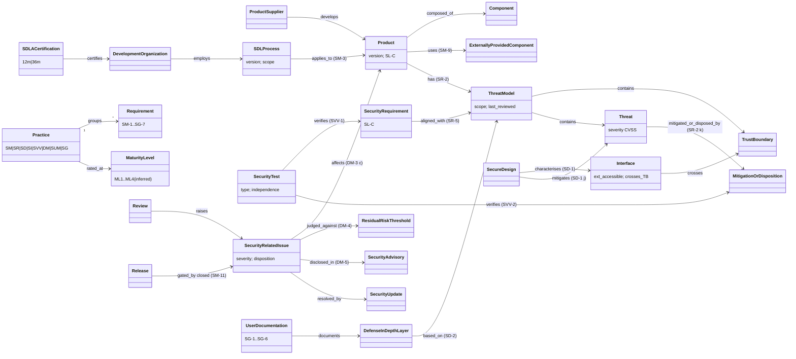

# IEC 62443-4-1:2018 — object model (what the standard assumes)

Object-model pass over the free material only (IEC preview + iTeh sample terms + the requirement text
reproduced in ISASecure SDLA-312 v6.3; SDLA-300 for certification). 54 objects, 38 edges, 10 gaps — full
list with locators in `object-model.yaml`. Anything resting on the unread Clause 4 (maturity model) is
`kind: inferred`.

The single most useful finding: **SR-2's threat-model characteristics a)–m) are a DFD schema**
(information flow with classification, trust boundaries, processes, data stores, external entities,
protocols, physical/debug ports, attack vectors, threats with CVSS severity, mitigations/dispositions,
external dependencies). A 62443-4-1 conformant threat model is therefore a tmodel instance, and SR-2 k)
("mitigations and/or dispositions for each threat") is the R-042 "every threat has an approved
mitigation" check — with a *disposition* escape hatch tmodel does not yet model.

## Gaps against tmodel (summary — see `object-model.yaml` `gaps`)

1. Graded conformance (ML1–ML4 per practice) — R-042 is pass/fail today.
2. Two requirement kinds: SDL process requirement vs product security requirement (SR-3/SR-4, SL-C).
3. Threat *disposition* (defer with reason/risk; accept below residual-risk threshold) beside mitigation.
4. Interface object with SD-1's attribute set; hardware/debug-port attack surface.
5. Tester-independence level on evidence; SM-5 tailoring justification; issue lifecycle; update objects;
   external certification as an attestation distinct from an internal Review.
