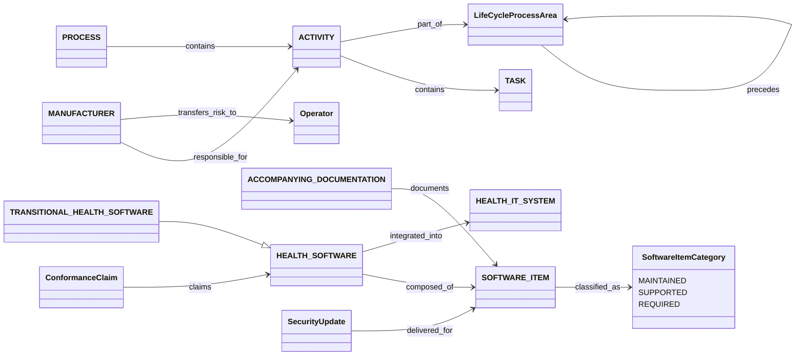

# IEC 81001-5-1 object model (from the free preview only)

The machine form is `object-model.yaml`: 24 objects and 20 edges. Four items (2 objects, 2 edges) are inferred from
ToC titles, because Clause 3 and Clauses 4-9 were not readable.

## Findings

1. **The support class of a component determines the manufacturer's duties.** ISH1:2025 Table 1 nests
   MAINTAINED ⊂ SUPPORTED ⊂ REQUIRED:
   - only MAINTAINED items get manufacturer security updates with verifiable integrity (6.3.2, 6.3.3);
   - SUPPORTED items get update documentation (6.3.1);
   - all three need risk management (5.2.3).

   Downgrading an item's category must trigger a re-evaluation of risk transfer. This is a small state machine on
   Component that tmodel lacks (see `state-machine.yaml`).
2. **Risk transfer is a first-class relation** from manufacturer to operator, carried by accompanying documentation.
   The FDA guidance (§V.A risk transfer) and the CRA (Annex II) have the same idea.
3. **Activity → process area → IEC 62304 ordering** gives a ready-made canonical phase line (Figure 2) for
   medical software. Gates fit between the 5.x process areas.
4. **The mapping to 62443-4-1 is partial.** 81001-5-1 is "derived from" 62443-4-1 but "not necessarily a sufficient
   condition" for conforming to it (0.3). R-044 `maps_to` therefore needs a strength attribute. BSI TR-03185 makes
   the same distinction.
