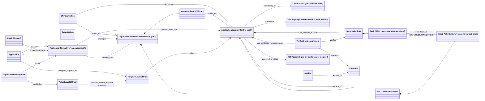

# ISO/IEC 27034 object model (object-model pass)

The single question for this pass: **which entity types and edges does ISO/IEC 27034 assume or
define?** `object-model.yaml` is the data: 45 objects and 37 edges, each with a locator and a
`kind`. Only 1 edge is `inferred`. Most objects are located in other parts of the series (2, 3,
5, 7, DIS 4) or in the free TS 27034-5-1 XSD, because only the preview of 27034-1 itself could be
read. 27034-1 defines just two of them verbatim in what we read: `actor` (3.1) and `Actual Level of
Trust` (3.2). It names the rest in its Introduction and ToC.

## Core graph

## Findings that matter for tmodel

1. **The ASC is a self-verifying control.** One versioned, signed object binds *why* (the
   requirements addressed, each with a context and a source), *what/where/who/how much/how/when*
   (the security activity), the *verification measurement*, which has the same six facets, and the
   *levels of trust* for which it is mandatory. tmodel splits these across `Requirement`,
   `MitigationInstance` and a verification that has no type yet. 27034 is the strongest argument
   for giving `MitigationInstance` a typed `VerificationProcedure` that produces `Evidence`
   (R-042).
2. **Level of Trust is the gate currency.** A Targeted Level of Trust selects the required ASCs.
   The audit establishes the Actual Level of Trust (3.2). By §0.4.4 an application "cannot be
   declared secure" until the auditor agrees the evidence shows the target was reached. That is the
   R-041 exit criterion and the R-042 conformance predicate in one sentence.
3. **ONF vs ANF = catalogue vs instantiation.** This is DEC-009's generic→product mapping, lifted
   from threats and mitigations to the whole SDL. The organization holds a governed, approved
   library (the ONF, which has an owner, iterations and audits). Each application gets a derived
   ANF holding the ASCs its Targeted LoT selects.
4. **The life cycle is two-dimensional.** The ASLC Reference Model is a grid: layer (management,
   supply, infrastructure, audit) × stage (provisioning, operation) × activity area × sub-area ×
   activity label. The organization's own SDL is *mapped* onto it ("MAP APPLICATION LIFE CYCLES
   USED IN THE ORGANIZATION TO THE REFERENCE MODEL"). This is the canonical-phase-plus-local-name
   pattern DL-0009 asks for. tmodel's single ordered `LifecyclePhase` enum is coarser.
5. **Controls have their own lifecycle with staged, signed approvals.** The XSD's
   `life-cycle-stage` runs CREATION_REQUEST → … → ACTIVE → EXPIRED, and each `approval-stage`
   records an approver and an e-signature. That is a governed-view pattern (R-043) applied to a
   single control.

See `state-machine.yaml` for the ASC lifecycle and the application-assurance lifecycle (mostly
inferred transitions), and `design-notes.md` for adopt / adapt / reject.
