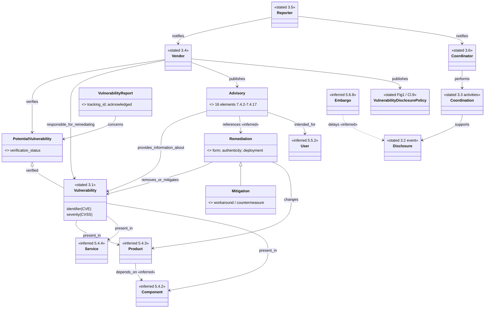

# ISO/IEC 29147:2018 — object model (free preview)

Machine form: `object-model.yaml` (20 objects, 19 edges, 6 gaps). Solid boxes are **stated**
(Clause 3 definitions, Figure 1, visible text); objects known only from a clause heading are
**inferred** and marked `«inferred»`.

## Findings

1. **Roles, not organisations.** Vendor, reporter and coordinator are defined by what a party
   *does* (remediates / notifies / coordinates), and Note 1 to 3.5 says anyone — including a vendor or
   a coordinator — can be a reporter. This confirms ARCH-0001 §2b's choice: relational roles are
   edges on one `Party`, never node types.
2. **Potential → verified is an acceptance gate.** The whole standard pair pivots on "Vulnerability
   verified?" (Figure 1). In tmodel this is the reified `Assertion` (a report) receiving a `Review`
   (verification verdict) — the same AI-proposes/human-accepts spine of ARCH-0001 §4.
3. **Remediation ⊃ mitigation.** 29147 defines remediation as a change that removes *or mitigates*,
   with workarounds/countermeasures as mitigations. tmodel's `MitigationInstance` is the general
   class; a remediation is `kind: technical`, an advisory telling users a workaround is
   `kind: documentation` (R-040).
4. **The advisory is a governed, versioned document** with a revision history (§7.4.16) and terms of
   use — exactly R-043's governed view, and its 16 elements are a ready-made field list (see
   `messages.yaml`) that OASIS CSAF renders as JSON.
