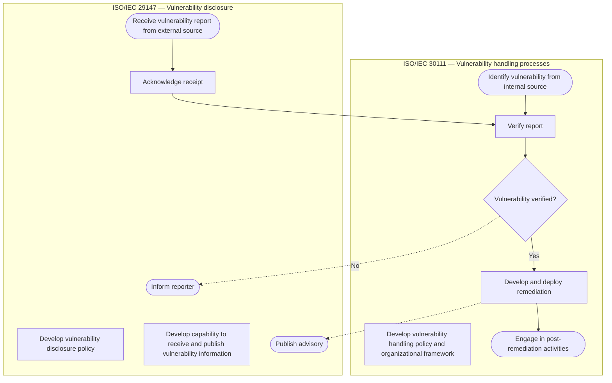
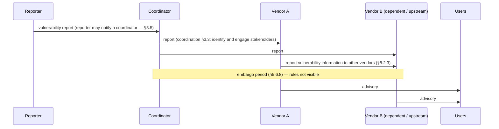

# ISO/IEC 29147 ↔ 30111 — disclosure protocol (from Figure 1 + Contents)

Machine form: `protocol.yaml`. **Provenance:** flows F0–F2 are drawn in Figure 1 (§5.3.1, the
same figure as ISO/IEC 30111:2019 §5.1) and are `stated`; F3–F4 are reconstructed from **clause
headings only** (bodies paywalled) and are `inferred-from-heading`. No deadline, embargo length or
message field rule is visible in the free preview, so none is drawn.

## Figure 1, transcribed

Two swim lanes. Left: **ISO/IEC 29147 Vulnerability disclosure** (the vendor's interface with the
outside world). Right: **ISO/IEC 30111 Vulnerability handling processes** (internal).



Solid arrows are control flow; the two **dashed** arrows (H4 → Inform reporter, H5 → Publish
advisory) are the points where the internal handling process emits something across the vendor
boundary. The **solid** D4 → H3 arrow is the single intake hand-off. The two preparation boxes (D1,
D2, H1) have no arrows: they are prerequisites, and §5.2 recommends policy before intake.

## F1 — external report (stated)

```mermaid
sequenceDiagram
  participant R as Reporter
  participant V as Vendor (PSIRT)
  participant U as User
  Note over V: F0: disclosure policy + intake/publish capability exist (§5.2: policy first)
  R->>V: vulnerability report (§6.2; contents §9.3.2 / Annex B — not visible)
  V-->>R: acknowledge receipt (§6.2.5)
  V->>V: verify report (30111 §7.1.4)
  alt not verified
    V-->>R: inform reporter (terminal)
  else verified
    loop on-going communication (§6.5 — inferred)
      V-->>R: status update
    end
    V->>V: develop and deploy remediation (30111 §7.1.5–7.1.6)
    V->>U: publish advisory (Clause 7) + remediation (§7.8)
    V->>V: engage in post-remediation activities (30111 §7.1.7)
  end
```

## F4 — coordinated, multi-party (inferred from headings)



## What the full text would add (not available)

Acknowledgement content and timing (§6.2.5), report tracking (§6.2.4), initial assessment and
further investigation (§6.3–6.4), operational security (§6.7), advisory publication timing (§7.3),
advisory communication/format/authenticity (§7.5–7.7), remediation authenticity and deployment
(§7.8.2–7.8.3), coordination rules (Clause 8), the required policy element "preferred contact
mechanism" (§9.2.2) and the recommended/optional policy elements (§9.3–9.4).
