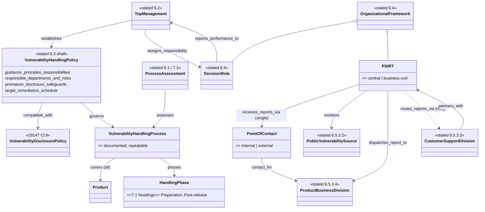

# ISO/IEC 30111:2019 — object model (free preview)

Machine form: `object-model.yaml` (18 objects, 19 edges, 5 gaps). 30111 imports 29147's terms
(Clause 3), so the vulnerability/reporter/advisory objects live in
`iso-iec-29147-2018/distilled/object-model.yaml`; this model adds the organisation (Clause 6, fully
visible) and the handling phases (Clause 7, headings only — see `state-machine.yaml`).

## Findings

1. **One hard requirement is a document.** The single visible `shall` on the vendor (§6.3) is to
   develop and maintain an internal vulnerability handling policy — a governed, maintained document
   (R-043) whose presence and contents (a)–d)) a conformance check (R-042) can test mechanically.
2. **The policy carries a remediation SLA.** §6.3 d) "a target schedule for remediation
   development" gives a mitigation planned-date that ARCH-0001 §5's `MitigationInstance` lacks.
3. **Organisation is a graph, not a role list.** PSIRT ⊂ vendor, per-product divisions with contacts,
   support routing — Parties with `part_of` and `contact_for` edges that ARCH-0001 §2b does not yet have.
4. **Handling feeds the SDL back.** §6.1 points root-cause analysis back into secure development
   (ISO/IEC 27034): a loop from the response phase to design/implementation, which an ordered gate line
   (R-041) alone does not express.
