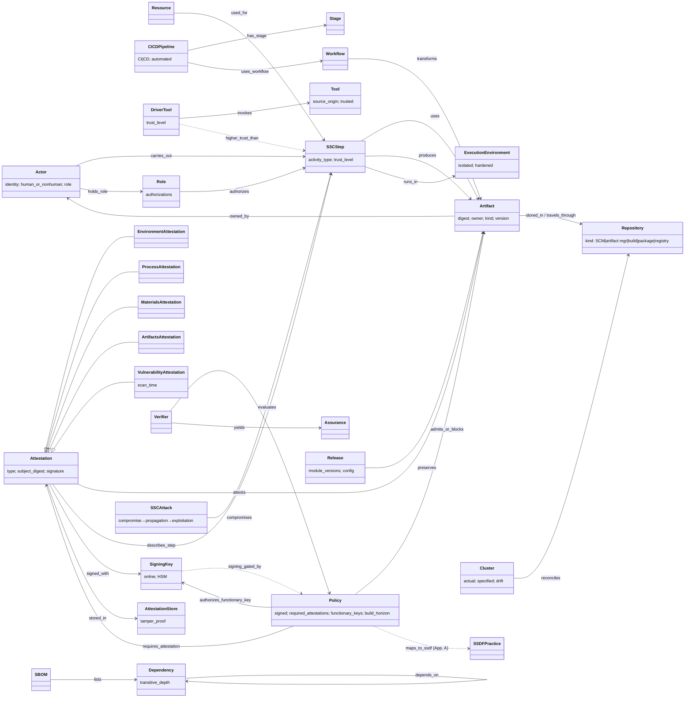

# SP 800-204D — object model

`object-model.yaml` is the machine form: 62 objects and 45 edges, each with a locator. One edge
(`maps_to_ssdf`) is inferred; the rest are stated. The document's own model is **Figure 1**: an SSC
is a chain of **Steps**. An **Actor**, human or not, *carries out* a Step. A Step *uses*
**Artifacts** and **Resources** and *produces* Artifacts. Everything else adds to that core.

## Findings for the tmodel object model

1. **Fig. 1 *is* PROV-O.** Step = `prov:Activity`, Actor = `prov:Agent` (including software agents,
   fn 1), uses/produces = `used`/`wasGeneratedBy`. ARCH-0001 §4 already uses PROV-O as its node
   model, so the 204D supply-chain model fits the same spine. The only open question is ADR-0001's
   split: is this custody provenance (deferred to radar) or something a conformance check reads?
2. **The signed Policy is the Gate's exit criterion.** 204D's Policy is "a signed document that
   encodes the requirements for an artifact to be validated". A Verifier evaluates it against stored
   attestations and gets an allow/block answer. That is the automatable check DL-0009 R-041/R-042
   describes. What 204D adds is that the criteria document is *signed*, names *which keys* may
   produce evidence, and depends on *time* (scan recency, build horizon).
3. **Attestation needs a type the model does not yet have.** It has four stated subtypes
   (environment, process, materials, artifacts) plus vulnerability-finding attestations and VSAs.
   It is not the §4 epistemic `Assertion`. See `gaps` in the YAML.
4. **Trust is ordered, not only zoned.** Driver tools run at higher trust than the steps they
   invoke, and the attestor at higher trust than the build. ARCH-0001 `TrustBoundary` models
   membership of a zone, not a ranking between zones.
5. **Separation of duties is a constraint on Review:** merge approvers cannot approve their own
   merges, and reviewers must be other developers.
