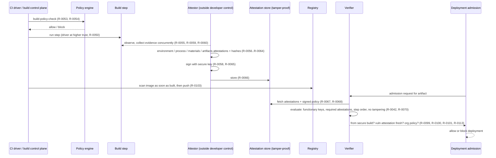

# SP 800-204D — interaction flows

**Derived, not a wire protocol.** SP 800-204D names no messages and puts attestation/SBOM formats
out of scope (§1.2, §6). The four flows below put the steps it does state into order; every step
cites the requirement ids that constrain it (`protocol.yaml` holds the same data in machine form).
Message names are ours. Where an error path is inferred, `protocol.yaml` marks it `kind: inferred`.

## F1 — Secure build → attest → verify → admit (§5.1.1, §5.2)



Error paths: build blocked by policy (inferred from §5.1.1 task 2); verification fails on a missing
attestation, wrong key or tamper evidence (inferred from §5.1.1); deployment blocked when the image
was not produced by the secure build or lacks a vulnerability attestation (stated, §5.2 DEPLOY-REQ-3,
DEPLOY_REQ-4).

## F2 — Signing gate for software updates (§5.1.3)

```mermaid
sequenceDiagram
    participant SG as Signer (update framework role)
    participant V as Policy check (§5.1.1 policy)
    SG->>V: does artifact pass the build policy? (R-0077, R-0082)
    alt passes
        V-->>SG: yes
        SG->>SG: sign with threshold / multi-key role; online keys in HSM; no online keys for client-trusted roles (R-0079, R-0081, R-0117)
    else fails
        V-->>SG: no — signing refused
    end
```

The source is inconsistent on online keys: §5.1.3 says they "should not be used" for client-trusted
roles (R-0081); Appendix A says "must not" (R-0117). Both are recorded.

## F3 — PULL-PUSH contribution (§3.2.2, §5.1.2, §5.1.4, §5.2)

```mermaid
sequenceDiagram
    participant Dev as Developer / outside contributor
    participant SCM as SCM / repository
    participant CI as CI pipeline
    participant M as Maintainer (write access)
    Dev->>SCM: pull (authenticated, role-consistent, R-0071)
    Dev->>SCM: push / PR — push protection: secrets, identity, signed commits, file names (R-0090..R-0094)
    alt outside contributor to public repo
        SCM->>M: hold CI until approved (or run CI sandboxed, no network/secrets) (R-0075)
        M-->>SCM: approve
    end
    SCM->>CI: run automated checks: tests, linters, integrity, SAST/DAST, SCA incl. transitive (R-0073, R-0086..R-0089)
    SCM-->>M: dependency review of vulnerable versions (R-0098)
    M->>SCM: code review by another developer; no self-approval; merge (R-0032, R-0071)
```

## F4 — GitOps release and drift reconciliation (§5.2.1)

```mermaid
sequenceDiagram
    participant Dev as Developer
    participant Git as Git repository (source of truth)
    participant G as GitOps controller (e.g., Argo CD, Flux)
    participant C as Cluster
    participant Adm as Administrator
    Dev->>Git: commit config/code change (no manual runtime change, R-0108)
    G->>C: release; package manager preserves release data (R-0107)
    loop drift monitoring (R-0109)
        G->>Git: pull specified state
        G->>C: compare actual vs specified
        alt drift
            G->>C: auto-resync (administrator's choice)
            G->>Adm: notification → manual remediation
        end
    end
```
