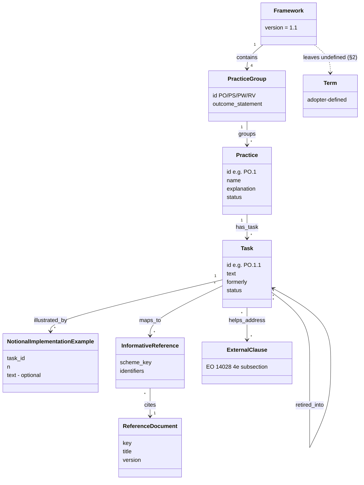
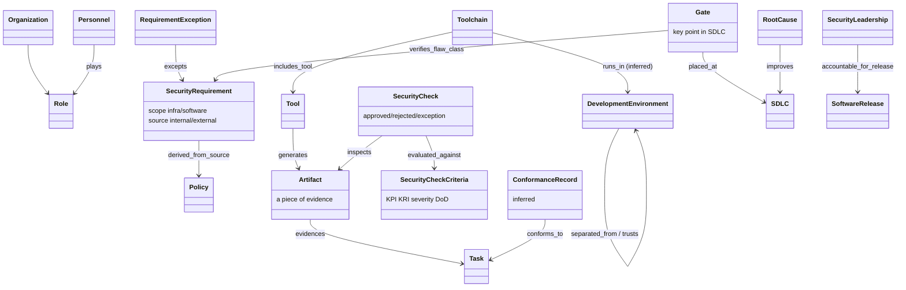
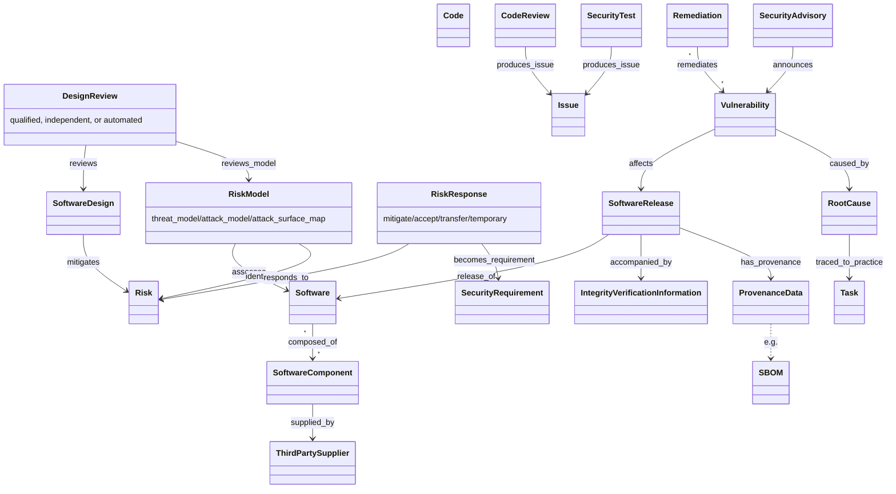

# SSDF 1.1 — object model

Object-model pass: the source was re-read for one question — *what entity types and edges does
the SSDF assume or define?* The machine form is `object-model.yaml` (82 objects, 82 edges, 9 gaps;
1 inferred object and 2 inferred edges). Each object and edge has a locator. This page shows the
backbone in three diagrams.

## 1. Framework layer: how the SSDF is built

## 2. Producer side: governance, toolchain, environment, evidence, gates

## 3. Product side: software, design, verification, release, response

## Findings

1. **The SSDF has two requirement tiers.** The first is the framework *Task* (what the SDL must
   do). The second is the product *SecurityRequirement* (PO.1.2, PW.1.2: what the software must
   meet). A conformance engine (R-042) needs both. A Task such as PW.2.1 is satisfied by a
   DesignReview, made by an independent reviewer, which shows that every product
   SecurityRequirement and identified Risk was addressed.
2. **The threat model enters at PW.1.1 and is approved at PW.2.1.** The independent reviewer
   reviews both the design and the risk model (PW.2.1/E2). This is the R-043 "governed view with
   approval" pattern, stated by the source.
3. **There is a feedback loop that tmodel does not have.** A Vulnerability has a RootCause
   (RV.3.1). That RootCause can be a Task not followed (RV.3.2), and it leads to an SDLC update
   (RV.3.4). Separately, a RiskResponse becomes a SecurityRequirement (PW.1.2/E1).
4. **The SSDF names gates but does not order them.** PO.1.2/E2 is the only place gates appear,
   and §2 denies any implied sequence. The criteria (PO.4.1) and recorded check outcomes
   (PO.4.1/E5) are rich, so they map well onto Gate exit criteria. The gate order has to come
   from somewhere else.
5. **Responsibility can be split across Parties per Task.** Under the §1 shared-responsibility
   agreement, providers attest to their part. This needs a Party→Requirement edge that tmodel
   lacks.
