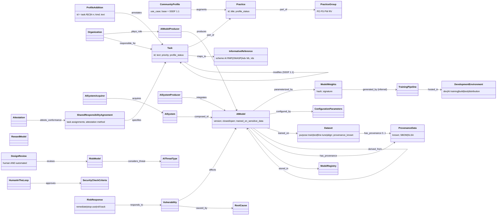

# SP 800-218A object model

The authoritative version is `object-model.yaml`: 62 objects (61 stated, 1 inferred) and
52 edges (50 stated, 2 inferred), each with a locator. This page is a reading aid. The
diagram shows the main structure, not every edge.

The source assumes three layers.

1. **The framework layer.** CommunityProfile → PracticeGroup → Practice → Task → R/C/N
   ProfileAddition, plus InformativeReference. Priority and ProfileStatus hang on the
   (Profile, Task) membership, not on the task.
2. **The AI artifact layer.** These are new compared with SSDF 1.1: AIModel and its
   separately protected parts (ModelWeights, ConfigurationParameters, RewardModel,
   AdaptationLayer), Dataset by purpose, AdversarialSample, ModelInputOutput,
   TrainingPipeline and ModelRegistry inside a DevelopmentEnvironment.
3. **The party layer.** AI model producer, AI system producer, AI system acquirer and
   user, joined by a SharedResponsibilityAgreement that assigns tasks and attestation.

## What the pass found

- **A threat model is SSDF work product PW.1.1.** 218A requires AI threat types in it
  (PW.1.1.R1 names seven) and asks for re-modelling for future versions and derivatives
  (PW.1.1.C1). This is the direct conformance hook for tmodel (R-042).
- **Responsibility is distributed.** The SharedResponsibilityAgreement (§2) is the only
  structure in the SSDF family that assigns tasks to *different* organizations. tmodel
  has no Party→Requirement responsibility edge.
- **Profile membership carries attributes.** Priority and ProfileStatus belong to the
  pair (Profile, Task). A Requirement node alone cannot hold them; an overlay edge can.
- **Provenance can be explicitly unknown.** PW.3.2 asks the organization to document
  which data do *not* have known provenance. The absence of an edge has to be
  representable, which is a gap in an open-world graph.
- **The model is both code and data.** AIModel, ModelWeights and Dataset get code-style
  protection (PS.1), and the provenance runs back through TrainingPipeline. The
  boundary that tmodel's §0 one-artifact rule assumes is blurred here (§1 says so
  explicitly).

The full gap list is in `object-model.yaml`.
