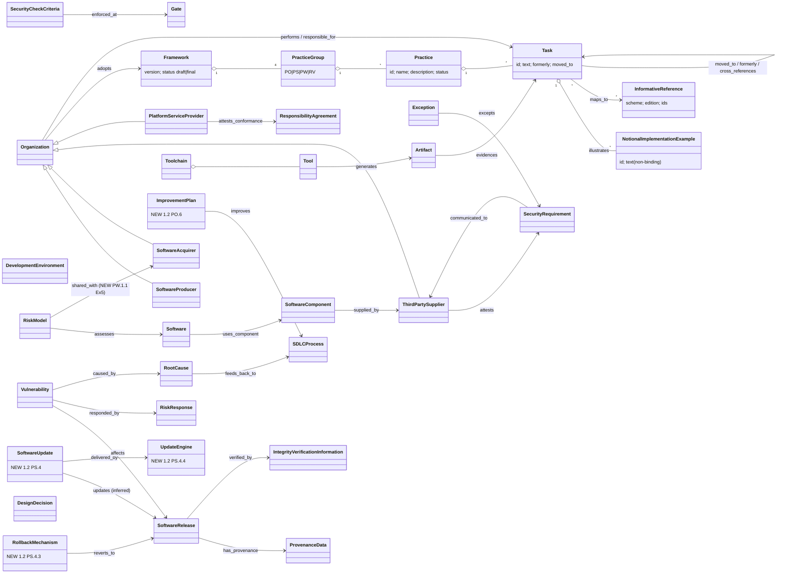

# SSDF 1.2 (IPD) — object model

The source of truth is `object-model.yaml`: 86 objects and 104 edges, each with a locator. Three are inferred: two objects (CommunityProfile; ConformanceRecord, ported) and three edges (SoftwareUpdate `updates` SoftwareRelease; Toolchain `runs_in` DevelopmentEnvironment and ConformanceRecord `conforms_to` Task, both ported). The other objects and edges are stated. Objects new in 1.2 are flagged `new_in_1_2`. 32 objects and 48 edges were ported from the `sp-800-218` model by the verify pass (2026-10-02) after checking that every cited id carries the same concept in the 1.2 IPD. The diagram below shows the backbone of the lane-A model and leaves out the leaf objects and the ported ones.

## Findings

1. **There are two kinds of requirement.** An SSDF *Task* is a process requirement on the producer, and this is what conformance is checked against. A producer's own *SecurityRequirement* (PO.1.1 and PO.1.2) is a product requirement on its software. In DL-0009 R-042 both are a single `Requirement`, so tmodel needs a `level` or `kind` field that separates them.
2. **Examples are not obligations.** §2 says "No examples or combination of examples are required". A NotionalImplementationExample is therefore a template for a MitigationInstance (R-040), not a conformance item.
3. **The table has no gate order.** §2, lines 311–313, says the order "is not intended to imply the sequence of implementation". The only gates are the ones PO.1.2 Ex 2 and PO.4 name. Ordered R-041 gates have to be laid over the SSDF by our own phase mapping.
4. **The new PS.4 practice adds an update lifecycle**: test, then staged or canary roll-out, then rollback to the last known good version, with anti-rollback protection. ARCH-0001 §3b has a maintenance/update phase but has no SoftwareUpdate event or rollback transition.
5. **Responsibility is split per task.** In shared-responsibility platforms, the agreement in §1 (lines 277–280) assigns each practice and task to a party, and each party attests to its share. That needs a `responsible_for` edge from Party to Requirement and an attestation Assertion.
