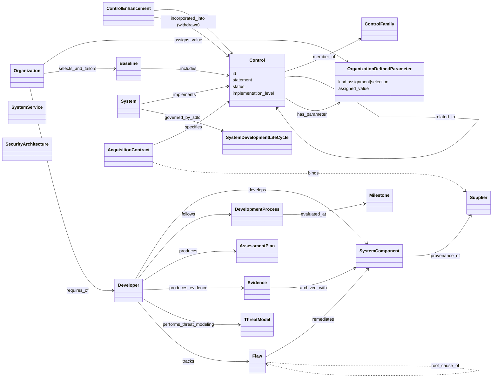

# SP 800-53r5 (SA/SR subset): object model

Generated from `object-model.yaml` (20 objects, 24 edges). The pass covered **only** the in-scope
controls (SA-3, SA-4, SA-8, SA-10, SA-11, SA-15, SA-17, SA-24 with all enhancements, SI-2(7),
SR-1..SR-12 base) and the catalog structure in §2.2–§2.3. Dashed edges are `kind: inferred`.

`SystemService` and `SecurityArchitecture` carry no edges of their own in this pass: the statements
treat "system, system component, or system service" as one disjunctive subject, and SA-17's
architecture is a developer deliverable, not linked by any other in-scope statement.

## Reading notes

- **The developer obligation is an edge, not a class property.** Every SA-10/11/15/17 statement
  reads "Require the developer of the system, system component, or system service to ...": the
  organization (acquirer) imposes the requirement on a developer Party. In ARCH-0001 §2b terms this
  is a relational role (`requires_of`), so one Party can be acquirer for one product and developer
  for another.
- **ODPs make a control checkable.** A control with unassigned `[Assignment: ...]` values cannot be
  evaluated. That is the main gap for R-042: tmodel's `Requirement` needs tailoring parameters.
- **SA-11(2) is a threat-model contract.** It needs contextual information, tools and methods, a
  level of rigor, and evidence that meets acceptance criteria. Those four slots are a usable
  acceptance shape for a tmodel threat-model deliverable at a gate.
- **Milestone (SA-15(1)) is the only gate-like construct** in the in-scope text. It is weaker than
  the DL-0009 Gate: it has no ordering and no entry or exit criteria beyond quality metrics.
