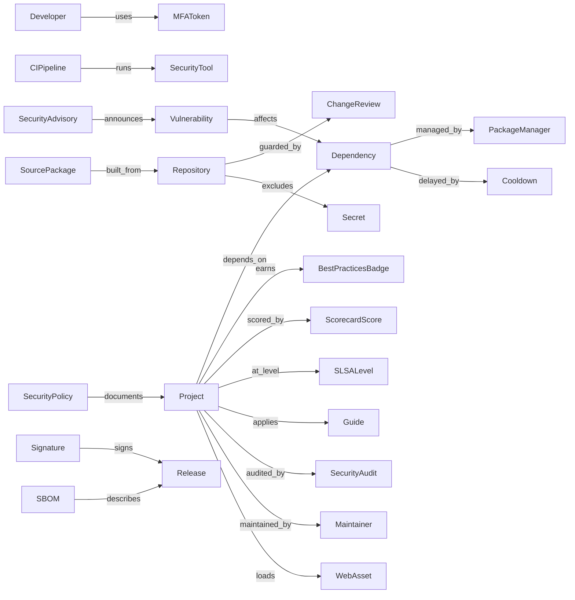

# Concise Guide for Developing More Secure Software — object model

Machine source: `object-model.yaml` (30 objects, 22 edges, 3 gaps; locators are item numbers).

## Findings for tmodel

1. **A checklist of delegations.** Items 14, 15, 17 and 20–22 are satisfied by meeting *another*
   requirement set: the Best Practices badge, Scorecard, SLSA, CNCF, ASVS and SAFECode. A
   crosswalk (R-044) therefore needs an edge from a Requirement to a whole requirement set, as
   well as Requirement ↔ Requirement edges.
2. **Mitigation kinds (R-040).** The items span all three kinds. MFA, signing and pinning are
   technical. The security policy, advisories and SBOM are documentation. Review, cooldown,
   deprecation and succession are process.
3. **No phases or gates.** The guide is unordered, so it supplies requirement content but no SDL
   structure for R-041.
