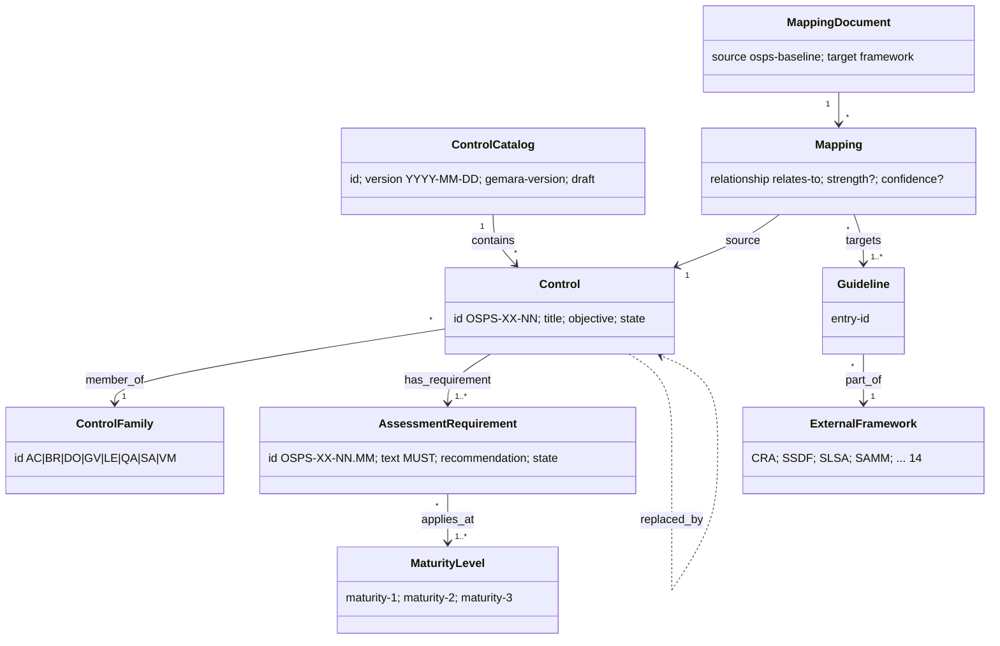
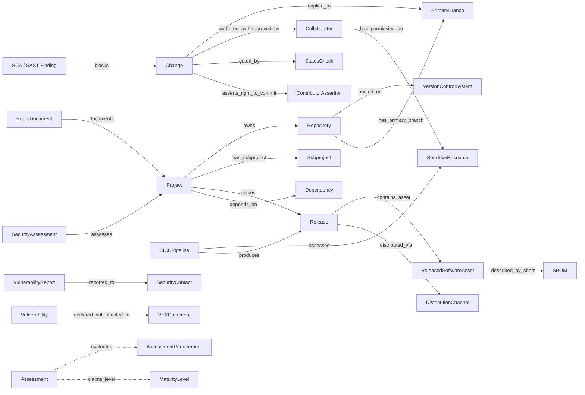

# Object model — OSPS Baseline v2026.08.28

Machine source: `object-model.yaml` (45 objects, 48 edges; 2 objects and 7 edges are `inferred`; the verify pass of 2026-10-02 added VulnerabilityAdvisory and 9 edges that are not yet drawn in the diagrams below).
OSPS has two halves: a **catalog model** it states formally (Gemara Layer 2 CUE schema), and a
**domain model** it assumes through its lexicon and control text — source-control, CI/CD and
release objects that tmodel does not yet have.

## Catalog half (stated in schema)

## Domain half (assumed by the controls)

## Findings

1. **Two grains of requirement.** `Control` (objective, mapping grain) and `AssessmentRequirement`
   (testable MUST, evaluation grain). tmodel's `Requirement` (R-042/R-044) needs both levels and a
   `part_of` between them; crosswalks attach at the coarse grain, conformance checks at the fine one.
2. **Maturity level is a profile, not a gate.** Levels are defined by *who the project is*
   (maintainers, users), not by lifecycle phase. They should not be modelled as DL-0009 `Gate`s;
   they are a conformance *target* a `Product` claims.
3. **Requirements are event-condition rules.** Most ARs start "When …" or (in earlier releases)
   "While active, …": the condition is a model fact (`has_released`, `new collaborator added`)
   that decides applicability. tmodel needs an applicability condition on `Requirement`.
4. **The domain half is the development environment.** ~20 ARs are configuration facts about the
   VCS, the primary branch and the CI pipeline. tmodel has no source-control objects; SLSA's Source
   track assumes the same ones — a shared gap.
5. **Gemara supplies the crosswalk vocabulary R-044 lacks:** typed relationship
   (`implements`/`supports`/`equivalent`/`subsumes`/`relates-to`/`no-match`), strength 1–10,
   confidence-level. OSPS itself only uses `relates-to` with everything else unset.
