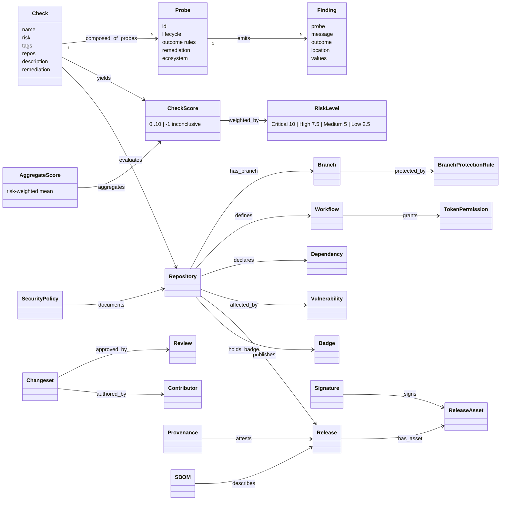

# OpenSSF Scorecard v5.5.0 — object model

Machine source: `object-model.yaml` (32 objects, 29 edges incl. one inferred cross-record edge to openssf-osps-baseline, 5 gaps). Every object and edge
carries a locator into the v5.5.0 tree; `Finding`/`Outcome`/`CheckScore` are stated by the code
(`finding/finding.go`, `checker/check_result.go`), not by the prose check documentation.

## Findings for tmodel

1. **Check → Probe → Finding is a ready conformance-check pattern (R-042).** A check is a graded
   rubric over atomic boolean probes; each probe run emits findings with a six-valued outcome. A
   tmodel `ConformanceCheck` should have the same split: requirement-level result built from
   atomic evidence predicates, each a PROV-generated `Assertion`.
2. **Graded and inconclusive results.** Scores are 0–10 with -1 for "no reliable information";
   probe outcomes include `NotApplicable`, `NotSupported`, `NotAvailable` and `Error`. tmodel's
   pass/fail `Review` cannot hold these.
3. **The aggregate is a view, not truth.** Scorecard's own non-goals say the aggregate "tells you
   nothing about what individual behaviors a repository is or is not doing" — consistent with
   ARCH-0001 §10 (derived presentation, never written back) and R-043.
4. **Presence ≠ verification.** Signed-Releases counts signature and provenance *files*; "The
   check does not verify the signatures." A model of release integrity needs distinct
   `present` and `verified` states (cf. SLSA verification in `slsa-1-2`).
5. **Bots don't review.** Code-Review excludes bot and AI/ML reviews — the same rule as tmodel's
   "AI proposes → a human accepts" gate (ARCH-0001 §4).
