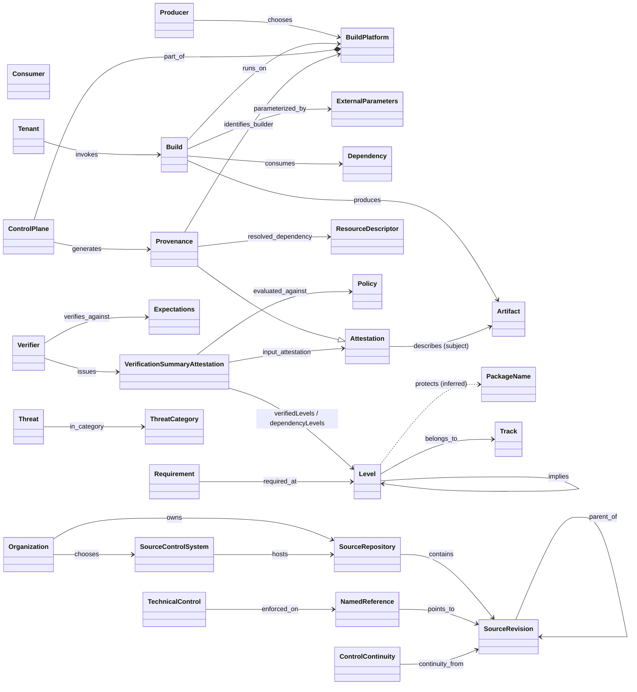

# SLSA v1.2 — object model

Machine source: `object-model.yaml`, with 80 objects, 81 edges and 8 gaps (the verify pass of
2026-10-02 added 25 structural edges — attestation layering, provenance sub-structures, source
roles, NamedReference subtypes, approvals — that are not yet drawn in the diagram below). One
object and three edges are inferred: `ArtifactRelease`, `same_party_as`, Level `protects`
PackageName, and ExampleControl `instance_of` TechnicalControl. Every
entry has a locator (page file + section/anchor) and a `tmodel_mapping`. The diagram shows the
core subset: 38 objects and 31 edges.

`Provenance --|> Attestation` is drawn as specialisation. In the YAML it is the
`Attestation describes Artifact` edge together with Provenance's definition as an attestation
type.

## Findings for tmodel

1. **Two orthogonal structuring axes.** A **Level** belongs to a **Track** and "implies the levels
   below it in the same track". A Level is a cumulative assurance claim about an artifact or
   revision. DL-0009's **Gate** is a time-ordered program step. tmodel needs both, and a Gate's exit
   criterion may name a Level (R-041/R-042).
2. **The VSA is a ready conformance-result node.** It has verifier, time, resource, a pinned policy
   (`uri` + `digest`), input attestations, PASSED/FAILED, verified levels and dependency levels.
   No ARCH-0001 class carries this. It is the strongest R-042 template in lane E.
3. **Expectations and policy are first-class and keyed by package name.** Provenance is evidence,
   expectations are the criterion, and the verifier is the judge. tmodel's Requirement → Evidence →
   Review chain lacks the "expectations bound to a product" node.
4. **A source sub-model tmodel lacks.** SourceRepository, SourceRevision, NamedReference
   (Branch/Tag), Change, ProposedChange, TechnicalControl and ControlContinuity are needed by
   about 87 Source-track requirements. ControlContinuity requires the `valid_from`/`valid_to` time
   axis that ARCH-0001 §3b already lists as missing.
5. **Cryptographic authenticity versus epistemic review.** Attestation, Envelope, Signature and
   SigningKey, with trusted signer–builder pairs (R-0214) and signer–verifier pairs (R-0229), give
   authenticity that tmodel's `Assertion` + `Review` does not model. Per ADR-0001 they stay on the
   radar side and are referenced by digest.
