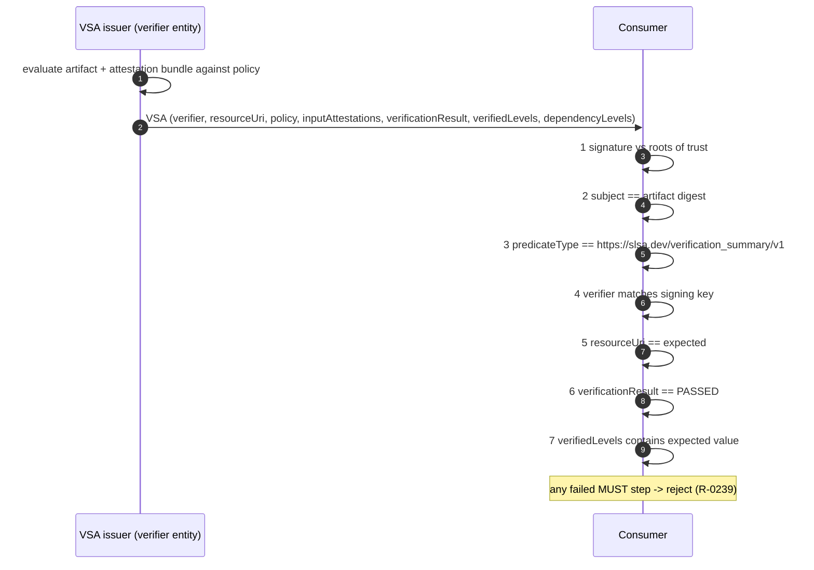

# SLSA v1.2 — flows (human view of `protocol.yaml`)

SLSA defines no wire protocol. It defines who produces, distributes and checks each attestation,
and two explicit, ordered verification procedures (provenance: `verifying-artifacts.md` Steps 1–3;
VSA: `verification_summary.md` "How to verify", 7 MUST steps). Message names refer to
`messages.yaml`; requirement ids to `requirements.yaml`. What happens on failure is left to each
ecosystem ("Each ecosystem … defines exactly how this is implemented, including … what happens on
failure" — `tracks.md`); the rejections shown are the ones SLSA's own threat examples state.

## 1. Build and attest (Build L1–L3)

```mermaid
sequenceDiagram
    autonumber
    participant T as Tenant (untrusted)
    participant CP as Control plane (trusted, L2+)
    participant BE as Build environment
    participant OS as Output storage
    T->>CP: invoke build (externalParameters) [R-0005]
    CP->>BE: init ephemeral, isolated env + initial deps [L3: R-0037..R-0043]
    BE->>BE: tenant-defined steps (may fetch more deps)
    BE-->>CP: outputs (names + digests may be tenant-reported, R-0022)
    CP->>CP: generate provenance-v1 (L2+: from platform data, R-0019/R-0020; L3: every field generated or verified, externalParameters complete, R-0031/R-0034/R-0189)
    CP->>CP: sign (DSSE) with key only the generator can access (R-0017; L3: R-0029/R-0030)
    CP->>OS: artifacts + signed provenance
```

## 2. Distribute provenance

```mermaid
sequenceDiagram
    participant P as Producer
    participant R as Package registry
    participant SR as Source repo releases
    participant TL as Transparency log
    P->>R: artifact + provenance sidecar (1:1; preferred long term, R-0053)
    P->>SR: provenance in GitHub/GitLab release (R-0051)
    P->>TL: hash of attestation + pointer (R-0052)
    Note over P,R: MUST publish in ≥1 place, SHOULD in >1 (R-0050); immutable, bound to artifacts (R-0044, R-0054)
```

## 3. Verify build provenance (verifying-artifacts Steps 1–3)

```mermaid
sequenceDiagram
    autonumber
    participant V as Verifier (registry at upload / consumer / monitor)
    participant RT as Roots of trust
    participant EX as Expectations (per package name)
    V->>V: provenance present? else REJECT ("provenance is missing")
    V->>RT: verify DSSE signature -> recognised keys
    alt bad signature
        V-->>V: REJECT (threat F/G: signature no longer valid)
    end
    V->>V: subject digest == artifact digest? else REJECT
    V->>V: predicateType == https://slsa.dev/provenance/v1? else REJECT
    V->>RT: level = lookup(key, builder.id), default Build L1
    V->>EX: compare builder id, canonical source repo, buildType, externalParameters
    alt mismatch or unrecognised externalParameters (R-0060, R-0065)
        V-->>V: REJECT (threat D: unofficial fork / branch / steps / parameters)
    end
    opt Step 3
        V->>V: recurse into resolvedDependencies (best effort; VSAs may short-cut)
    end
    V-->>V: ACCEPT at level L
```

## 4. Issue and verify a VSA



## 5. Source change and Source VSA (Source L1–L4)

```mermaid
sequenceDiagram
    autonumber
    participant A as Author (trusted / untrusted person)
    participant CMI as SCS change-management interface
    participant RV as Trusted reviewer(s)
    participant SCP as SCS control plane
    participant SV as SCS verifier
    participant C as Consumer
    A->>CMI: proposed change
    CMI->>RV: human-readable diff (R-0095, R-0116)
    RV->>SCP: approve (L4: two trusted persons, final revision, context-specific; R-0113..R-0117)
    SCP->>SCP: enforce technical controls on protected Named Reference (L3+, R-0110..R-0112); fast-forward only, tags immutable (L2+, R-0080/R-0082/R-0100)
    SCP->>SCP: record ref change (when, who, new revision) + contemporaneous source provenance (L2+, R-0099/R-0108)
    SCP->>SV: provenance
    SV->>C: Source VSA (highest SLSA_SOURCE_LEVEL_n + ORG_SOURCE_* props; R-0096..R-0098, R-0127)
    C->>C: verify-source-revision: trust SCS + VSA applies; compare to branch/tag expectations; optionally check source provenance (L3+)
```

## 6. Safe expunging and platform assessment

```mermaid
sequenceDiagram
    participant O as Organization
    participant AD as Administrator + trusted person
    participant S as SCS
    participant AS as Assessor / consumer
    O->>S: expunge request (legal/privacy only, documented & tracked; R-0083, R-0084)
    AD->>S: two-party trigger (R-0085)
    S->>O: removal log (MAY be private, SHOULD prefer public; R-0086, R-0087)
    AS->>S: assessment prompts (adversary profiles, components)
    S-->>AS: self-attestation evidence or third-party certification
    AS->>AS: add (key, id) to roots of trust at assessed max level
```
