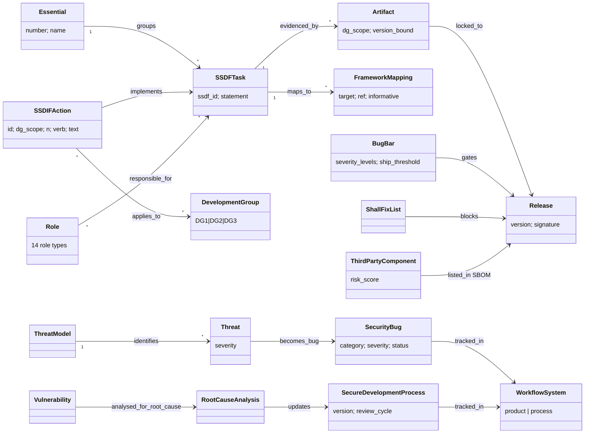

# ETSI TS 104 219 (SSDIF): object model

This is the object-model pass, done separately from extraction. It asked one question of the source: *what entities and edges does the SSDIF assume?* The machine form is `object-model.yaml`: 60 objects and 36 edges, of which 2 are inferred. It also lists 7 gaps against ARCH-0001 v0.2.0 and DL-0009.

## Findings

1. **Development Group is an applicability tier, not a maturity level.** An organisation is DG1, DG2 or DG3 according to what it builds: off-the-shelf reliant, some custom code, or major custom/SaaS. Each action applies to a DG scope, and the scopes are cumulative. To use SSDIF conformance, tmodel needs an applicability filter on SecurityProgram (R-041). R-042 conformance also has to distinguish a requirement that is "not applicable at this DG" from one that "fails". OWASP SAMM and BSIMM have nothing like this.
2. **Evidence is a by-product of development, bound to a version.** §3.1 defines an artifact as "not for the sole purpose of proving compliance", and §5.0.4 says such artifacts are "locked or attached to a specific version of code". An evaluator can re-run the tool at the required version to reproduce the evidence. This supports R-042/R-043: evidence lives in the KG and is linked to ProductInstance versions; it is not generated into a separate compliance document.
3. **The process is itself a product with its own work items.** Root-cause analysis produces bugs against the SecureDevelopmentProcess (§5.0.4, RV.3.4). tmodel has no edge from a Finding to a change of the SDL program. A `Finding --drives_change--> SecurityProgram` edge is needed.
4. **The gate is a bug bar.** The release gate is expressed as Finding severity against a ship threshold, using "shall fix" (blocks release) and "should fix" (does not). For DG3 it is reinforced by a static-analysis "shall fix" list (PO.4.1, PW.8.2). This is an automatable Gate exit criterion of the R-042 kind.
5. **Threat means design weakness, not attacker.** PW.1.1 #2 says the term "threat" refers to "vulnerabilities and weaknesses in design rather than threat actors". This settles the sense for this source. tmodel's ThreatInstance should declare which sense it uses (critic M1).
