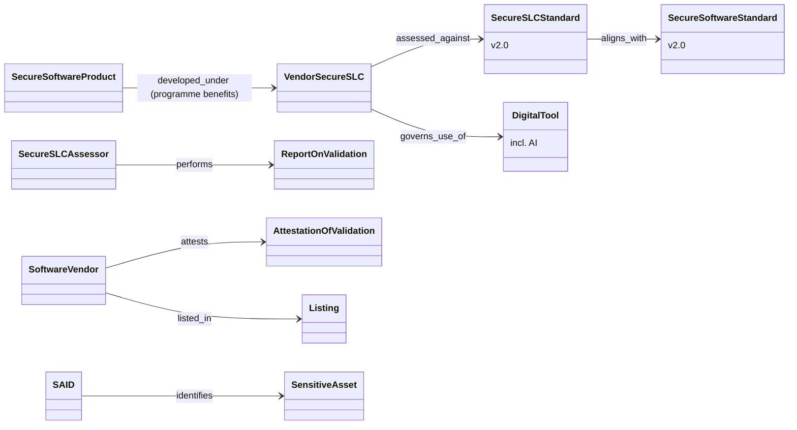

# PCI Secure SLC v2.0 — object model (public material only)

16 objects, 9 edges (2 inferred), 3 gaps — from PCI SSC public pages only; the standard text was not read (licence agreement).

Finding: the PCI programme is the only SDL source here with a **public registry of validated SDL processes** and an explicit **process-to-product benefit** (a validated Secure SLC eases product validation). If tmodel ever models third-party validation status, it needs a `validated_by` edge from SecurityProgram to an external assessment with a listing.
