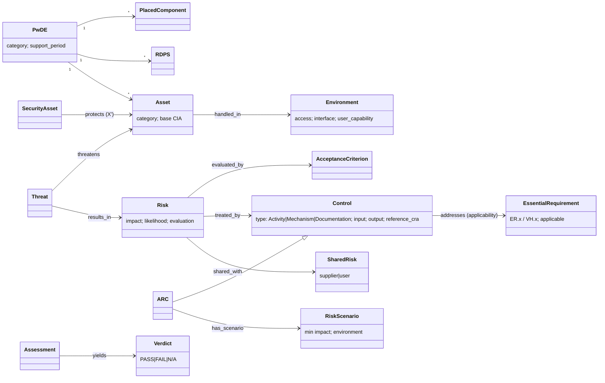

# BSI TR-03183-1: object model

This is the object-model pass, done separately from extraction. `object-model.yaml` holds 40 objects and 26 edges, all of them stated, and 7 gaps.

## Findings

1. **The control types are R-040 exactly.** BSI's three control types, Activity, Mechanism and Documentation (§4.6), correspond one-to-one to tmodel's `MitigationInstance.kind ∈ {process, technical, documentation}`. Each type has its own PASS rule. This is the cleanest primary-source warrant for R-040 in the SDL set.
2. **Applicability comes from controls.** An essential requirement is applicable exactly when a selected control addresses it. Otherwise it must be documented and justified as non-applicable (RH_RT.1.1.2). R-042 therefore needs three outcomes: PASS, FAIL and N/A-with-justification. ETSI's DG scoping needs the same.
3. **Controls are templates selected by a predicate.** An ARC is chosen by matching (minimum asset impact) × (access, interface, user-capability environment). This predicate is machine-evaluable, and it is the most automatable control-selection rule in the library. It is a candidate for the "generic mitigation → product mitigation" step of DEC-009.
4. **Environments compose along the supply chain.** A component expects an environment. The integrator either provides that environment or delegates the expectation, with a description and the means to meet it (§6.6). This is an assume/guarantee edge that ARCH-0001's Deployment layer does not have.
5. **Risk sharing is a treatment outcome.** A risk can be shared with a supplier (through CRA compliance or a contract) or with the user (through guidance). In both cases the manufacturer keeps responsibility. DEC-009 should add a `shared` disposition with its counterparty and due-diligence evidence.
