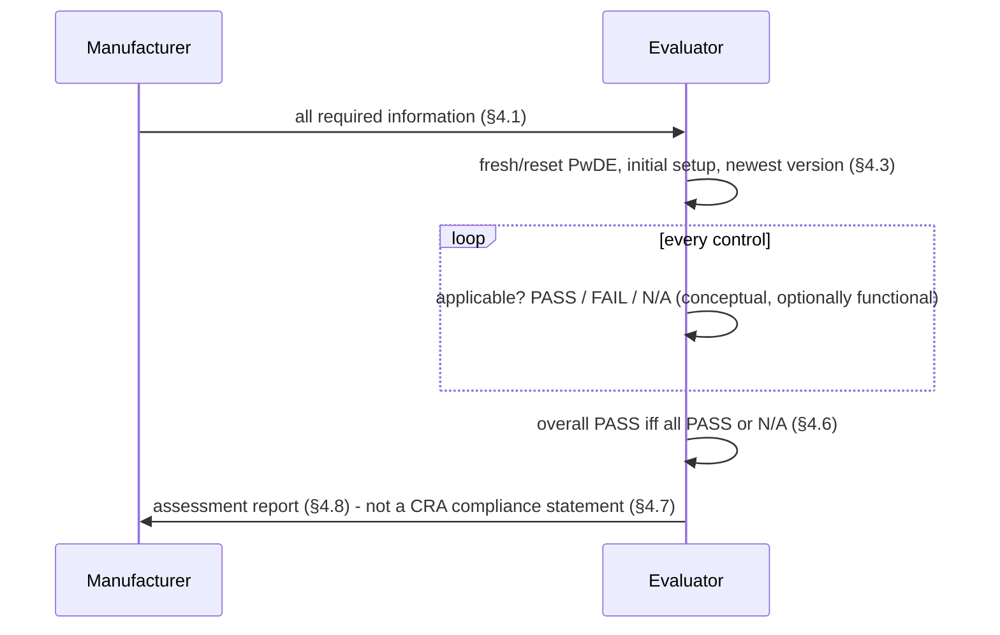

# BSI TR-03183-1 — flows

Steps, constrained-by ids and stated/inferred flags in `protocol.yaml`.

## P1 Risk handling (Figure 4, §5.4–§5.13)

```mermaid
sequenceDiagram
  participant M as Manufacturer
  participant S as Supplier
  participant U as User
  M->>M: risk context incl. decision criteria (§5.7)
  M->>M: RH_RA.1.1.1 assets -> RH_RA.1.1.2 threats
  M->>M: RH_RA.1.2 analyse (impact x likelihood)
  M->>M: RH_RA.1.3 evaluate vs acceptance criteria (§5.14.3)
  alt not acceptable
    M->>M: RH_RT.1.1.1 select controls; RH_RT.1.1.2 ER applicability
    opt cannot treat alone
      M->>S: RH_RT.1.2.1 share (CRA compliance / contract), due diligence
      M->>U: RH_RT.1.2.2 share via guidance [USER_DOCUMENTATION]
    end
    M->>M: RH_RT.1.3 implement + verify
  end
  M->>M: RH_DOC.1 document
  loop support period
    M->>M: RH_UPD.1 update when risk context changes
  end
```

## P2 Assessment (§4)



## P3 CRA Art. 14 reporting (quoted in §3.6, CRA obligations, not TR requirements)

```mermaid
sequenceDiagram
  participant M as Manufacturer
  participant C as CSIRT coordinator + ENISA
  M->>C: early warning <= 24 h
  M->>C: notification <= 72 h
  M->>C: final report (vuln: 14 d after fix available; incident: 1 month)
```
