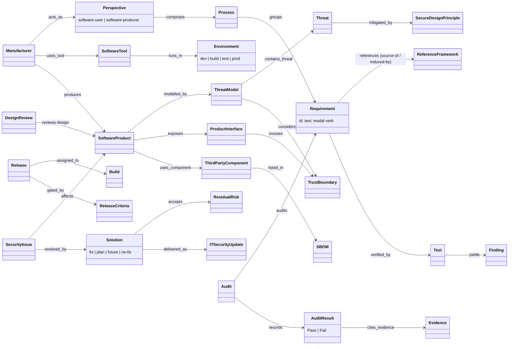

# BSI TR-03185: object model

`object-model.yaml` has the full set (67 objects, 45 edges, 8 gaps). Each element has a locator and a mapping to
ARCH-0001 or DL-0009. Every object is stated in the source; one edge (`SoftwareTool runs_in Environment`) is
inferred. The audit objects (Audit, AuditResult, Evidence, Certification) come from BSI's Prüfspezifikation
spreadsheet and landing page, not from the TR text. The diagram below shows the core.

## Findings

1. **The development toolchain is a governed subject in its own right.** Part 1 splits every requirement by
   *perspective*. `USER.*` requirements cover the tools used to build (selection, trusted source, hardening,
   patching, decommissioning). `PROD.*` requirements cover the product. ARCH-0001 can model the product but
   cannot yet say "this Environment's tools are subject to these requirements".
2. **The threat model is a required work product with prescribed content.** PROD.DEV.C.2 lists DFD elements
   (data flows, processes, data storage, trust boundaries, external dependencies), protocols, debug
   interfaces, CVSS-type severity and mitigations. It is reviewed by the team (C.3), kept current for
   products in use (C.4), and its findings must be closed (C.5). It also drives security requirements
   (PROD.PM.A.3), design (DEV.B.1, B.3) and test selection (TEST.A.2). This supports the R-042 idea that the
   threat model drives conformance.
3. **Only one gate is explicit.** §1.2.2 states that the processes are not a chronological sequence. The only
   gate is Release, and its exit criteria are stated: tests match expectations, all security issues are
   conclusively addressed (PROD.TEST.A.17), and completion of the security activities is documented
   (PROD.PM.A.14).
4. **Mappings come in two strengths.** Part 1 and the Prüfspezifikation give the *sources* of each
   requirement. Part 2's "Induced by" column is "neither directly derived from nor equivalent to" its targets.
   The maps_to edge in R-044 needs to record that difference.
5. **The assurance objects are concrete.** The BSI Prüfspezifikation adds an Audit row per requirement:
   evidence checked, a binary Pass/Fail result and additional information. IT-Grundschutz audit team
   leaders perform the audits for BSI certification of Part 1.
