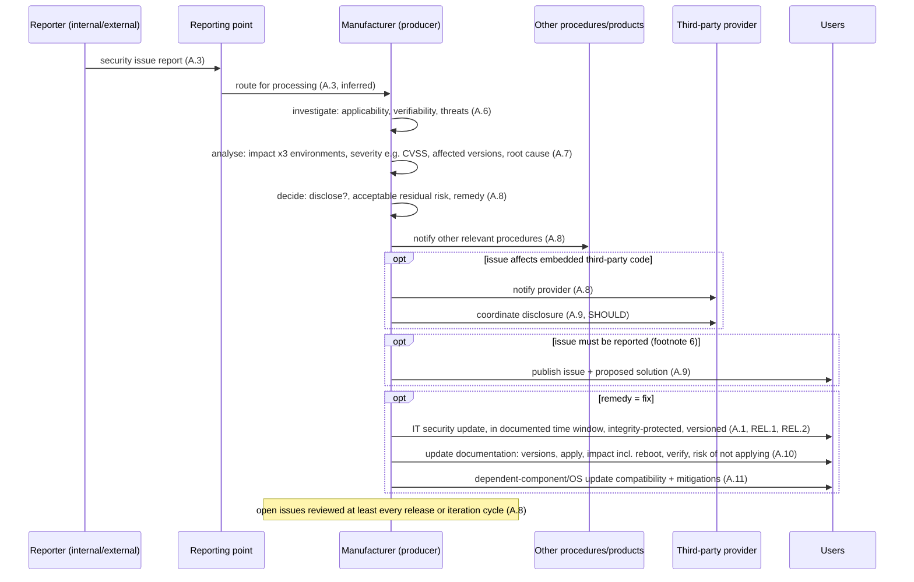
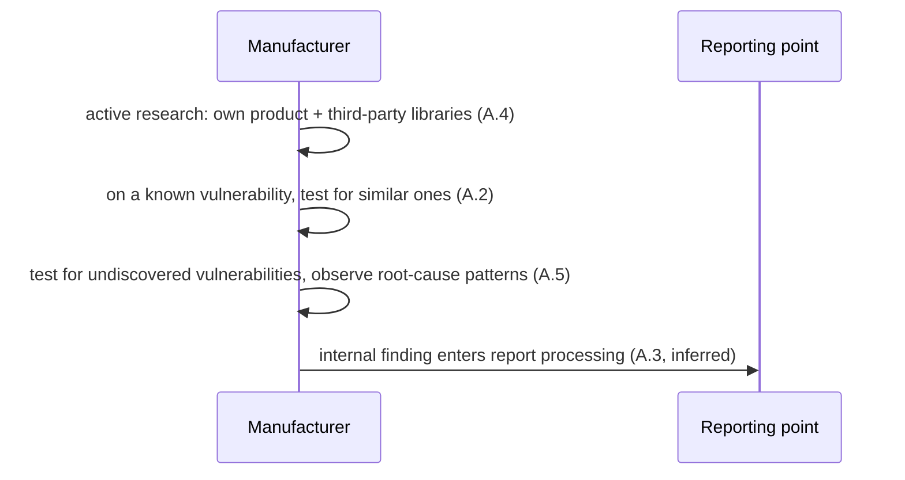

# BSI TR-03185 — process exchanges

The TR is a process guideline, so these are **process flows between parties**, not wire messages. Every step names
the requirement id it rests on; `protocol.yaml` marks the steps whose ordering we inferred. The TR states that its
ordering "does not represent a mandatory chronological sequence" (§1.2.2), and it sets **no numeric deadlines**:
"timely" and "promptly" are left to "market conditions" (footnotes 5 and 7). Contrast with the CRA's 24 h / 72 h /
14-day clock (`eu-cra-2024-2847`).

## F1 — Security issue intake → analysis → decision → disclosure (PROD.FIX.A.3–A.11)



Error paths: not applicable / not verifiable → closed with record (inferred); **no fix** with acceptable residual risk
→ recorded and, if reportable, published as "non-correction" (A.8, A.9); **plan / future version** → stays open
under periodic review (A.8).

## F2 — Proactive discovery (PROD.FIX.A.2, A.4, A.5)



## F3 — Test → release → delivery (PROD.TEST.A.*, PROD.PM.A.14, PROD.REL.*)

```mermaid
sequenceDiagram
    participant BO as Business owner
    participant M as Manufacturer
    participant TE as Tester (separate from developer)
    participant RU as Responsible org. unit
    participant U as Users
    BO->>TE: minimum test types, areas, use cases (TEST.A.6, SHOULD)
    M->>TE: test framework conditions + expected results + release criteria + rejection procedure (TEST.A.1-A.3)
    TE->>RU: evaluated, documented results; target-actual comparison (TEST.A.16)
    M->>RU: record that all security activities completed (PM.A.14)
    alt tests successful AND all security issues conclusively addressed
        RU->>M: documented release (TEST.A.17)
        M->>U: delivery with integrity mechanism, unique build version, version-matched user docs, archived release data, SBOM (REL.1, REL.2, DOC.B.6, DEV.L.1, DEV.L.2)
    else criteria not met
        RU->>M: release-rejection procedure (TEST.A.3)
    end
```

## F4 — Tool patch intake (manufacturer as software user, USER.PATCH.A.*)

```mermaid
sequenceDiagram
    participant TM as Tool manufacturer
    participant M as Manufacturer (tool user)
    participant C as CISO
    TM->>M: patch (authenticity + integrity ensured, A.4)
    M->>M: evaluate promptly + prioritise; check patch for known vulns (A.15)
    opt change may affect information security
        M->>C: involve CISO (A.8)
    end
    alt apply
        M->>M: planned, approved, documented, tested, with fallback (A.5-A.7); verify success (A.13, A.15)
    else do not apply
        M->>M: document decision and reasons (A.15)
    end
    Note over M: unsupported tool whose secure operation cannot be confirmed MUST cease to be used (A.15)
```

## F5 / F6 — End of support; OSS reporting

```mermaid
sequenceDiagram
    participant M as Manufacturer / OSS project
    participant R as Reporter
    participant U as Users
    M->>U: discontinuation + support-withdrawal date + migration paths (DECOM.2, DE.01, DE.02)
    M->>U: decommissioning instructions in user docs (DECOM.1)
    R->>M: vulnerability report via documented security contact, private channel SHOULD exist (VM.01, QA.03)
    M->>U: publish vulnerability information within a reasonable period (VM.02); release log of security changes (BR.04)
```
