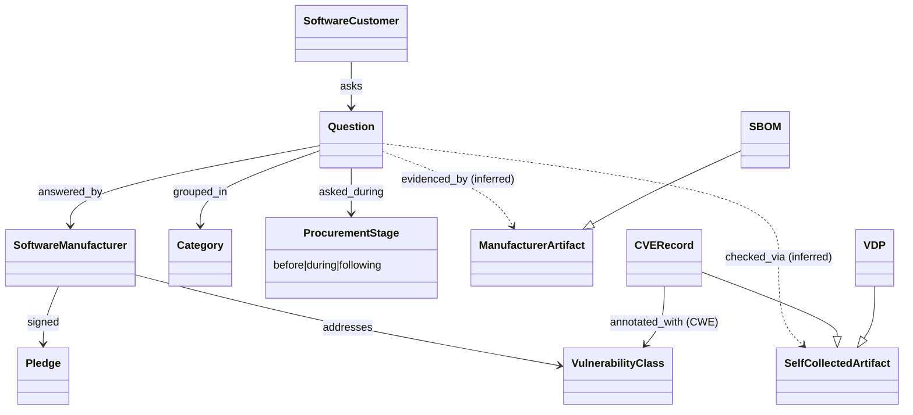

# Secure by Demand Guide — object model

Machine form: `object-model.yaml` (16 objects, 12 edges — 3 inferred — 2 gaps).
The customer-side mirror of Secure by Design: a **SoftwareCustomer** asks **Questions** (in six
**Categories**) of a **SoftwareManufacturer** at a **ProcurementStage**, and checks answers against
**artifacts** either supplied by the manufacturer (SBOM, roadmaps) or **collected by the customer**
from public sources (baseline features, VDP page, CVE records, pledge status).

