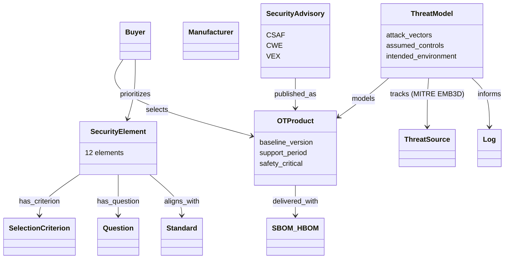

# Secure by Demand — OT priority considerations: object model

Machine form: `object-model.yaml` (16 objects, 11 edges, 3 gaps). Object-model pass only
(secondary record, `status: summarized`).

```mermaid
classDiagram
    class Buyer
    class Manufacturer
    class OTProduct {
      baseline_version
      support_period
      safety_critical
    }
    class SecurityElement {
      12 elements
    }
    class SelectionCriterion
    class Question
    class ThreatModel {
      attack_vectors
      assumed_controls
      intended_environment
    }
    class ThreatSource
    class Log
    class SBOM_HBOM
    class SecurityAdvisory {
      CSAF
      CWE
      VEX
    }
    class Standard
    Buyer --> OTProduct : selects
    Buyer --> SecurityElement : prioritizes
    SecurityElement --> SelectionCriterion : has_criterion
    SecurityElement --> Question : has_question
    ThreatModel --> OTProduct : models
    ThreatModel --> ThreatSource : tracks (MITRE EMB3D)
    ThreatModel --> Log : informs
    OTProduct --> SBOM_HBOM : delivered_with
    SecurityAdvisory --> OTProduct : published_as
    SecurityElement --> Standard : aligns_with
```
