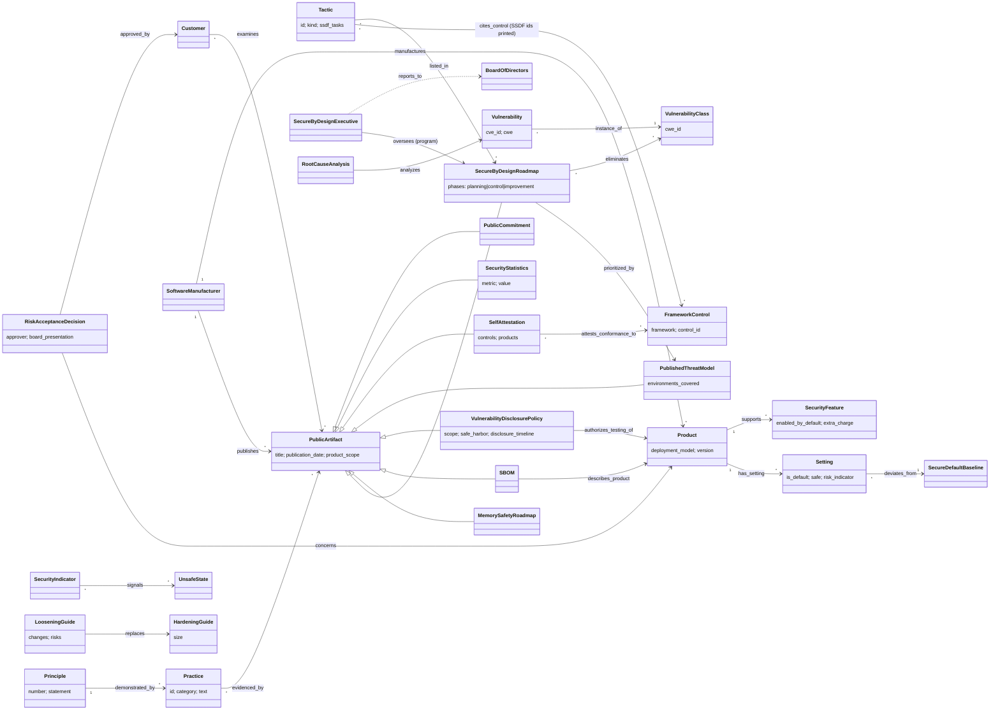

# Object model assumed by *Secure by Design* (2023-10-25)

Object-model pass: a separate re-read of the source with one question, *what entity types and edges does
this document assume or define?* Machine form: `object-model.yaml` (58 objects, 38 edges, 9 gaps; 1
inferred object, 1 inferred edge). This page shows the core.

## Reading

The document's conformance model is **artifact-based**, not audit-based. A **Principle** is
*demonstrated by* **Practices**, and each practice is *evidenced by* a **PublicArtifact** that the
**SoftwareManufacturer** *publishes* and the **Customer** *examines* ("show, rather than tell", p. 14).
No artifact is sufficient alone; a set "builds a case". There is no assessor, no certificate and no
pass/fail.

The second half of the model is the **product configuration**. A **Product** *has* **Settings**. A
**SecureDefaultBaseline** is the out-of-box configuration. Settings are continuously *evaluated against*
the threat landscape. A **SecurityIndicator** *signals* every **UnsafeState**, and a **LooseningGuide**
*replaces* the **HardeningGuide** by listing the risk of each *deviation from* the baseline. ARCH-0001
has none of these objects.

The third thread is **class-level vulnerability management**. A **Vulnerability** is an *instance of* a
**VulnerabilityClass** (CWE). A **RootCauseAnalysis** asks whether a secure by design practice would
have prevented it. The **SecureByDesignRoadmap** *eliminates* whole classes across the portfolio.

## Mapping to tmodel (ARCH-0001 v0.2.0, DL-0009)

| Source object | tmodel | Fit |
|---|---|---|
| SoftwareManufacturer, Customer, AuthoringOrganization, SecurityResearcher | `Party` (§2b), with the relational roles supplier, consumer and reported_by | adopt |
| Principle, Practice, Tactic, FrameworkControl | `Requirement` (R-042) with `maps_to` (R-044) | adopt; the printed SSDF ids are first-class crosswalk edges |
| PublicArtifact and its subclasses | `WorkProduct`/`Evidence` (R-042), rendered as a governed view (R-043) | adapt: needs publication state and an *external* audience |
| SelfAttestation, PublicCommitment | `Assertion` (§4) by the manufacturer `Party` | adapt: a commitment is forward-looking |
| SecurityFeature, SecurityIndicator, ApplicationHardening | `MitigationInstance` kind=technical (R-040) | adopt |
| HardeningGuide, LooseningGuide, VulnerabilityDisclosurePolicy | `MitigationInstance` kind=documentation (R-040) | adopt; a guide also needs a polarity attribute |
| FieldTest, RootCauseAnalysis | `Review` with verification evidence (§5) | adopt |
| Vulnerability / VulnerabilityClass | `Finding`/`Vulnerability` / `Weakness` (CWE) | adopt |
| SecureByDesignRoadmap, SecureByDesignProgram | SDL/`SecurityProgram` (R-041) | adapt: its phases are planning, control and improvement, not lifecycle gates |
| Setting, SecureDefaultBaseline, UnsafeState | none | **gap** |
| RiskAcceptanceDecision, PurchasingCriteria | `Review` (accept-risk) on the consumer side | **gap**: tmodel has no acquirer view |
| SecurityStatistics, Incentive, councils | none | **gap**: out of scope for the threat model, in scope for SDL governance |
