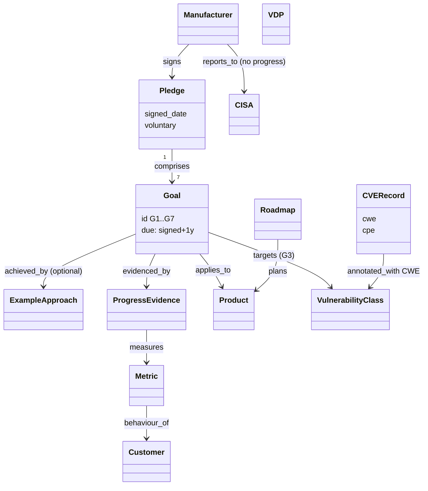

# Secure by Design Pledge — object model

Machine form: `object-model.yaml` (14 objects, 11 edges, 3 gaps; all stated).

Key difference from the SbD whitepaper: the pledge turns principles into **seven time-boxed
goals with measurable, public outcome evidence**, but leaves the method entirely to the signer.
