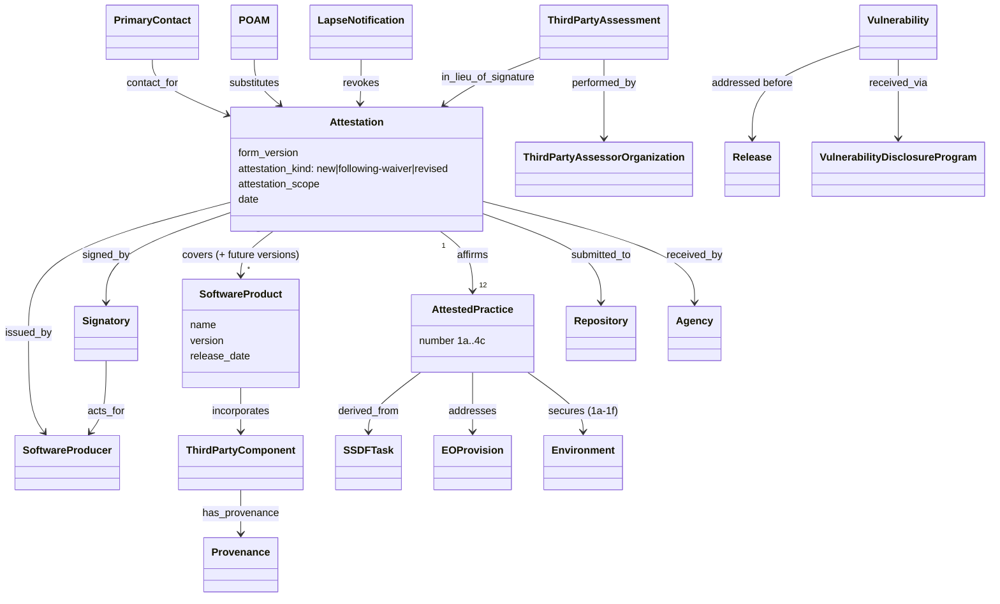

# Attestation form — object model

Machine form: `object-model.yaml` (25 objects, 24 edges, 5 gaps; all `kind: stated`).

The form is a **signed, scoped, revocable conformance claim**: a `SoftwareProducer`, through a
`Signatory` who can bind it, affirms all 12 `AttestedPractice`s for a `SoftwareProduct` scope;
the Appendix maps each practice to `SSDFTask`s and `EOProvision`s. Alternatives are a
`ThirdPartyAssessment` (no signature) or a `POAM`. A `LapseNotification` ends it.

| form object | tmodel (ARCH-0001 / DL-0009) |
|---|---|
| Attestation | `Assertion` (§4) specialised: signatory, scope, kind, revocation — **new** |
| AttestedPractice / SSDFTask / EOProvision | `Requirement` + `maps_to` crosswalk (R-044) |
| SoftwareProducer / Signatory / 3PAO / Agency | `Party` facets and roles (§2b) |
| ThirdPartyAssessment | `Review` with assurance level |
| POAM | `MitigationInstance` kind process/documentation (R-040) + milestones |
| Environment (dev/build) | needs Component/Environment for build infrastructure — gap |
| Release | SDL release `Gate` (R-041) |
