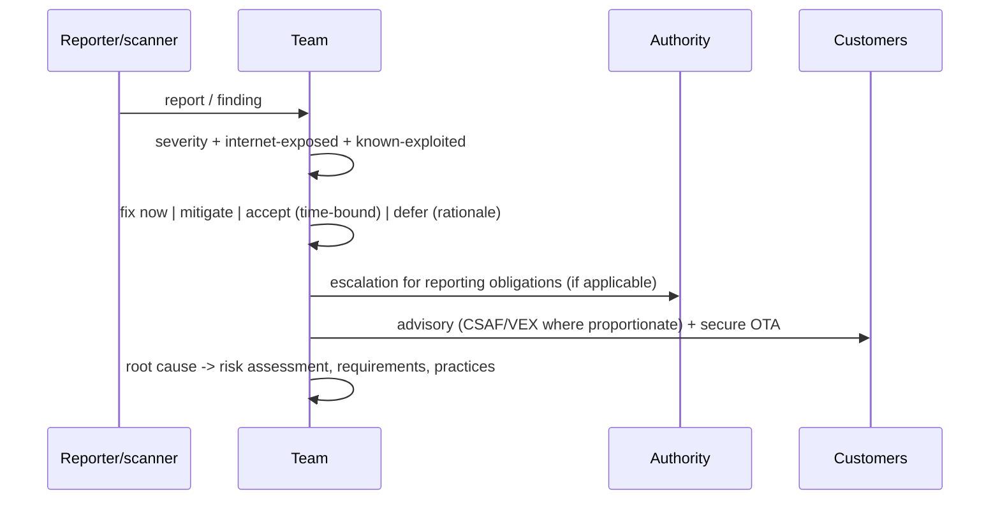
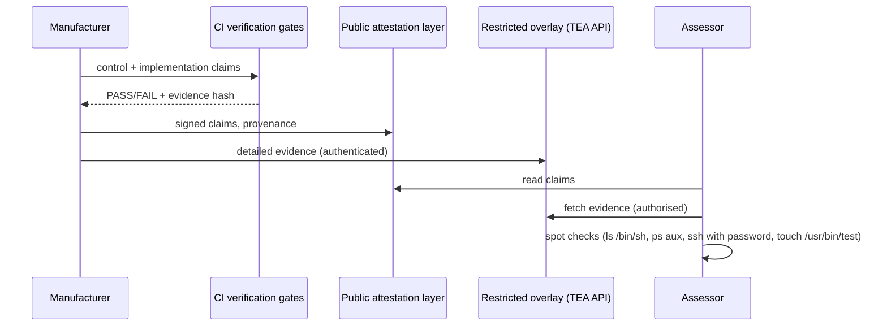

# ENISA SbD&D Playbook — flows

Details and constrained-by ids in `protocol.yaml`.

```mermaid
sequenceDiagram
  participant T as Team
  participant G as Release review / CI gate
  T->>G: changed components + threat model + risk register
  G->>G: select relevant release-gate criteria (unchanged = not affected)
  G->>G: evaluate pass/fail per playbook (4.1 ... 4.22)
  alt any fail
    G-->>T: no-go (or exception: rationale, owner, review date)
  else
    G-->>T: go; release security review record
  end
```




