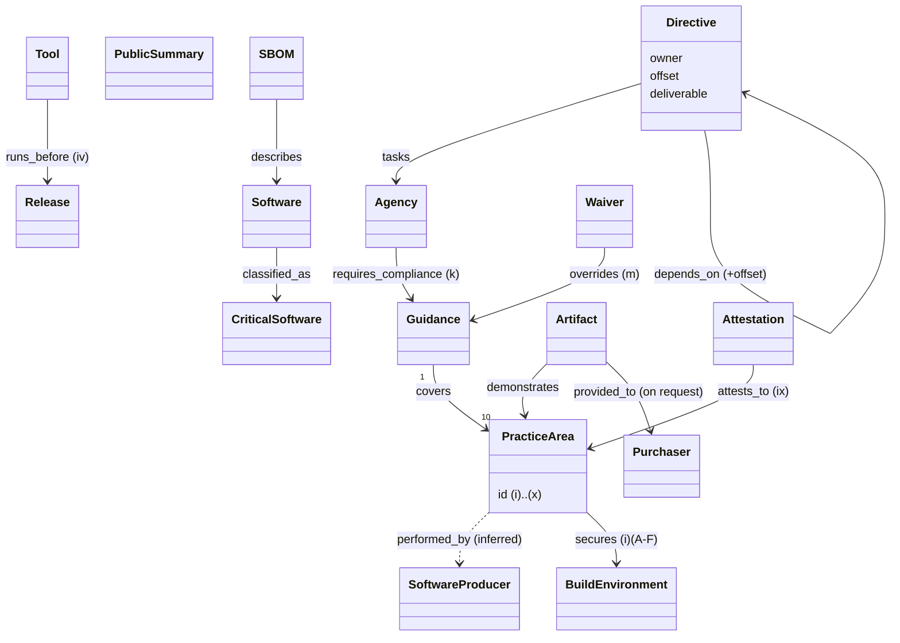

# EO 14028 §4 — object model

Machine form: `object-model.yaml` (22 objects, 13 edges — 1 inferred — 4 gaps).

§4 is a *program*: dated **Directives** to named officials produce **Guidance** covering ten
**PracticeAreas** (§4(e)(i)–(x)); OMB then requires **Agencies** to comply, and producers
**attest**, deliver **SBOMs** and **Artifacts**, and publish a summary of risks assessed and
mitigated.

The ten practice-area ids (`eo-14028#§4(e)(i)(A)` … `#§4(e)(x)`) are the hub the CISA attestation
form's Appendix maps onto (cisa-ssdf-attestation-form-2024 `maps_to`).
