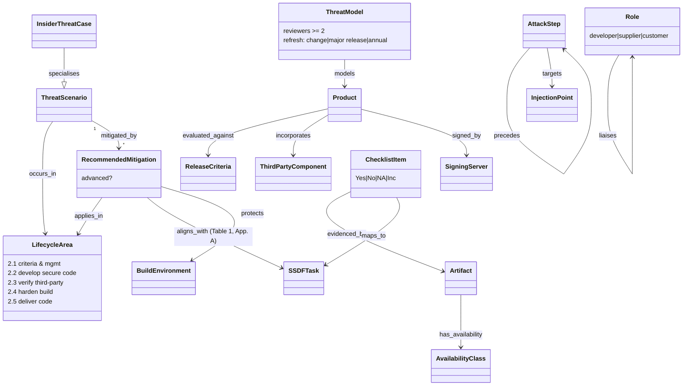

# ESF developer guide — object model

Machine form: `object-model.yaml` (27 objects, 22 edges, 6 gaps; all stated with locators).
The guide's spine is **ThreatScenario → mitigated_by → RecommendedMitigation → applies_in →
LifecycleArea**, with mitigations aligned to **SSDF tasks** (Table 1, Appendix A) and evidenced by
**Artifacts** that a **ChecklistItem** asks for (Appendix D).

| ESF object | tmodel (ARCH-0001 / DL-0009) |
|---|---|
| ThreatScenario / InsiderThreatCase | `ThreatInstance` / `AttackPattern`, `applies_in_phase` (§1, §3b); insider = `ThreatActor` facet of a `Party` |
| AttackStep (4-step build-chain exploit) | `AttackStep` + `precedes` (§2a) |
| RecommendedMitigation | `Mitigation` → `MitigationInstance` with `kind` technical/documentation/process (R-040) |
| LifecycleArea | `LifecyclePhase` (§3b) — the guide adds a *build* phase |
| ReleaseCriteria | SDL release `Gate` exit criteria (R-041/R-042) |
| ThreatModel (governance rules) | governed view + `Review` quorum (R-043) |
| Artifact / AvailabilityClass / ChecklistItem | `Evidence` with visibility; conformance verdict (R-042) |
| SSDFTask | crosswalk target (R-044) |
