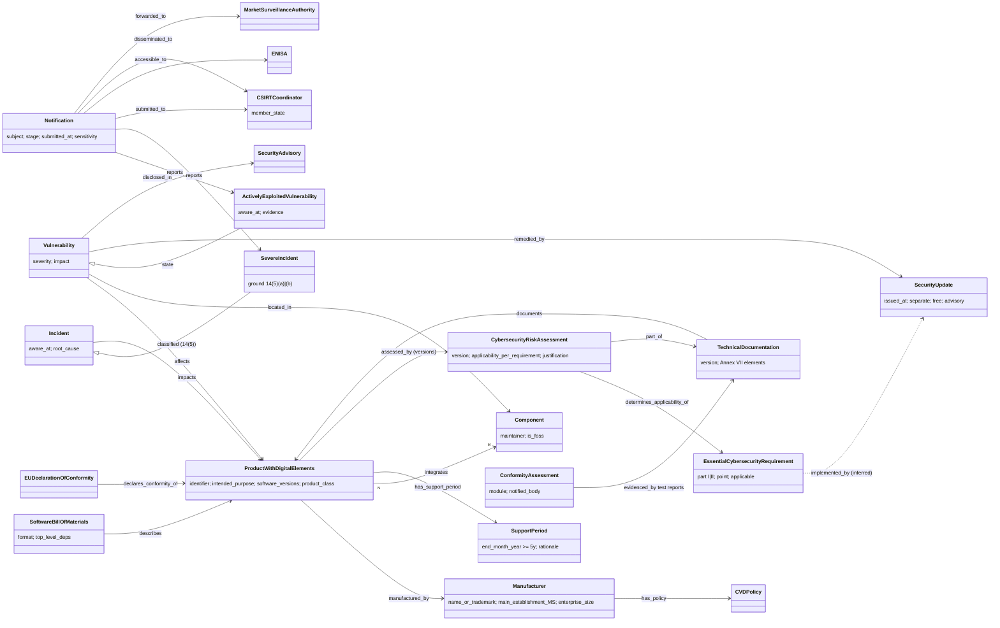

# CRA object model

Machine form: `object-model.yaml` (51 objects, 37 edges incl. 3 added in the verify pass; 2 objects and 2 edges inferred, the rest defined or named by
the Regulation, mostly Art 3). Only the core is drawn here. Parties and the reporting infrastructure are in the YAML.

## Findings

1. **The cybersecurity risk assessment is the hinge object.** Art 13(3) requires it to state, for *each* Annex I Part I(2)
   requirement, whether it applies, how it is implemented, and (Art 13(4)) a justification where it does not. That is a
   per-product `Requirement` applicability table with `MitigationInstance` pointers. It is exactly the R-042 conformity
   object, and a tmodel threat model is a natural way to produce it.
2. **Conformity covers product and process together.** CE marking (Art 3(31)) and the DoC attest to the product (Annex I
   Part I) *and* the manufacturer's vulnerability-handling processes (Part II). An SDL object (R-041) therefore has to be
   linkable to a product's conformity claim. It cannot stand alone.
3. **The lifecycle has dated legal anchors.** These are the support period (at least 5 years, end month and year
   published), update availability (`max(10y, remainder)`), and documentation retention (`max(10y after placing,
   support period)`). They give ARCH §3b's `LifecyclePhase` the `valid_from`/`valid_to` window it still lacks.
4. **"Actively exploited" and "known exploitable" are evidence-bearing states of a Vulnerability, not types.** The 24 h
   clock starts on awareness of reliable evidence, so the state change needs provenance: an Assertion plus a Review.
5. **Reporting needs objects tmodel does not have:** Incident/SevereIncident, a staged deadline-bound `Notification`,
   and the jurisdiction set (`made_available_in` Member States), which drives where the report is disseminated.
