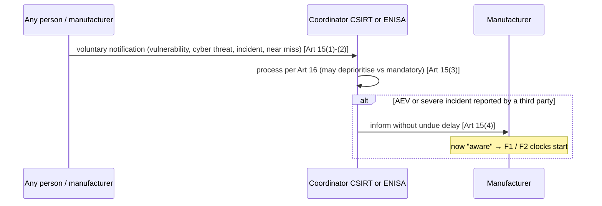

# CRA reporting and vulnerability-handling protocol

Machine form: `protocol.yaml` (roles, timers, flows F1-F4, error paths E1-E8). Message ids: `messages.yaml`.
Dissemination-delay detail comes from Commission Delegated Regulation (EU) 2026/881 (a separate act, cited as DR-2026/881).

## Clocks

| Timer | Value | Starts when | Due | Locator |
|---|---|---|---|---|
| T24 | 24 h | manufacturer becomes aware | early warning (vulnerability or incident) | Art 14(2)(a), 14(4)(a) |
| T72 | 72 h | manufacturer becomes aware | vulnerability notification / incident notification | Art 14(2)(b), 14(4)(b) |
| T14d | 14 days | a corrective or mitigating measure is available | final report (vulnerability) | Art 14(2)(c) |
| T1m | 1 month | the 72 h incident notification is submitted | final report (incident) | Art 14(4)(c) |
| — | on request | CSIRT asks | intermediate report | Art 14(6) |

Two asymmetries matter for an implementation. The vulnerability final report is anchored to **fix availability**, not to
awareness, so it has no upper bound if no fix appears. The incident final report is anchored to the **72 h submission**.
Points (b) and (c) apply "unless the relevant information has already been provided", so an early submission can satisfy
a later stage.

## F1 — Actively exploited vulnerability (Art 14(1)-(2), 14(6)-(8), 16, 17(5))

```mermaid
sequenceDiagram
    autonumber
    participant M as Manufacturer
    participant SRP as Single reporting platform (ENISA)
    participant C as Coordinator CSIRT (main establishment)
    participant E as ENISA
    participant R as Relevant CSIRTs (MS where made available)
    participant MSA as Market surveillance authorities
    participant U as Users / public
    Note over M: becomes aware (own finding, reporter, or Art 15(4) CSIRT notice)
    M->>SRP: early warning (≤24 h) [Art 14(2)(a)]
    SRP->>C: via national end-point [Art 14(7)]
    SRP-->>E: simultaneously accessible [Art 14(7)]
    alt no withholding
        C->>R: disseminate without delay via SRP [Art 16(2)]
    else withheld (E1/E3) or particularly exceptional (E2)
        C->>E: withholding decision + justification + when [Art 16(2)]
        E-->>C: may support; recommends dissemination on systemic risk [Art 16(2)]
    end
    C->>MSA: notified information [Art 16(3)]
    R->>MSA: notified information [Art 16(3)]
    M->>SRP: vulnerability notification (≤72 h; sensitivity, 16(2)(a)-(c) flags) [Art 14(2)(b)]
    M->>U: inform impacted users, machine-readable where appropriate [Art 14(8)]
    opt where necessary
        C->>M: request intermediate report [Art 14(6)]
        M->>SRP: intermediate report [Art 14(6)]
    end
    M->>U: security update + advisory message (without delay, free) [Annex I Part II (2),(7),(8)]
    Note over M: corrective or mitigating measure available → T14d starts
    M->>SRP: final report (≤14 days after measure) [Art 14(2)(c)]
    M->>U: public advisory on fixed vulnerability (may delay until users could patch) [Annex I Part II (4)]
    E->>E: add to European vulnerability database, in agreement with manufacturer [Art 17(5)]
```

## F2 — Severe incident (Art 14(3)-(8), 16, 17(1)-(2))

```mermaid
sequenceDiagram
    autonumber
    participant M as Manufacturer
    participant SRP as Single reporting platform
    participant C as Coordinator CSIRT
    participant E as ENISA
    participant R as Relevant CSIRTs
    participant MSA as Market surveillance
    participant U as Users / public
    Note over M: aware of incident; severe per Art 14(5)(a) or (b)
    M->>SRP: early warning (≤24 h; suspected unlawful/malicious?) [Art 14(4)(a)]
    SRP->>C: national end-point; accessible to ENISA [Art 14(7)]
    C->>R: disseminate [Art 16(2)]
    C->>MSA: notified information [Art 16(3)]
    M->>SRP: incident notification (≤72 h; nature, initial assessment, measures) [Art 14(4)(b)]
    M->>U: inform impacted users [Art 14(8)]
    opt where necessary
        C->>M: request intermediate report [Art 14(6)]
        M->>SRP: intermediate report
    end
    M->>SRP: final report (≤1 month after 72 h notification; root cause, mitigations) [Art 14(4)(c)]
    opt public awareness necessary
        C->>U: inform public, or require manufacturer to (after consulting it) [Art 17(2)]
    end
    opt large-scale relevance
        E->>E: share with EU-CyCLONe [Art 17(1)]
    end
```

## F3 — Voluntary reporting (Art 15)



## F4 — Manufacturer vulnerability handling / CVD (Annex I Part II, Art 13(6), 13(17))

```mermaid
sequenceDiagram
    participant Rep as Reporter
    participant M as Manufacturer (SPOC / contact address)
    participant CM as Component maintainer
    participant U as Users
    participant Pub as Public
    Rep->>M: vulnerability report (user's preferred channel, not only automated) [Art 13(17); Annex I II(6)]
    M->>M: identify + document; SBOM lookup of affected components [Annex I II(1)]
    opt vulnerability in an integrated component
        M->>CM: report; share fix code/docs, machine-readable where appropriate [Art 13(6)]
    end
    M->>U: security update, separate from features where feasible; free; advisory [Annex I II(2),(7),(8)]
    M->>Pub: disclose fixed vulnerability (description, affected product, impact, severity, remediation) [Annex I II(4)]
    Note over M: if actively exploited at any point → F1
```

## Error paths

E1 withholding on request / DR-2026/881 grounds (72 h mitigation window, exploit-technique risk, partial sharing, CVD);
E2 particularly exceptional circumstances (restricted ENISA view, ENISA systemic-risk recommendation); E3 CVD delay
(Art 16(6)); E4 missed deadline and fines (Art 64(2); micro/small exempt for the 24 h deadline only, Art 64(10)(a) as
corrected); E5 manufacturer fails to inform users (CSIRT may); E6 SRP compromised (Art 16(4); DR Art 5); E7
non-conformity (Art 13(21): correct, withdraw, recall); E8 cessation of operations (Art 13(23)).
