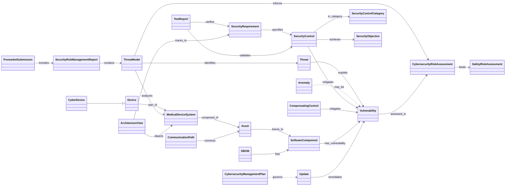

# Object model: FDA premarket cybersecurity guidance (Feb 2026)

The machine form is `object-model.yaml`: 46 objects and 42 edges. Two edges (`crosses` and `governed_by`)
are inferred; everything else is named in the guidance, mostly in Appendix 5 and §V. This diagram shows only the core
chain that a premarket reviewer follows:

> system → threat model → risk assessment → controls → requirements → tests → traceability

(`governs` from the management plan to updates is drawn only for readability. It is not in the YAML. The plan's
"timeline to develop and release patches" and "update processes" are attributes of the plan.)

## Findings

1. **Traceability is the object FDA actually reviews.** §V.A, §V.B.2 and Appendix 2.B ask for links in every direction:
   - threat model, risk assessment, SBOM and tests;
   - architecture elements to requirements;
   - diagram elements to hazards, controls and tests;
   - assets to SBOM components.

   That is exactly R-042's conformance graph. FDA asks for it as a submission artefact.
2. **Three loci of mitigation.** Mitigation is designed in (SecurityControl), deployed by the user (CompensatingControl,
   App. 5), or handed to the user or patient (RiskTransfer, §V.A). R-040's `kind` does not capture *who holds* the
   mitigation, so tmodel needs a locus attribute.
3. **Two linked risk assessments.** The security risk assessment (exploitability-based, non-probabilistic) is
   separate from the ISO 14971 safety assessment and feeds it through a documented transfer method (§V.A.2). This
   supports the critic's H3 guardrail: a separate axis, not a re-indexing.
4. **The cyber-device test is a regime switch.** A Product facet evaluated from three statutory criteria (§VII.B)
   turns recommendations into requirements: the 524B(b)(1) plan, the (b)(2) processes and the (b)(3) SBOM.
   ARCH-0001 has nothing like it.
5. **Component support status.** Level of support and end-of-support date per component (§V.A.4(b)) are new
   Component attributes, and they drive end-of-support risk.
