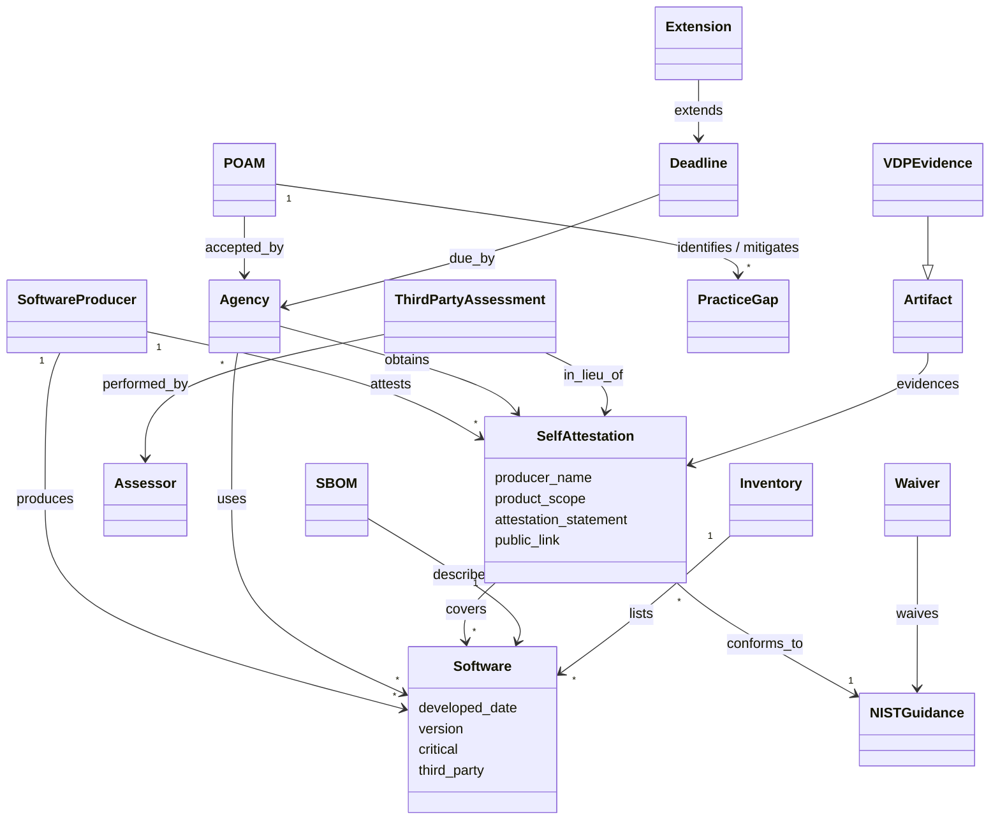

# OMB M-22-18 — object model

Machine form: `object-model.yaml` (21 objects, 18 edges, all `kind: stated` with locators).
The memo assumes a small acquisition-side model: an **Agency** may use **Software** only when the
**SoftwareProducer** has issued a **SelfAttestation** (a conformance statement against the
**NIST Guidance**) — or a **ThirdPartyAssessment** in lieu, or a satisfactory **POA&M** over the
**PracticeGaps**. **SBOMs** and other **Artifacts** are evidence the agency *may* demand. The
program runs on dated **Deadlines** with **Extension**/**Waiver** overrides.

## Mapping to tmodel (ARCH-0001 / DL-0009)

| M-22-18 object | tmodel | fit |
|---|---|---|
| Agency, SoftwareProducer, Assessor | `Party` (§2b), relational roles on edges | good |
| Software (+ critical) | `Product`/`ProductInstance` + a classification attribute | adapt: add applicability attributes |
| SelfAttestation | `Assertion` + `Review` (§4) | gap: no first-class signed, scoped Attestation |
| POA&M / PracticeGap | `MitigationInstance` kind=process/documentation (R-040) + `Milestone` (R-041) | gap: per-Requirement "not met, plan accepted" state |
| SBOM / Artifact / VDP evidence | `Evidence` / `WorkProduct` (R-042) | good |
| Deadline / Extension / Waiver | `Milestone` / gate override / risk acceptance (R-041/R-042) | gap |

Gaps are listed in `object-model.yaml`.
