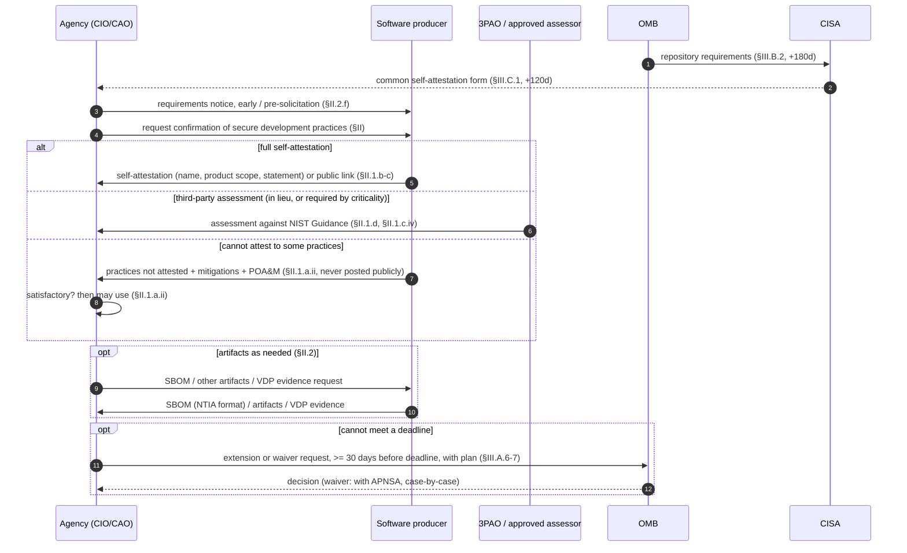

# OMB M-22-18 — exchanges (protocol view)

Machine form: `protocol.yaml`; messages: `messages.yaml`. Rescinded 2026-01-23 (omb-m-26-05).
The memo is policy, not a wire protocol: the "messages" are documents exchanged between
parties, and there is no transport, encoding or timeout except the 30-day lead time on
extension/waiver requests.

