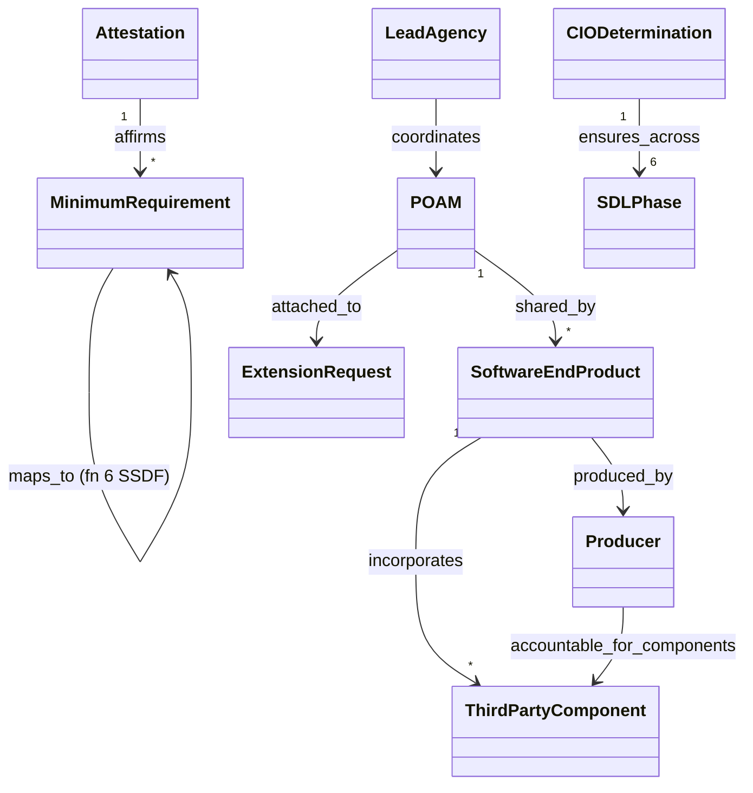

# OMB M-23-16 — object model (delta over M-22-18)

Machine form: `object-model.yaml` (12 objects, 9 edges, 3 gaps). Builds on
`omb-m-22-18/distilled/object-model.yaml`. The main new idea: the **end product** is the unit of
accountability, and its producer carries the assurance burden for **third-party components**.

`SDLPhase` (requirements, design, development, testing, deployment, maintenance — §B.3) is a
six-phase SDL list stated by OMB; it maps onto ARCH-0001 §3b `LifecyclePhase`
(architecture/design … maintenance/update).
