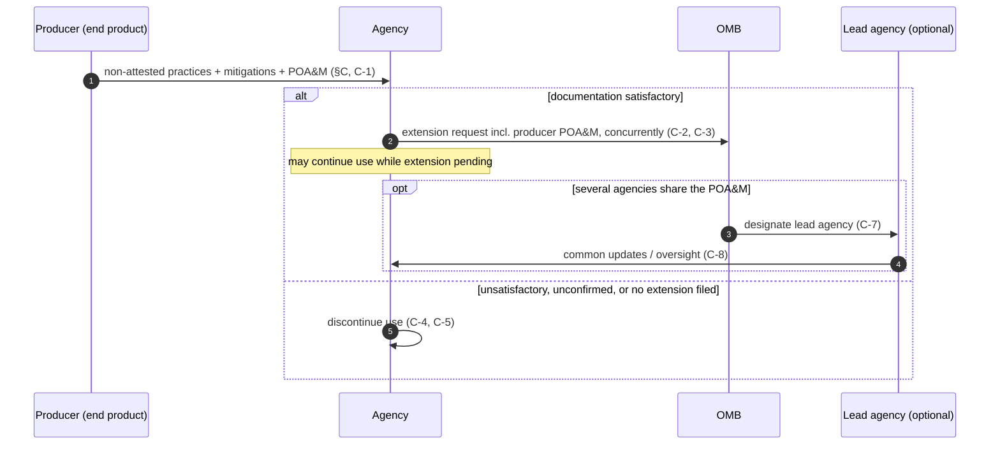

# OMB M-23-16 — changed exchanges

Base flows: `omb-m-22-18/distilled/protocol.md`. Rescinded 2026-01-23 (omb-m-26-05).

```mermaid
sequenceDiagram
    autonumber
    participant P as Producer (end product)
    participant A as Agency
    participant O as OMB
    participant L as Lead agency (optional)
    P->>A: non-attested practices + mitigations + POA&M (§C, C-1)
    alt documentation satisfactory
        A->>O: extension request incl. producer POA&M, concurrently (C-2, C-3)
        Note over A: may continue use while extension pending
        opt several agencies share the POA&M
            O->>L: designate lead agency (C-7)
            L->>A: common updates / oversight (C-8)
        end
    else unsatisfactory, unconfirmed, or no extension filed
        A->>A: discontinue use (C-4, C-5)
    end
```
