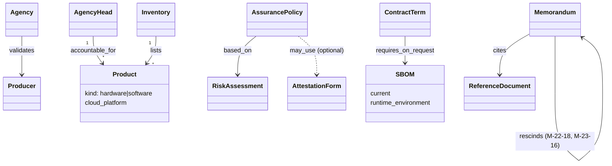

# OMB M-26-05 — object model

Machine form: `object-model.yaml` (13 objects, 8 edges, 2 gaps). The memo replaces one fixed
gate (attestation against SSDF) with an **agency-owned, risk-based assurance policy**; the
attestation form and SBOM become optional evidence sources.

Verifier note (2026-10-03): the `rescinds` edge runs memo -> memo (para 3). Pass 1 had drawn it
AssurancePolicy -> AttestationForm, which the source does not support (the form stays usable, R-0006).
