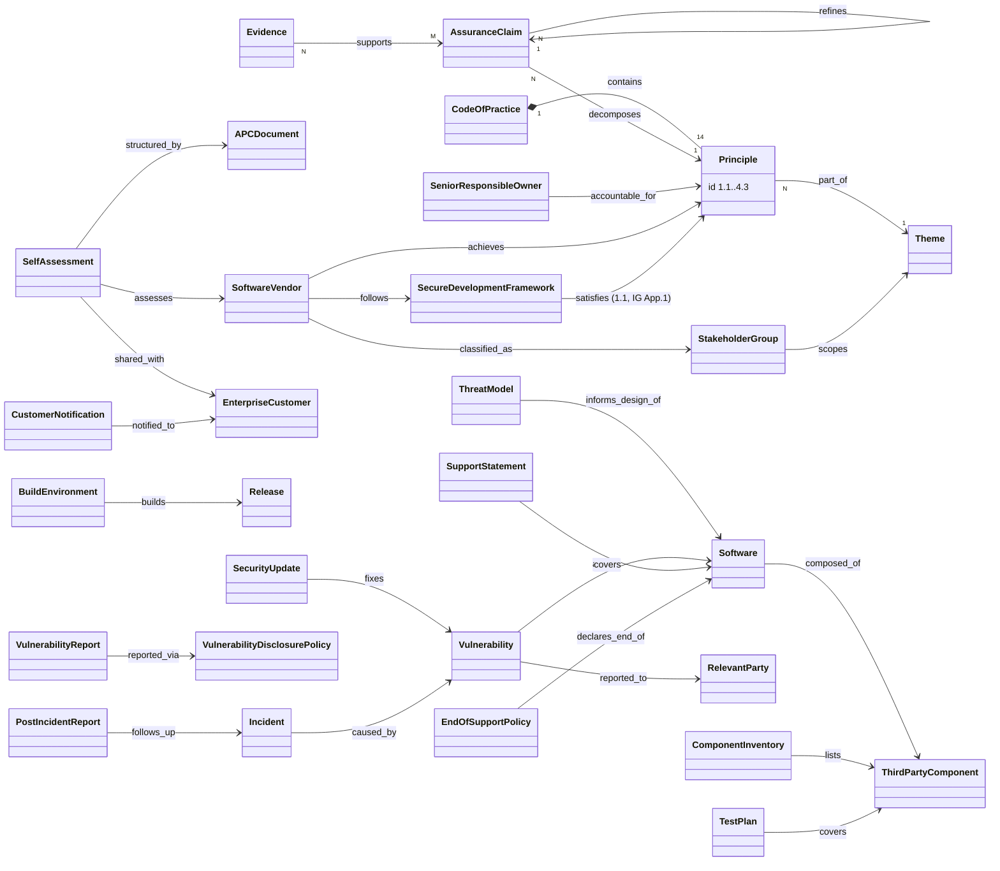

# Object model — UK Software Security Code of Practice

Source of truth: `object-model.yaml` (46 objects, 42 edges, 6 gaps; every entry has a locator, one
object and one edge marked `inferred`). This page is the picture and the three findings that matter.

## Findings

1. **The Code is a three-level conformance structure: Principle → Claim → Evidence.** The Code
   states 14 principles; the NCSC APC decomposes each into 1–6 outcome claims (45 in all) that "if
   well-evidenced" let a vendor "claim in good faith" it meets the principle; evidence is document
   inspection, interview, or audit of test plans and results. tmodel's R-042 has Requirement →
   Evidence → Review and is missing the middle (claim) layer. The claims are what make a principle
   testable.
2. **Applicability is decided by the organisation's role, not by the product.** Table 1 scopes the
   themes by stakeholder group (resellers: themes 3–4 only; developers only: 1–2, and 3 where in
   scope). A conformance check must resolve which requirements apply before it evaluates any.
3. **One accountable person, and an obligation to gain assurance rather than to perform.** The
   normative verb is "The Senior Responsible Owner … shall gain assurance that their organisation
   achieves …". That is an accountable-owner role, distinct from the approver of a single work
   product (DL-0009's owner/approver).
4. **There is a threat-model hook.** APC 1.4 claim 1, "Techniques to understand how the software
   might be exploited (threat modelling) have been used in the design of the software", is evidence
   that a tmodel model can satisfy directly.
5. **Customer-facing commitments carry dates.** The support statement (4.1), the end-of-support
   notice of at least one year (4.2), and incident and update notifications (3.5, 4.3) are dated
   promises attached to a product. ARCH-0001 §3b has no dated transition or notice period for them.
